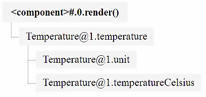
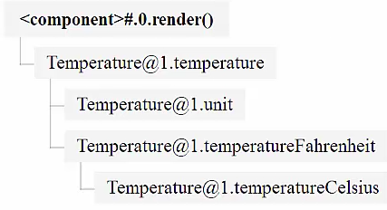

MobX is built around four core concepts. Actions, observable state, computed values, and reactions. Here's a simple temperature class.

#### ES6/Babel
```javascript
const (observable, computed) = mobx;
const (observer) = mobxReact;
const (Component) = React;
const DevTools = mobxDevtools.default;

const t = new class Temperature {

}
```

Its state consists of two `@observable`, one is `unit` in which you want to express our temperature in Celsius, `"C"`, Fahrenheit or Kelvin, and the second `@observable` will be temperature in degrees Celsius.

```javascript
const t = new class Temperature {
    @observable unit = "C";
    @observable temperatureCelcius = 25;
}
```

The `Temperature` `class` only stores the temperature in degrees Celsius because from that temperature, we can derive the other two units. That is a very important principal behind MobX.

Find the smallest amount of state you need, and derive all the other things. Let's find those derivations. The reason for only storing temperature in degrees Celsius is simple. It will keep actions as simple as possible.

If we don't store the temperature in degrees Kelvin or Fahrenheit, we also don't have to update those in our actions, if the temperature changes. We market innovations with `@computed`. They inform back studies properties, can be completely derived from other observables.

`@computed` values are very similar to formulas in spreadsheets and this is very important to know, that `@computed` values are not allowed to clear side effects like changing state or making network requests. Instead, they should be pure functions in terms of other observables or other computed values. 

Now using `@computed`, lets create how to get the temperature in Kelvin and the temperature in Fahrenheit. 

```javascript
const t = new class Temperature {
    @observable unit = "C";
    @observable temperatureCelcius = 25;

    @computed get temperatureKelvin() {
        return this.temperatureCelsius * (9/5) + 32
    }

    @computed get temperatureFahrenheit() {
        return this.temperatureCelcius + 273.15
    }

    @computed get temperature() {
        switch(this.unit) {
            case "K": return this.temperatureKelvin + "°K"
            case "F": return this.temperatureFahrenheit + "°F"
            case "C": return this.temperatureCelsius + "°C"
        }
    }
}
```

Remember what I just said about not having side effects, let's violate that rule and add some `log` statements to see what our `@computed` functions do. 

```javascript
const t = new class Temperature {
    @observable unit = "C";
    @observable temperatureCelcius = 25;

    @computed get temperatureKelvin() {
        console.log("calculating Kelvin")
        return this.temperatureCelsius * (9/5) + 32
    }

    @computed get temperatureFahrenheit() {
        console.log("calculating Fahrenheit")
        return this.temperatureCelcius + 273.15
    }

    @computed get temperature() {
        console.log("calculating temperature")
        switch(this.unit) {
            case "K": return this.temperatureKelvin + "°K"
            case "F": return this.temperatureFahrenheit + "°F"
            case "C": return this.temperatureCelsius + "°C"
        }
    }
}
```

Let's change the state a few times and let's assign anywhere, temperature and any units. Surprisingly, we see that the computations aren't triggered. Instead, they are triggered when we inspect the value.

#### Console
```javascript
t.temperatureCelsius = 20

t.unit = "K"

t.temperature
"calculating temperature"
"calculating Kelvin"
"68°K"
```

You might find this surprising, but by default MobX doesn't try to keep computed values up to date. The reason for that is that MobX always tries to defer the computation of computed properties until they are needed by IO and side effects.

In order to make a computed value reactive, to make it reactive to state, we have to consume them in what's called a MobX a reaction. Remember `observer` from the previous lesson? Observer is an example of such a reaction, and reactions do not produce a value. Instead, they produce a side effect.

The side effect of the `observer` decorator is that if pushes a rendering to the DOM. Let's introduce a tiny observer based check components that takes the `temperature` and renders it at the very bottom of our application. 

#### ES6/Babel
```javascript
const App = observer(({ temperature }) => {
    <div>
        {temperature.temperature}
        <DevTools />
    </div>
})

ReactDOM.render(
    <App temperature{t} />,
    document.getElementById("app")
)
```

Let's start changing our state again. Let's see how changing our state influences the computed value.

Let's start by assigning a new unit, and what we see is that unlike the previous time, assigning a new value to the units immediately takes your recomputation off that temperature. That's because that computation is needed by the component that observes the temperature.

#### Console
```javascript
t.unit = "C"
"calculating temperature"
"C"
```

Suddenly, our `temperature` calculations have become reactive and we can see even see that by using the MobX React dev tools and inspecting the components. What you see is that the components depends on the temperature property of the temperature objects, which in itself depends on the units and `temperatureCelsius` observables.



Let's try to pick a different unit. Let's change it to Fahrenheit and when we recheck the dependencies of the components, we see that the component now depends on the temperature in degrees Fahrenheit. That computation has now become reactive.



We can try this another time and I'll change the unit to degrees Kelvin. We can inspect the components again, now the component depends on the computed property, `temperatureKelvin`, and no longer on the temperature in degrees Fahrenheit.

When we now inspect the `temperature`, we immediately get back a response from MobX, except when we inspect the temperature in degrees Fahrenheit, because this computation is no longer observed by MobX. It isn't tracked anymore and has to be reevaluated.

You probably understand why they're so important, as computed expressions are side effect free, because MobX will decide what is the best moments to reevaluate those expressions. This allows MobX to have millions of computer properties in memory and still actively track only a few of them, namely those that are directly or indirectly used by some reaction.

For example, because they are visible on the current screen.

That concludes the introduction of reactions and computed values. Computed values derive a value from the state and are automatically suspended if not needed. In contrast, reactions always reactively trigger a side effect.