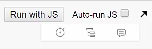
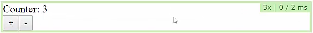
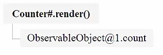
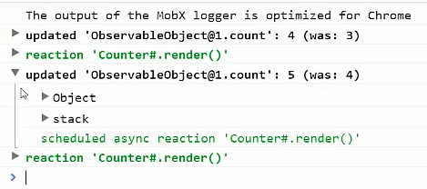

Before we continue, I want to introduce you first to the MobX React DevTools. These tools are a very valuable asset to analyze what MobX is doing. We'll use them throughout the course, so let's use them.

In the same project from last lesson, you can `import` them as devtools from the MobX React DevTools package, `import Devtools from "mobx-react-devtools";`. In this JSbin, however, we have loaded them as UMD module so we can import them from the global scope, `const Devtools = mobxDevtools.default;`. The only thing we need to do after importing them is to inject them somewhere in our component tree. Lets put them in our `<div>` inside of `@observer`. 

#### ES6/Babel
```javascript
const Devtools = mobxDevtools.default;
...
@observer class Counter extends Component {
    render() {
        return (
            <div>
                <Devtools />
                Counter: {this.props.store.count} <br/>
                <button onClick={this.handleInc}> + </button>
                <button onClick={this.handleDec}> - </button>
            </div>
        )
    }
}
```

There they are. We have this new toolbar, which introduces three tiny buttons on the website. 



The first one, if enabled, makes sure that MobX shows all the renderings that are happening on the screen per components. For example, if you press a `<button>`, this component is rerendered, and we can see how often it has been rendered and how long it took to render this component.



The second `<button>` can be used to analyze when a component will rerender. We now have the selection mode, and we can click components. We get a report about which observables are being observed by this component. Our `<Counter/>` component observes one field, which is the count fields of the first observable object we have created.



Finally, there is this button that enables extensive logging about everything that happens in MobX. If we open the browser's console, and we enable the log, and we press the buttons, we see exactly what happens. Our count has been updated from four to five. Based on that, MobX has determined that our counter component needs to rerender, which happens after that.



These are the MobX DevTools. Use them to your advantage.