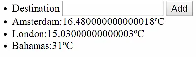

Let's do something useful with these `temperatures`. Let's build a small application that helps us picking the best spot for a holiday. Let's give each temperature a `location` and make sure that we toss that one in our `constructor()` instead.

#### ES6/Babel
```javascript
class Temperature {
    id = Math.random();
    @observable unit = "C";
    @observable temperatureCelsius = 25;
    @observable location = "Amsterdam, NL";
}

constructor(location) {
    this.location = location
}
```

These default values don't make any sense anymore. Let's remove them. Let's add a new component in which we can input a new `Temperature`. We pass the current set of `temperatures` so that we can add one. 

```javascript
const temps = observable([])

const App = observer(({ temperatures }) => (
    <ul>
        <TemperatureInput temperatures={temperature} />
        {temperatures.map(t =>
            <TView Key={t.id} temperature={t} />
        )}
        <DevTools />
    </ul>
))
```

We define the new `<TemperatureInput/>` component. This component has one piece of state, the `input` of the user. We use `@observable` to declare its state so that the component will react whenever this state changes. This component turns this number list item in a simple input box and a button.

```javascript
@observer(["temperatures"])
class TemperatureInput extends React.Component {
    @observable input = "";

    render() {
        return (
            <li>
                Destination
                <input onChange={this.onChange}
                    value={this.input}
                />
                <button onClick={this.onSubmit}>Add</button>
            </li>
        )
    }
}
```

The event handlers again are pretty straightforward actions. `onChange` input handler. Simply copies the value of the inputs into the input state and `onSubmit` handler adds the `new Temperature`, sets the location to the current `input`, and clears the input again.

```javascript
@action onChange = (e) => {
    this.input = e.target.value
}

@action onSubmit = () => {
    this.props.temperatures.push(
        new Temperature(this.input)
    )
    this.input = ""
}
```

Finally, we also have to adjust our `TView` components because it wants to enter the location as well. 

```javascript
@observer class TView extends React.Component {
    render(){
        const t = this.props.temperature
        return (
            <li onClick={this.onTemperatureClick}>
                {t.location}:{t.temperature}
            </li>
        )
    }
    ...
```

If it does that we can simply add locations, but all locations still have a temperature of 25 degrees Celsius because we didn't do anything yet with the location.

Luckily, there's a freely available API by "openweathermap.org" and we use that API to map our location to the actual current temperature so that we can find a nice location for a holiday.

Before we add a `fetch()` action we first introduce some additional state, namely `loading`, so that we can track whether we already have loaded our `Temperature`. 

```javascript
class Temperature {
    id = Math.random();
    @observable unit = "C";
    @observable temperatureCelsius = 25;
    @observable location = "Amsterdam, NL";
    @obserable loading = true;
}

constuctor(location) {
    this.location = location
    this.fetch()
}
```
After construction we simply invoke the `@action fetch`, and the fetch action takes the current location and resolves it to a temperature. We use a browser fetch API for that, and we call the endpoints. We inject an API key we got from the servers, and we add our location as search query using template strings.

```javascript
@action fetch() {
    window.fetch(`https://api.openweathermap.org/data/2.5/weather?appid=${APPID}&q=${this.location}`)
}

```

`fetch()` returns a promise and once the promise resolves we update the `res.json()` which is internal. Again a promise, and once that promise is resolved we take our action to update the state.

```javascript
@action fetch() {
    window.fetch(`https://api.openweathermap.org/data/2.5/weather?appid=${APPID}&q=${this.location}`)
        .then(res => res.json()
        .then(action(json => {
        })))
}
```

The temperature returned by that service is in the degrees Fahrenheit. We fix that be converting it back to Celsius, and we simply say that are done loading. The idea here is that asynchronous processes aren't anything complicated.

```javascript
@action fetch() {
    window.fetch(`https://api.openweathermap.org/data/2.5/weather?appid=${APPID}&q=${this.location}`)
        .then(res => res.json()
        .then(action(json => {
            this.temperatureCelsius = json.main.temp -273.15
            this.loading = false
        })))
        .catch(err => alert('Sorry, failed to fetch. Try running from an HTTP url. ' + err))
}
```

An asynchronous process just executes an action in a lower point of time. It's nothing more than that. We just assume that MobX will react to that as usual.

Finally, we should deal with the fact that data might be loading in the `TView`. Let's show temperature only if we have fetched our data and otherwise show that we are loading. 

```javascript
@observer class TView extends React.Component {
    render(){
        const t = this.props.temperature
        return (
            <li onClick={this.onTemperatureClick}>
                {t.location}:
                {t.loading ? "loading.." : t.temperature}
            </li>
        )
    }
    ...
```

Let's try some locations for our holiday. Let's try Amsterdam or London. Our promises have returned, but the temperature isn't promising. Lt's try something more radical, the Bahamas. That's what I like.



What we see is that if our asynchronous actions modify the states that is automatically reflected in our components. Asynchronous actions are actually just two synchronous actions, one at the moment you start them, and one when they finish.