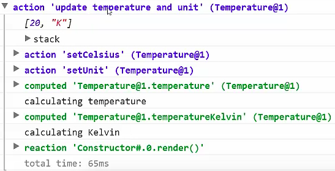

Actions are the fourth concept in MobX. In essence, any piece of code that tries to alter a state is an action. For example, if you modify the state in the console, we perform an action. Actions can be implicit and explicit.

If you modify the state in the console, we implicitly perform an action. To clearly restrict your code base and to avoid accidentally changing states, MobX provides the means to explicitly mark in your code where your actions live.

Let's start by extending our temperature class with a method to change the units of the temperature. On that method, we put the `@action` decorator to indicate that this method is an action that will modify a state. Now we can use this method to change the unit of the temperature.

#### ES6/Babel
```javascript
const t = new class Temperature {
    @observable unit = "C";
    @observable temperatureCelcius = 25;

    @computed get temperatureKelvin() {
        console.log("calculating Kelvin")
        return this.temperatureCelsius * (9/5) + 32
    }

    @computed get temperatureFahrenheit() {
        console.log("calculating Fahrenheit")
        return this.temperatureCelcius + 273.15
    }

    @computed get temperature() {
        console.log("calculating temperature")
        switch(this.unit) {
            case "K": return this.temperatureKelvin + "°K"
            case "F": return this.temperatureFahrenheit + "°F"
            case "C": return this.temperatureCelsius + "°C"
        }
    }

    @action setUnit(newUnit) {
        this.unit = newUnit;
    }
}
```

As usually, this nicely updates our view. Actions are the start of anything that happens. Actions modify a state, which ultimately leads to reactions. With actions, we have closed the circle of state management.

We have now clearly indicated in our code that the `setUnit` method is intended to modify a state. Actions do more than just that. Remember that MobX always runs all derivations synchronously. Let's modify our state again from the console.

We perform two modifications at once. 

#### Console
```javascript
t.unit = "K";
t.unit = "F";
```

What we see is that MobX recalculates the temperature for both modifications. It runs them twice. For that, you can group your changes by using `transaction`.

```javascript
transaction(() => {
    t.unit = "K";
    t.unit = "F";
})
```

But you can forget about transactions already because actions will automatically apply them. Let's try that by introducing two more actions, one to update the temperature, and one to update both the units and the temperature.

#### ES6/Babel
```javascript
@action setCelsius(degrees) {
    this.temperatureCelsius = degrees;
}

@action setTemperatureAndUnit(degrees, unit) {
    this.setCelsius(degrees);
    this.setUnit(unit);
}
```

If we invoke `setTemperatureAndUnit`, you see that the transaction is applied because the temperature is recalculated only once. Two more things about actions. First of all, if we decorate all of our methods that modify state, we can forbid all our attempts to modify the state so that you always modify the state in a confined area. This can be done by using MobX in strict mode.

```javascript
useStrict(true);
```

If we now try to change the state directly from the console, an error is thrown. We should use actions to modify a state. Secondly, actions can be named. 

```javascript
@action("update temperature and unit")
setTemperatureAndUnit(degrees, unit) {
    this.setCelsius(degrees);
    this.setUnit(unit);
}
```

That is really nice because those names show up in the MobX dev tools, if we enable those, and in the Spy API, which is the API behind the dev tools.

If we enable the change log in the dev tools, we can nicely see our actions being logged to the console. 



We see with which arguments our actions are invoked, we see which state is modified, and we see which reactions are triggered in response to those state changes.

That concludes the concept of actions. They communicate the intent to move our state, and they allow you to control where a state is allowed to be modified.