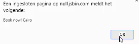

Earlier we talked about the concept of reactions. So far, the only reaction we discussed is `@observer`. Let's take a look what reactions are, and how observer works. We'll first take a look at a reaction that is built in to MobX, `when`.

What `when` does is that it triggers a side effect whenever a certain condition is met. In our tiny app, we want it to give us an alert whenever a location with a nice temperature is found.

#### ES6/Babel
```javascript
function isNice(t) {
    return t.temperatureCelsius > 25
}

when(

)
```

`when` takes two parameters. The first parameter is an expression that is automatically re-evaluated until it returns `true`. Second argument of when is another function which is invoked as soon as the first one returns true. We can simply say when there's a nice temperature, then we want to have an `alert`. After when has executed its effect, it stops observing. 

```javascript
when (
    () => temps.some(isNice),
    () => {
        const t = temps.find(isNice)
        alert("book now! " + t.location)
    }
)
```

We can try that when doesn't trigger on Amsterdam, and it doesn't trigger on London, but it does trigger on Cairo. 



Another built-in reaction function is `autorun`. Unlike `when`, it takes only one argument, one function, and it keeps running that function until we manually dispose it. The function we pass to autorun is run once, and after that, whatever data that was used in the previous run changes.

`autorun` is used internally by `observer`. Let's remove our `ReactDOM.render`, and see how we can replace our React rendering by using `autorun`. Let's start by building our own `render()` function, which takes `temperature`, and returns a string, which represents the DOM.

We can use template strings for that. We `map` over our `temperatures`, and we print the same information as our React components did. 

```javascript
function render(temperatures) {
    return `
        <ul>
        ${temperatures.map}
    `
}
```

Here, we have our `render()` function. It renders exactly the same information as our React component already did. It renders `temperature`. Based on the state of the temperature, it renders a `.loading` text, or the current temperature.

```javascript
function render(temperatures) {
    return `
        <ul>
        ${temperature.map(t => 
            `<li>
                ${t.location}:
                ${t.loading ? "loading" : t.temperature}
            </li>`
        ).join("")}
        </ul>
    `
}
```

We can now add some temperatures to our `temperatures` collection, then we invoke the `render()` function, and we assign the results to the DOM. 

```javascript
temps.push(new Temperature("Amsterdam"))
temps.push(new Temperature("Rotterdam"))

document.getElementById("app").innerHTML = render(temps)
```

What we see is a similar rendering as we had previously, except that this rendering remains loading.

If we change the collection, nothing happens. Of course, this is because our `render()` function is invoked only once. Let's fix that. We simply fix that by wrapping `autorun` around our assignments to the DOM. That's all it takes to make this rendering reactive.

What happens is that `autorun` invokes the thing we pass into it, which invokes our render function, which accesses all pieces of data from our state. Whenever one of these pieces changes, the `autorun` function is notified, and it will run again, resulting in the `render()` function being pre-triggered, resulting in a new DOM assignments.

```javascript
autorun(() => {
    document.getElementById("app").innerHTML = 
        render(temps)
})

```

Now we can simply `.push()` new temperatures to the collection, and we see that everything still works as before. Our rendering reacts to changing temperatures. Our rendering reacts to the promises, which resolve, and even our `when` `alert` is still running.

That concludes the introduction to reactions, which are primarily intended to manage side effects. Side effects like showing an alert, or assigning a new value to the DOM.