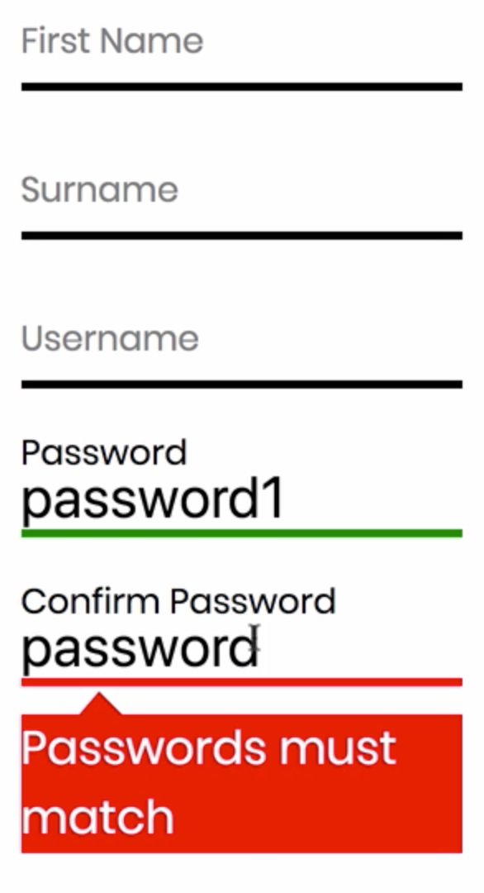

Instructor: 00:00 Often when using validation, we may want to access values of other fields in our form. A classic example of this is password and password confirmation, because the password confirmation field needs to know what the value of the password field is.

00:17 Let's head to our register form. We're going to add two new fields, both of them text inputs which are using our custom input component. We'll place them underneath the user name field.

00:31 We'll have a `password` field, which is `required`, and a `confirmPassword` field, which is `required`, but also has to `match` the `password`.

#### RegisterForm.js
```javascript
<Field
  name="password"
  component={customInput}
  type="password"
  label="Password"
  validate={[required]}
/>
<Field
  name="confirmPassword"
  component={customInput}
  type="password"
  label="Confirm Password"
  validate={[required, matchesPassword]}
/>
```

00:48 We're going to write a function called matchesPassword in our validation. This technique uses field-level validation, but we could also use the other way of achieving validation in Redux Form, which is to write a validation object.

01:02 For field-level validation, let's head over to our validation/index.js file, where we've written our other validation functions. We're going to add a function down here, which is `password`.

01:19 Instead of just taking a value, it's also going to take `allValues`. Redux Form provides all of the values of the form to this validation function, and we can say, If the value matches `allValues.password`, then no problem. Otherwise, `Passwords must match`.

#### validation/index.js
```javascript
export const matchesPassword = (value, allValues) =>
  value === allValues.password ? undefined : 'Passwords must match';
```

We can import this function in our register form.

#### RegisterForm.js
```javascript
import {
  required,
  minLength,
  maxLength,
  matchesPassword
} from '../validation';
```

01:51 Let's save and refresh now. Here are our two new fields. We'll add a password value, and I'll write the confirmation now.

02:04 They match, so we have two valid fields now. If they don't match, then we get our error message. Of course, for this situation, we're going to make both of these fields type password to ensure that we can't see the password being entered as it's written.

