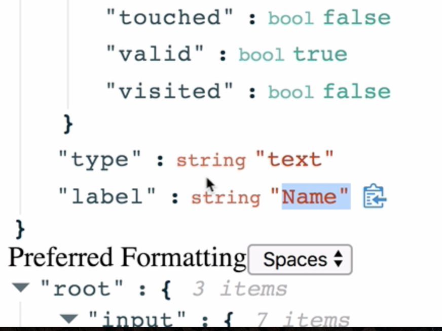
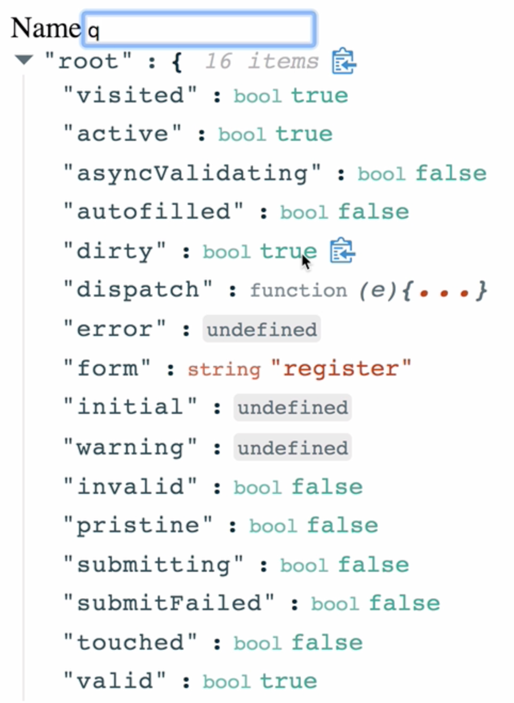

Instructor: 00:00 The Field component of ReduxForm provides us with props that we can use to find out about the state of our form field. Let's take a look at our `customInput` field. There are props here that we've passed in, for example, `label` and `type`. There's also props provided by ReduxForm, such as `input`.

00:23 Let's take a look and see how these props change as the field changes. Let's add a dependency to help us out here. We're going to add `react` to `json` `view`. 

```bash
$ yarn  add react-json-view
```
We'll import that here, so `import ReactJson from 'react-json-view'`.

#### fields/index.js
```javascript
import ReactJson from 'react-json-view';
```

00:45 I'm going to use the `ReactJson` component underneath our input, and we're going to pass it our props as the source prop. 

```javascript
export const customInput = props => {
  return (
    <div>
      <label>{props.label}</label>
      <input {...props.input} type={props.type} />
      <ReactJson src={props.meta} />
    </div>
  );
};
```

We'll do that inside both components, hit save, and we'll refresh.

```javascript
export const customSelect = props => {
  return (
    <div>
      <label>{props.label}</label>
      <select {...props.input}>
        <option value="tabs">Tabs</option>
        <option value="spaces">Spaces</option>
      </select>
      <ReactJson src={props.meta} />
    </div>
  );
};
```


01:04 Now underneath each input, we can see the props that we get by using Redux Forms field component. Here are the props that we've passed in. 


We also have this meta object which contains the state of a form field.

01:23 Furthermore, we have the input object, which is what connects the field to Redux. Let's see how this information changes as we change our field. Instead of showing all the props, we'll show props.meta. If we head over to our name field and we focus it, we notice that immediately, the state of our meta object changes.

01:52 In this case, active turned to true, and visited turned to true. If we start typing, we can see that pristine turns to false and dirty turns to true. This object will respond every time the field is changed so the state of the form field is accurately represented inside the meta object.



02:20 This is going to become extremely important for when we begin to use validation on our form.