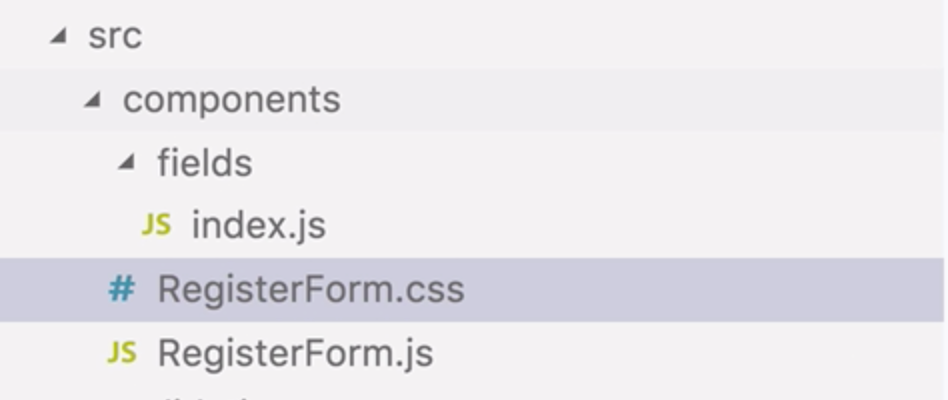
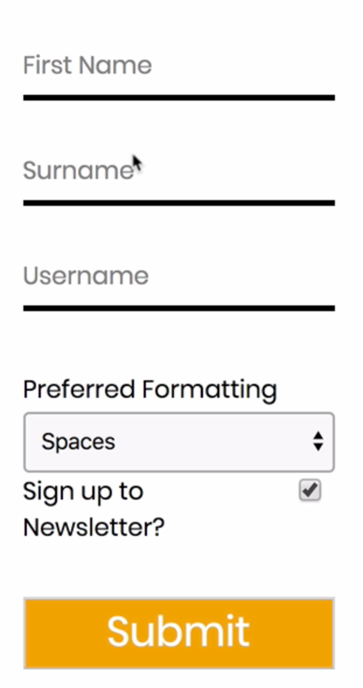
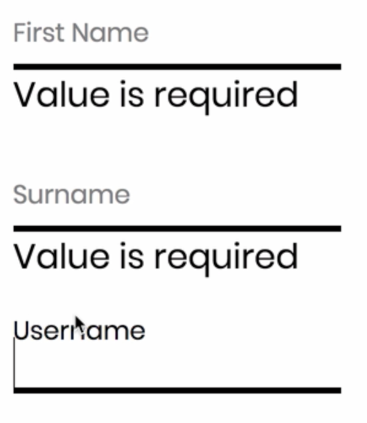
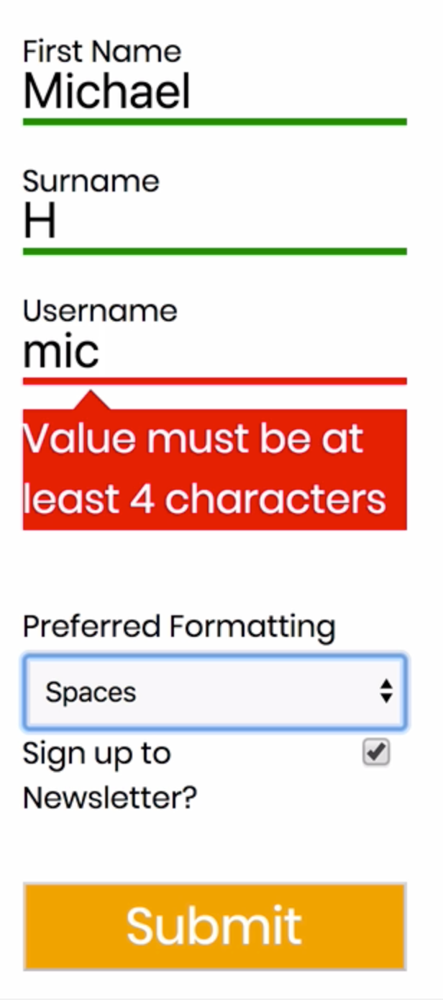

Instructor: 00:00 Let's add some styles to improve the overall look and feel of our form. Firstly, let's go ahead and `add` `classnames` as a dependency. 

```bash
> $  yarn add classnames
```

We're going to `import` that as `cx`, at the top of `fields/index.js`.

#### fields/index.js
```javascript
import cx from 'classnames';
```

00:21 This will help in adding multiple classnames to one element and adding classnames conditionally. Let's head over to our `customInput` `div`, and we're going to add some `classNames` here.

00:37 `custom-input-container`, `flex-row-reverse` if our `type` is `checkbox`. `Dirty` if `meta.dirty` is `true`. We're going to move our `label` underneath our input field, because this makes it easier to target with css. To our error message, we'll remove the style prop.

01:09 We're going to add `className=feedback-text error-text`. All these `classNames` correspond to some css which was written earlier. Let's bring that in now. 

```javascript
export const customInput = props => {
  const { label, input, type, meta } = props;
  return (
    <div
      className={cx(
        'custom-input-container',
        { 'flex-row-reverse': type === 'checkbox' },
        { dirty: meta.dirty },
        getValidityClassName(meta)
      )}
    >
      <input {...input} type={type} />
      <label>{label}</label>
      {meta.error &&
        meta.touched &&
        !meta.active && (
          <div className="feedback-text error-text">{meta.error}</div>
        )}
    </div>
  );
};
```

In source components, we'll add a new file, registerForm.css. 



I'll paste in the styles now.

01:39 We can now import this into RegisterForm.js. 

#### components/Registerform.js
```javascript
import './RegisterForm.css';
```

Let's save. We can see a different look of our form. 



The styles for validation could do with some improvements. For example, this error message should look more like an error.



01:59 Let's head over back to fields/index.js. Inside our `CustomInput`, we're going to `getValidityClassName` passing in our `meta` object. 

#### fields/index.js
```javascript
<div
  className={cx(
    'custom-input-container',
    { 'flex-row-reverse': type === 'checkbox' },
    { dirty: meta.dirty },
    getValidityClassName(meta)
    )}
>
```

`getValidityClassName` is going to be a function.

02:20 We're going to say, `if` the field is `active`, then don't return any `ClassName`. If the field is `touched` and `invalid`, then `return` `invalid` as a `ClassName`. If the field is `touched` and `valid`, then return `valid`.

```javascript
const getValidityClassName = meta => {
  if (meta.active) {
    return;
  }
  if (meta.touched && meta.invalid) {
    return 'invalid';
  }
  if (meta.touched && meta.valid) {
    return 'valid';
  }
};
```

02:56 Let's head over back to our css now, and we can write in some validation styles. For a `valid input`, `border-color` can be `green`. For `invalid input`, it can be `red`. For `error-text`, let's add a `red background` and `white text`.

#### RegisterForm.css

```javascript
/* Validation styles */
.valid input {
  border-color: green;
}

.invalid input {
  border-color: red;
}

.error-text {
  background-color: red;
  color: white;
  margin-top: 10px;
  position: relative;
}
```

03:22 We'll add some spacing between the error message and the field and relative positioning. We're going to add a small triangle as a before pseudo-element. So that our error textbox is pointing at the field that it's corresponding to.

03:47 To do this, we need to supply a content of empty string. `Border-color`, `transparent`, `transparent`, `red`, `transparent`, `width` and a `height` of `0`. `Border-style` of `solid` and a `border-width` of `0.` `8 pixels`, `8 pixels`, `7 pixels`. `Absolute` `positioning`, `left`, `20 pixels`, and `top`, `-8 pixels`.

```javascript
.error-text::before {
  content: '';
  border-color: transparent transparent red transparent;
  width: 0;
  height: 0;
  border-style: solid;
  border-width: 0 8px 8px 7px;
  position: absolute;
  left: 20px;
  top: -8px;
}
```

04:26 Let's save and see what this looks like. We have a green border for valid fields and a red border for invalid fields, with a blatant error message underneath. This pseudo-element in our css is causing our triangle to appear.

04:52 It can be quite intrusive for this error field to continuously show as we're entering data into the form field. If we want to wait until the user's finished entering their data into the field, we can just head over back to our fields, and we'll only show the error message when the field is not active. 

#### fields/index.js
```javascript
    <input {...input} type={type} />
      <label>{label}</label>
      {meta.error &&
        meta.touched &&
        !meta.active && (
          <div className="feedback-text error-text">{meta.error}</div>
        
```

Now, our error won't show up when the field is active.

