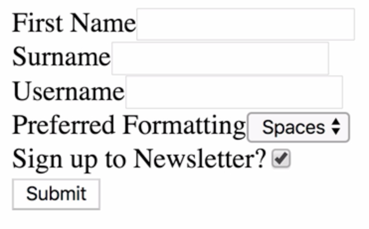
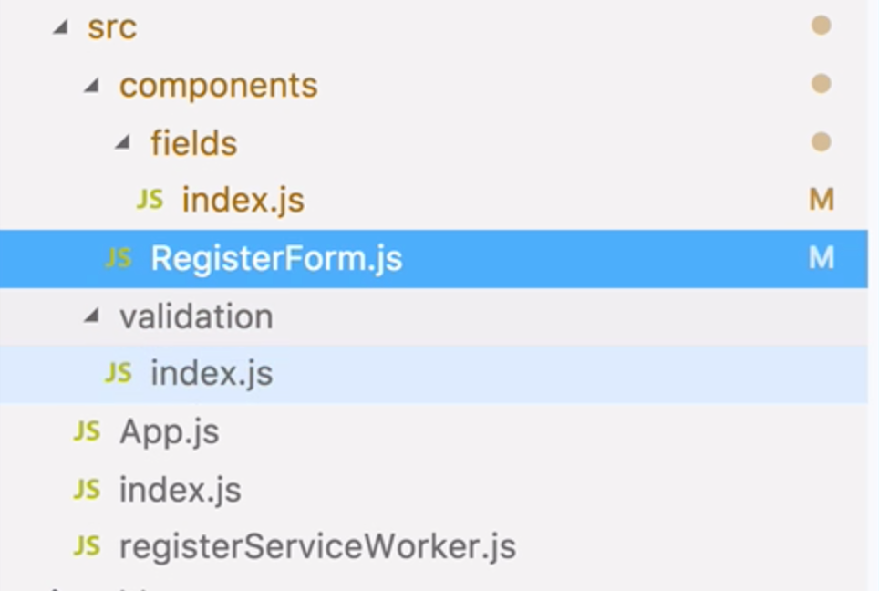
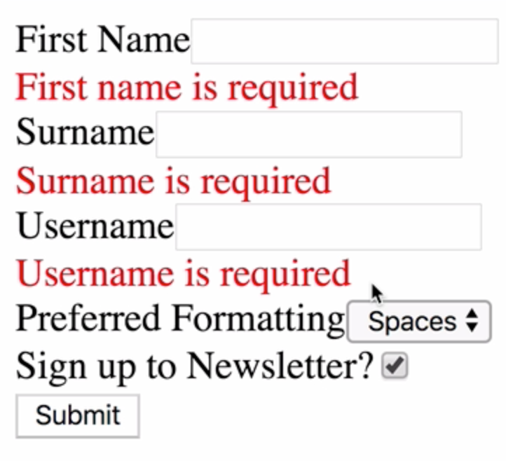
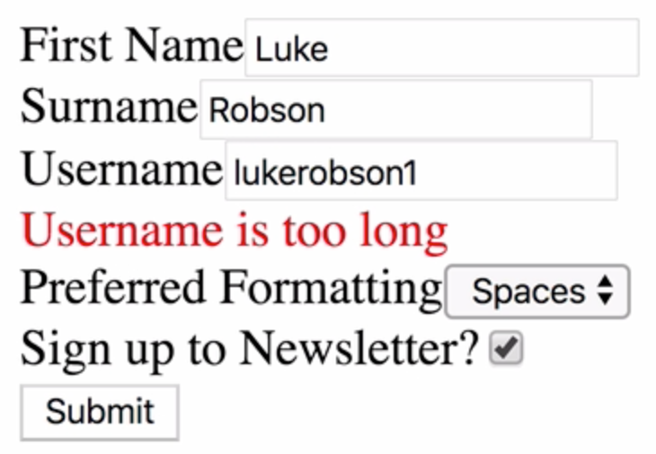

Instructor: 00:00 Let's add some client-side validation to our Redux Form. We've got three fields here at the moment, so let's add a couple more.

00:08 We'll change our `name` Field to `First Name`. We'll add a `Surname` field, and a `Username` field. 

#### RegisterForm.js
```javascript
<form onSubmit={handleSubmit}>
    <Field
      name="firstname"
      component={customInput}
      type="text"
      label="First Name"
    />
    <Field
      name="surname"
      component={customInput}
      type="text"
      label="Surname"
    />
    <Field
      name="username"
      component={customInput}
      type="text"
      label="Username"
    />
    <Field
      name="preference"
      component={customSelect}
      label="Preferred Formatting"
    />
    <Field
      name="newsletter"
      component={customInput}
      type="checkbox"
      label="Sign up to Newsletter?"
    />
    <button type="submit">Submit</button>
</form>
```

Here are our extra fields. 



Let's write some validation for these fields.

00:30 In our source folder, let's make a new folder called validation, and inside there, a new file, index.js. This is where we're going to write a validation function.



00:44 We're going to export a `validate` function which takes a values argument. We're going to create an empty object called `errors`, and we're going to add error messages to this `errors` object which correspond to our form fields, and then we're going to return it.

#### validation/index.js
```javascript
export const validate = values => {
  const errors = {};

  return errors;
}
```


01:07 Let's say we want our `Firstname` field to be required. We can say, `if` `values.firstname` doesn't exist, then `errors.firstname` `=` `First name is required`. Let's do the same for `Surname` and `Username`.

```javascript
if (!values.firstname) {
    errors.firstname = 'First name is required';
  }

  if (!values.surname) {
    errors.surname = 'Surname is required';
  }

  if (!values.username) {
    errors.username = 'Username is required';
  }
```

01:37 We want some further validation on the username. We can say, `if` `values.username.length` `is less than four`, then we can write an appropriate error message to the user. We'll do a similar thing if the Username is too long.

```javascript
  } else if (values.username.length < 4) {
    errors.username = 'Username must be at least 4 characters long';
  } else if (values.username.length > 10) {
    errors.username = 'Username is too long';
  }
  ```

02:07 We're going to want to show these error messages appropriately. In our case, we're going to show them underneath the input field. Let's head back over to our fields.

02:18 We will destructure some values from props to tidy everything up a bit. 

#### fields/index.js
```javascript
export const customInput = props => {
  const { label, input, type, meta } = props;
}
```

And underneath our input, we can say, If there's an `error`, then render a `div` and place the error inside, and we'll give it a red color for the time being.

```javascript
return (
    <div>
      <label>{label}</label>
      <input {...input} type={type} />
      {meta.error && (
          <div style={{ color: 'red' }}>{meta.error}</div>
        )}
    </div>
  );
};
```

02:46 Now we need to hook up our validation to our register form. To do this, we'll head over to our RegisterForm, and we'll `import validate from validation`. 

#### RegisterForm.js
```javascript
import { validate } from '../validation';
```

All we need to do is pass it in to our decorator.

```javascript
RegisterForm = reduxForm({
  form: 'register',
  validate
})(RegisterForm);
```

03:10 Let's save and refresh now, and instantly, we can see our validation errors.



 This isn't great for the user, though, because often, you're not going to want to be shouted at as soon as you come to a register form.

03:27 Let's wait until the user's interacted with the field until we show the error message. To do this, let's head over back to our fields, and we can say, if there's an `error` and the field has been `touched`, then we can show the error message.

#### fields/index.js
```javascript
return (
    <div>
      <label>{label}</label>
      <input {...input} type={type} />
      {meta.error &&
        meta.touched && (
          <div style={{ color: 'red' }}>{meta.error}</div>
        )}
    </div>
  );
};
```

03:47 Now if we enter some values into our form, but we don't enter anything for the user name, let's say, when we go onto the next field, we see the error message. Let's test our user name validation a bit more, and it works.



04:12 One great thing about Redux Form is that when a form is submitted, all of the fields inside become touched by default. This means that if we have a completely pristine form and we hit submit, then we're automatically going to be able to see our validation errors, so the touched property is extremely useful for client-side validation.