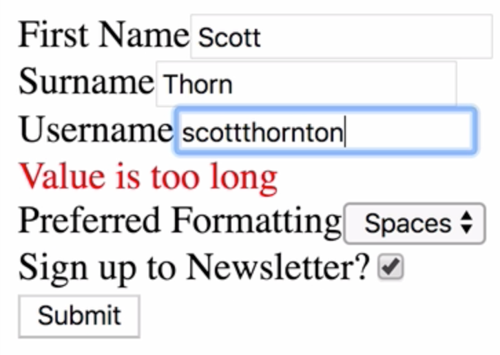

Instructor: 00:00 In our form currently, we're using a validation function to provide synchronous validation to our form. This involves creating an errors object, and adding values to the object corresponding to the names of fields in our form, and we just return the errors object at the end.

00:25 Using Redux Form is another approach to validation, so let's refactor our app so far so that it uses field-level validation. Field-level validation involves passing functions into our fields, so instead of one large validate function, this file is going to contain several functions, each one dealing with a specific validation situation.

00:52 We can have a `required` function, which takes a `value`. We'll return a ternary operator if there is a `value`, and we can return `undefined` as the `error`. Otherwise, we'll return a suitable error message.

01:11 Let's apply the same logic to our `minLength` function, and the same for our `maxLength` function. 

#### validation/index.js
```javascript
export const required = value =>
  value ? undefined : 'Value is required';

export const minLength = value =>
  value.length < 4
    ? 'Value must be at least 4 characters'
    : undefined;

export const maxLength = value =>
  value.length > 10 ? 'Value is too long' : undefined;
```

Now let's head over back to our RegisterForm. Instead of importing validate from validation, we're going to need to `import` the functions that we've just written, so `required`, `minLength`, and `maxLength`.

#### RegisterForm.js
```javascript
import {
  required,
  minLength,
  maxLength
} from '../validation';
```

01:47 Then we can remove the validate function from being passed into our decorator.

```javascript
RegisterForm = reduxForm({
  form: 'register'
})(RegisterForm);
```

The way that we hook this up is to pass in an array to the validate prop on each of our fields.

02:04 For the First Name, we want this to be `required`, same thing for the Surname. 

```javascript
<form onSubmit={handleSubmit}>
  <Field
    name="firstname"
    component={customInput}
    type="text"
    label="First Name"
    validate={[required]}
  />
  <Field
    name="surname"
    component={customInput}
    type="text"
    label="Surname"
    validate={[required]}
  />
```
For the `Username`, let's have `required`, `minLength`, `maxLength`.

```javascript
<Field
  name="username"
  component={customInput}
  type="text"
  label="Username"
  validate={[required, minLength, maxLength]}
/>
```

02:22 Let's save and refresh now, and let's test our values.


 We have the same result as before, so the two separate ways of applying synchronous validation in Redux Form will depend on your own situation and preference.