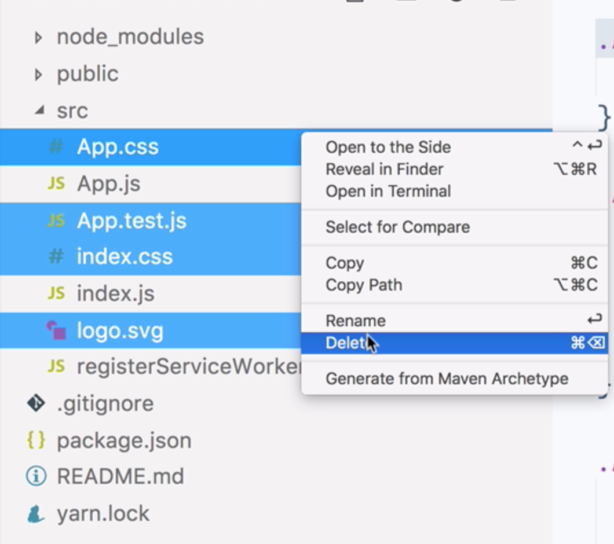

Instructor: 00:00 We're going to use `create-react-app` to bootstrap our new application. Let's call it `awesome-form.` 

```bash
$ create-react-app-awesome-form
```

Then, we can open that in our text editor.

```bash
$ cd awesome-form
$ code .
```

00:13 Firstly, let's get rid of some files that we're not going to need that were provided to us by Create React App. We're not going to need `App.css`, `App.test.js`, `index.css`, or `logo.svg`. 



Next, let's head into `App.js` and we can `remove` the reference to the `logo` and the `.css` file. We can `remove` the `image` from the `render method`.

####App.js
```javascript
import React, { Component } from 'react';
import logo from './logo.svg';
import './App.css';

class App extends Component {
  render() {
    return (
      <div className="App">
        <header className="App-header">
          
          <h1 className="App-title"> Welcome to React </h1>
        </header>
        <p className="App-intro">
          To get started, edit <code>src/App.js</code> and save to
          reload.
        </p>
      </div>
    );
  }
}

export default App;
```

```javascript
import React, { Component } from 'react';

class App extends Component {
  render() {
    return (
      <div className="App">
        <header className="App-header">
          <h1 className="App-title">Welcome to React</h1>
        </header>
        <p className="App-intro">
          To get started, edit <code>src/App.js</code> and save to
          reload.
        </p>
      </div>
    );
  }
}

export default App;
```
00:40 Now, we're going to need to install some dependencies. Let's add `redux`, `react-redux`, and `redux-form`. 

```bash
$ yarn add redux react-redux redux-form 
```

Now, let's hook up Redux and Redux Form to our application. We're going to head to `source/index.js`. We can `remove` the reference to the `.css file`. Let's `import Provider` from `react-redux`. Also, `createStore` and `combineReducers` from `redux` and `reducer` as `formReducer` from `redux-form`.

####index.js
```javascript
import React from 'react';
import ReactDOM from 'react-dom';
import App from './App';
import registerServiceWorker from './registerServiceWorker';
import { Provider } from 'react-redux';
import { createStore, combineReducers } from 'redux';
import { reducer as formReducer } from 'redux-form';
```

01:30 Next, we need to specify redux-forms formReducer as one of our reducers. `const reducers` contains `form`, `formReducer`. 

```javascript
const reducers = {
  form: formReducer
};
```

In a realistic situation, there would be other reducers inside this object because a large application is likely to make use of several reducers, but for the sake of this example, we're just going to use what we need, which is the `formReducer`.

02:03 We still need to use Redux's `combineReducers` method. `const reducer = combineReducers`. We're pass in the `reducers` object. 

```javascript
const reducer = combineReducers(reducers);
```

Next, let's set up our store using Redux's `createStore` method. We need to pass in the `reducer` that we just made.

02:25 Let's also hook up `REDUX_DEVTOOLS`. To do this, we first need to check that the `extension` is available and then `invoke` it if it is. 

```javascript
let store = createStore(
  reducer,
  window.__REDUX_DEVTOOLS_EXTENSION__ &&
    window.__REDUX_DEVTOOLS_EXTENSION__()
);
```

If we haven't done so already, we can install Redux dev tools from the Chrome web store.

02:42 Finally, we need to wrap our app inside React Redux's `Provider` component, passing in the `store`. 

```javascript
ReactDOM.render(
  <Provider store={store}>
    <App />
  </Provider>,
  document.getElementById('root')
);
registerServiceWorker();
```

Now, we're set up and ready to use Redux and Redux Form inside our React application.