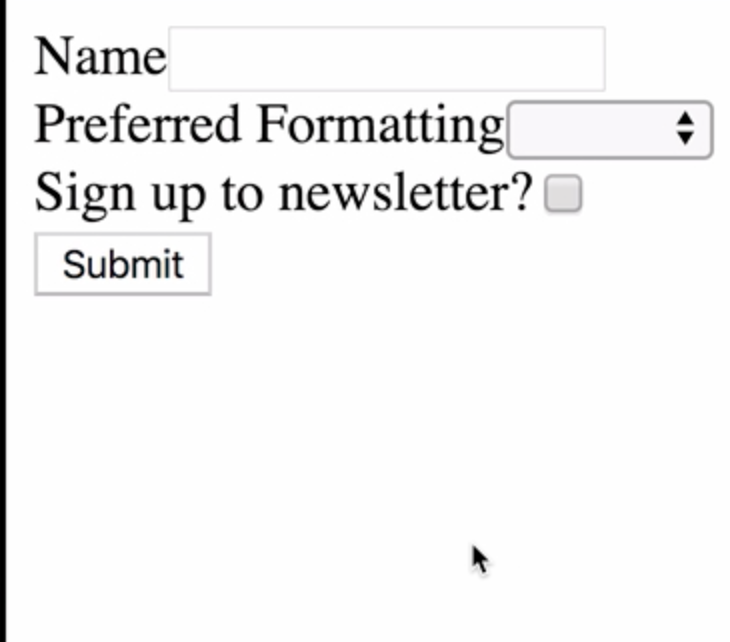
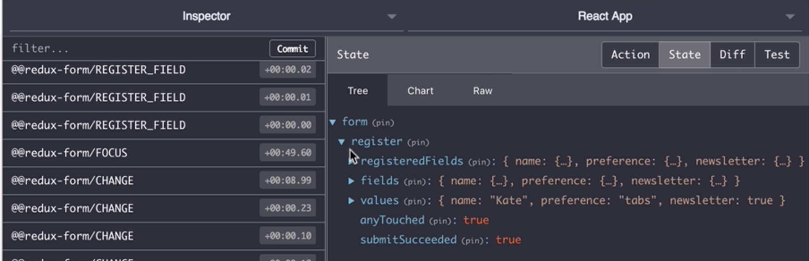

Instructor: 00:01 Let's write a form using Redux form. In our source folder, we'll create a new folder called `components`. Let's add a new file in here. We're going to call it `registerform.js`.


00:14 Let's start writing a simple register form. Firstly, we're going to need to import `React` and its `Component` class. We're also going to need `Field` and `reduxForm` from `redux-form`.

#### RegisterForm.js
```javascript
import React, { Component } from 'react';
import { Field, reduxForm } from 'redux-form';
```

00:31 Let's start writing the `Component`. We're going to call it `RegisterForm`. At the moment, all we need is a `render` method. We're going to write a `form`, and there are going to be `three fields` inside.

```javascript
class RegisterForm extends Component {
  render() {
    return (
      <form>
        <div></div>
        <div></div>
        <div></div>
      </form>
    );
  }
}
```

00:46 The first field is going to be a `Name` field, and we're going to use Redux form's `Field` `component`. We'll pass it a `name` of `name`, a `component` of `input` and a `type` of `text`. We need to pass in the name prop as an identifier for our field. The component prop refers to the html element.

```javascript
        <div>
          <label>Name</label>
          <Field name="name" component="input" type="text" />
        </div>
```

01:16 By passing input here as our component, we're going to render an html input element. It's going to be a text input. 

In our second field, we're going to have `Preferred Formatting`. We're going to use the `Field` `component` again, we'll call it `preference`.

01:35 This time, we're going to use a select element. Let's pass in some options to our select field. We'll have a blank option as the `default`. One option with the value of `tabs`, and one with `spaces`.

```javascript
<div>
  <label>Preferred Formatting</label>
  <Field name="preference" component="select">
    <option />
    <option value="tabs">Tabs</option>
    <option value="spaces">Spaces</option>
  </Field>
</div>
```
01:55 In the last field, let's use a `checkbox`. The label can be, `"Sign up to newsletter."` Once again, we will use the `Field component`. The name can be `newsletter`. `Component` will be `input`, but this time, the `type` is going to be `checkbox`.

```javascript
<div>
  <label>Sign up to newsletter?</label>
  <Field
    name="newsletter"
    component="input"
    type="checkbox"
  />
</div>
```

02:17 We're going to need a submit button for this form, let's set that up. 

```javascript
<button type="submit">Submit</button>
```

Of course, we'll need to hook up the `onSubmit` method of our form. `OnSubmit`, we're going to pass in a method, `handleSubmit`. That's going to come from `props`.

```javascript
class RegisterForm extends Component {
  render() {
    const { handleSubmit } = this.props;
    return (
      <form onSubmit={handleSubmit}>
        <div>
          <label>Name</label>
          <Field name="name" component="input" type="text" />
        </div>
        <div>
          <label>Preferred Formatting</label>
          <Field name="preference" component="select">
            <option />
            <option value="tabs">Tabs</option>
            <option value="spaces">Spaces</option>
          </Field>
        </div>
        <div>
          <label>Sign up to newsletter?</label>
          <Field
            name="newsletter"
            component="input"
            type="checkbox"
          />
        </div>
        <button type="submit">Submit</button>
      </form>
    );
  }
}
```

02:38 Let's destructure that now. We need to decorate this component using our `reduxForm` decorator. Underneath the component, we can say `RegisterForm = reduxForm`. Inside the object that we pass to `reduxForm`, we need to pass a `form` name.

03:00 Let's call this one `register`. That's going to decorate our `RegisterForm` component. Now, we'll need to `export` this wrapped component. 

```javascript
RegisterForm = reduxForm({
  form: 'register'
})(RegisterForm);

export default RegisterForm;
```
Let's hook this component up to our `source/app.js` file.

03:18 We'll need `React` and React `Component`. We'll need to import the `RegisterForm` that we just wrote. 

#### App.js
```javascript
import React, { Component } from 'react';
import RegisterForm from './components/RegisterForm';
```

This component is going to act as a container for our form, we'll call it `registerFormContainer`.

03:38 The `render` method is simply going to return `RegisterForm`, and we pass it an `onSubmit` method, `this.submit`. Let's write that submit method now. The submit method can be a narrow function, which takes a value's argument.

03:58 We're just going to alert whichever values we get back from the form. We're going to use `JSON.stringify`, passing in `values`. We'll `indent` each line with `four` spaces. Let's `export` the component.

```javascript
class RegisterFormContainer extends Component {
  submit = values => {
    window.alert(JSON.stringify(values, null, 4));
  };

  render() {
    return <RegisterForm onSubmit={this.submit} />;
  }
}

export default RegisterFormContainer;
```

04:18 Let's save everything now, and we'll open our terminal and run yarn start. 

```bash
$ yarn start
```

Here, we have our form: 



Let's test it to make sure it works: 


Here's our alert returning the values:

 


Let's open up our dev tools, and we'll head to the Redux pane.

04:41 We can see here that there are many events that have occurred to our form that have been tracked automatically for us in Redux form. For example, these focus events have fired every time we focused a field. An onChange event is fired every time a field is changed. If we look at the Redux state, we can see that all of our form values are stored.

