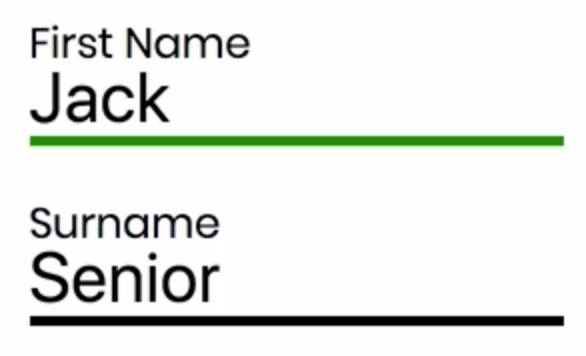

Instructor: 00:00 Using Redux Form, we can use normalization to format the user's input. For example, we could ensure that the user's first name and surname are capitalized, regardless of how they type the values into the fields.

00:15 The demonstrate this, let's go ahead and add capitalize as a dependency. 

```bash
$ yarn add capitalize
```

We can import that in our register form. 

#### RegisterForm.js
```javascript
import capitalize from 'capitalize';
```

Now, we can use the normalize prop, and pass in the capitalize function. Let's apply this to the first name and the surname. Of course, you could pass whichever function you wanted in here.

```javascript
<Field
  name="firstname"
  component={customInput}
  type="text"
  label="First Name"
  validate={[required]}
  normalize={capitalize}
/>
<Field
  name="surname"
  component={customInput}
  type="text"
  label="Surname"
  validate={[required]}
  normalize={capitalize}
/>
```

00:45 Let's save and refresh now. Now, even if I type everything lowercase, the values are capitalized.

