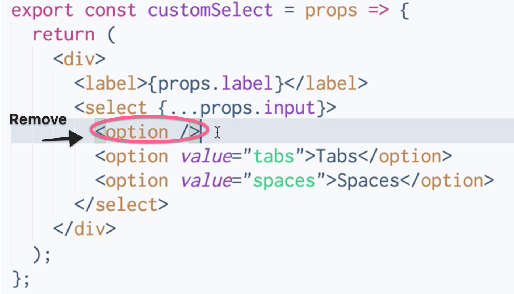
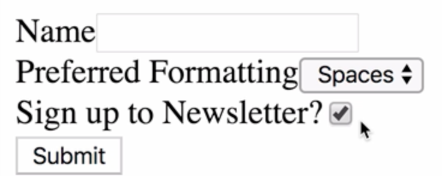

Instructor: 00:01 There may be situations in which we want to set initial values for fields in our form. In redux-form, we can achieve this by passing in an `initialValues` prop to our form component.

00:16 Let's pass `initialValues` in as a prop to `RegisterForm`. We're going to pass `this.getInitialValues`. 

#### App.js
```javascript
render() {
    return (
      <RegisterForm
        onSubmit={this.submit}
        initialValues={this.getInitialValues()}
      />
    );
  }
}
```


Let's write `getInitialValues`, and we're going to return an object containing some `initialValues` for our form.

00:37 To do this, we need to specify the name of the form Field. If we look in our RegisterForm, we have `name`, `preference`, and `newsletter`. In our `initialValues`, let's `return` an object. The object keys will correspond to the names of our form fields. Let's say `preference` is `spaces` by default, and `newsletter` is `true` by default.

```javascript
getInitialValues() {
    return {
      preference: 'spaces',
      newsletter: true
    };
  }
```

01:11 Then, let's head over to our fields, and we can remove this empty option from our custom select component. 

#### index.js


Let's save and refresh. Now we have the `initialValue` set up. Preferred Formatting is set to `spaces` and Sign up to Newsletter is set to `true`.

