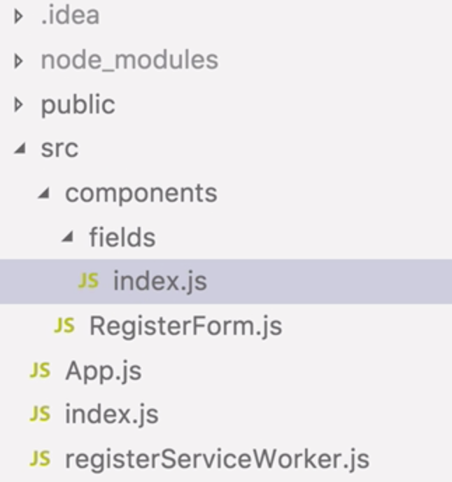
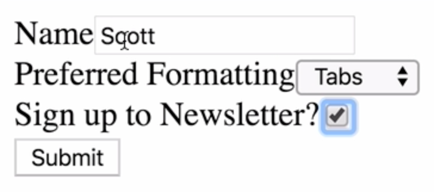
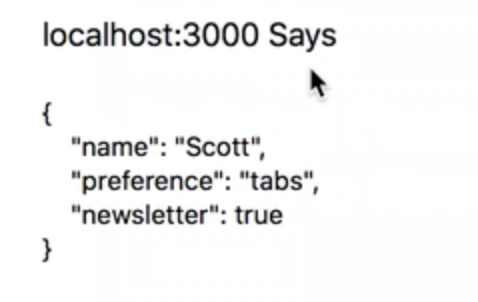

Instructor: 00:00 Currently, we're passing a string as the component prop into our Redux form field component. Often, though, we're going to want more control over what gets rendered as part of this field.

00:15 Fortunately, we can pass a custom component as the component prop, and it can be a React class component or a simple functional component. What we're going to do is abstract each field into its own custom component.

00:30 Let's start by heading into `source/components` and create a new folder called `fields`. Inside there, a new file, `index.js`. 



In this file, we're going to need to `import React`. We're going to write a `customInput` field -- which takes `props` -- and a `customSelect`. These are functional components that don't need to extend React's component.

#### index.js
```javascript
import React from 'react';

export const customInput = props => {

}

export const customSelect = props => {

}
```

01:08 Let's abstract out these fields away from our RegisterForm component. We'll take the container `div` and `label`. Inside here, we can use our input field. To make this a reusable component, our label needs to come from the `props` that we pass in. So does the type of `input`.

01:36 Furthermore, we need to attach ReduxForm's input object to hook it up to Redux. To do that, we just pass in `props.input` to our input field. 

```javascript
import React from 'react';

export const customInput = props => {
  return (
    <div>
      <label>{props.label}</label>
      <input {...props.input} type={props.type} />
    </div>
  );
};
```


We need to apply the same principle to our custom select field, let's head back to `RegisterForm`.

01:55 We'll take the `div` and the `label`. Again, the `label` will come from `props`. Set up the `select` field, and we'll take our `option` field across. Again, we need to make sure that this is hooked up to Redux by passing in `props.input`.

```javascript
export const customSelect = props => {
  return (
    <div>
      <label>{props.label}</label>
      <select {...props.input}>
        <option />
        <option value="tabs">Tabs</option>
        <option value="spaces">Spaces</option>
      </select>
    </div>
  );
};
```


02:24 Let's hook our `customInput` and `customSelect` components up to our `RegisterForm`. We're going to want to `import` `customInput` and `customSelect` from the `fields` directory. 

#### RegisterForm.js
```javascript
import { customInput, customSelect } from './fields';
```

In our render method, we can use those components.

02:48 The `name` is going to be the same. A component is going to refer to our `customInput` component. The `type` is going to be the same, and we need to pass in a `label`. Because now, it's being dealt with in the `props`.

03:04 `label=name`. 

```javascript
class RegisterForm extends Component {
  render() {
    const { handleSubmit } = this.props;
    return (
      <form onSubmit={handleSubmit}>
        <Field
          name="name"
          component={customInput}
          type="text"
          label="Name"
        />
```

We can apply the same principle to our `select` field. The name is the same. The component becomes `customSelect`, and we'll pass in the `label`. 

```javascript
<Field
  name="preference"
  component={customSelect}
  label="Preferred Formatting"
/>
```

Our checkbox can reuse our `customInput` component.

03:27 Let's copy this `field` and paste it in place of our old checkbox. The name is `newsletter`, the component is `customInput`. But the type is `checkbox`, and we pass in the `label`. Let's save everything, and we'll refresh the page now.

```javascript
<Field
  name="newsletter"
  component={customInput}
  type="checkbox"
  label="Sign up to Newsletter?"
/>
```

03:49 Let's give it a quick test. 



We get our form values back. 



The result of our app hasn't changed, but now, we're in a position to be able to use custom, reusable components as our form fields.