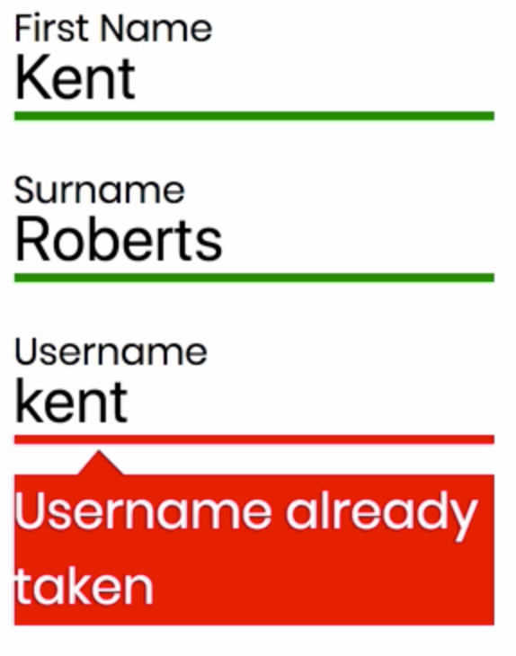
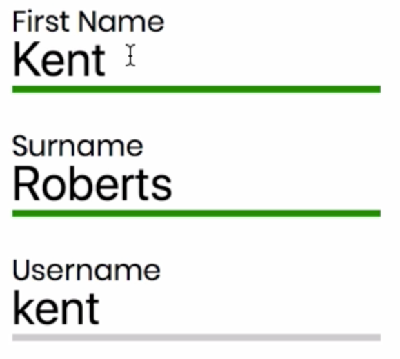

Instructor: 00:00 Using Redux Form, we can provide asynchronous validation when the form is submitted. In this example, we're checking to see if the user's specified username is available. We can also perform this task as the form is being filled out, we wouldn't need to wait until submit.

00:20 To do this, let's go to the submit method of our registered form container. We're going to cut the if statement, which checks if the username is available. The submit method is going to simply be an alert that shows the values of the form field.

00:39 Then we're going to head over to validation/index.js, which is where the rest of our validation functions live. We'll write a new function called `asyncValidate` which takes values. Here, we can paste in the if statement from before.

01:01 Instead of throwing a submission error which comes from Redux Form, we can just return `promise.reject`, passing in an object. The object key corresponds to the name of the form field.

01:19 Currently, we'll be able to see the results of this function immediately. In a real-world situation, we would need to wait until the database is queried. Let's simulate some latency.

01:33 We'll write a function called `sleep`, which takes `milliseconds` and returns a `Promise`. We're going to use `setTimeout`, passing in `resolve` and the `milliseconds` value. Then, we can use `async` `await` to provide one second of time until this is evaluated.

#### validation/index.js
```javascript
export const asyncValidate = values => {
  const sleep = ms => new Promise(resolve => setTimeout(resolve, ms));
  return sleep(1000).then(() => {
    if (['kent', 'andy', 'john', 'joel'].includes(values.username)) {
      return Promise.reject({
        username: 'Username already taken'
      });
    }
  });
};
```

02:02 Now, let's hook this to our `RegisterForm`. We need to import `asyncValidate` from `validation`. 

#### RegisterForm.js
```javascript
import {
  required,
  minLength,
  maxLength,
  matchesPassword,
  asyncValidate
} from '../validation';
```

Inside our decorator, we need to pass in `asyncValidate`, but we also need to specify the fields which will be asynchronously validated.

02:23 To do this, we provide `asyncBlurFields`, which is an array. In this case, we're going to pass `username`. 

```javascript
RegisterForm = reduxForm({
  form: 'register',
  asyncValidate,
  asyncBlurFields: ['username']
})(RegisterForm);
```

Let's save and refresh now.

02:39 Now, we get our "Username already taken" message as soon as we blur the field. The user doesn't need to wait until they submit to find out this information. However, because of the green border which turns red, it appears as though the value becomes valid, and then instantly becomes invalid.



03:02 Ideally, we want to show the user that something is happening while we get the information from the server. Let's add some styles which assist the user.

03:15 We're going to head over to fields/index.js, which is where our form fields are. Inside our `getValidity` class name function, we're going add an if statement, and the meta object will provide us with whether or not the field is asynchronously validating.

03:38 We can say `meta.asyncValidating`. `if` this is true, let's return `async-validating`. This will add `async-validating` as a `className` to our `customInput` outer `div`.

#### fields/index.js
```javascript
const getValidityClassName = meta => {
  if (meta.asyncValidating) {
    return 'async-validating';
  }
```

03:58 Now, let's open our CSS file. At the bottom, we can add `async-validating`. We want to target the `input`. The `border-color` can be `gray` to differentiate between either red or green. We're going to use an `animation` which is going to `pulse` between gray and white. This will give the impression that some action is happening.

04:27 The `animation-iteration-count` is `infinite`, and the `animation-duration` is `1.4 seconds`. 

#### RegisterForm.css
```javascript
.async-validating input {
  border-color: gray;
  animation-name: grey-pulse;
  animation-iteration-count: infinite;
  animation-duration: 1.4s;
}
```

Now, let's write our gray pulse animation. At `zero percent`, `border` is gray. At `50 percent`, it's very light gray, almost white, and at `100 percent`, back to gray.

```javascript
@keyframes grey-pulse {
  0% {
    border-color: grey;
  }
  50% {
    border-color: #eee;
  }
  100% {
    border-color: grey;
  }
}
```

05:02 Let's save and refresh now, and let's add some information. Now when we enter our username field and blur the field, we can see the border change color. This is happening in the one second of time which we added with our mock latency.



05:24 This will get reevaluated every time the field is blurred. In this case, we have a valid username, the border goes back to green.