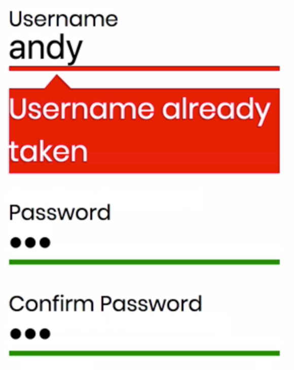

Instructor: 00:00 let's add some submit validation to our form. When the user hits submit, we're going to check if their user name already exists and return an appropriate error message. To do this, we firstly need to `import` `SubmissionError` from `redux-form` inside our app component, which is used to differentiate IO errors from validation errors.

#### App.js
```javascript
import { SubmissionError } from 'redux-form';
```

00:26 Inside our `submit` method, which is being fired on submit, we're going to add an `if` statement. The alert that we have down here is going to come in the `else` section. Here's where we're going to check to see if the `username` is available. In the real world, we would query our database, but for the sake of this example, we'll mark some already-taken user names.

00:57 If our username is one of those, then we want to throw a new `SubmissionError`, passing in an object, and the object keys must pertain to form field names, in this case, username, and the value can be an appropriate error message.

```javascript
class RegisterFormContainer extends Component {
  submit = values => {
    if (['kent', 'andy', 'john', 'joel'].includes(values.username)) {
      throw new SubmissionError({
        username: 'Username already taken'
      });
    } else {
      window.alert(JSON.stringify(values, null, 4));
    }
  };
```

 Let's save and refresh. We'll add some example values.

01:27 I've used a user name which is already taken. I'll hit submit. Here's the appropriate error message.

