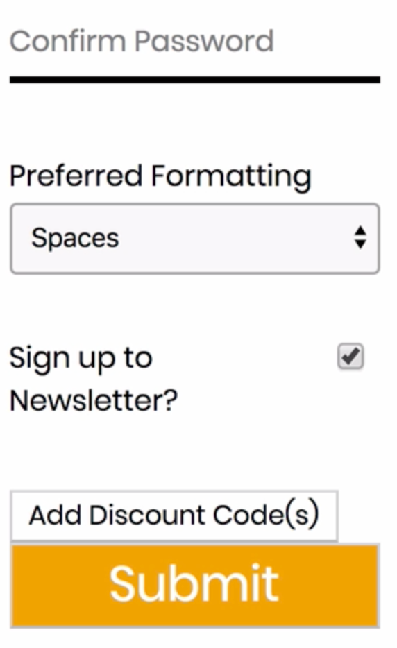
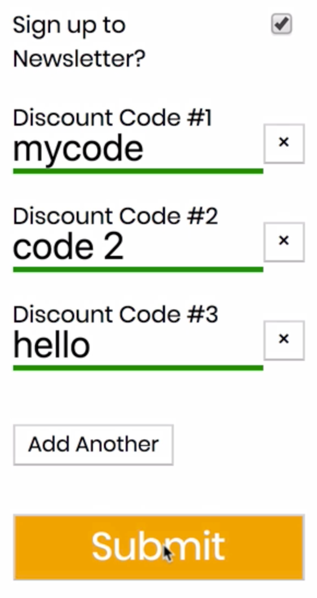
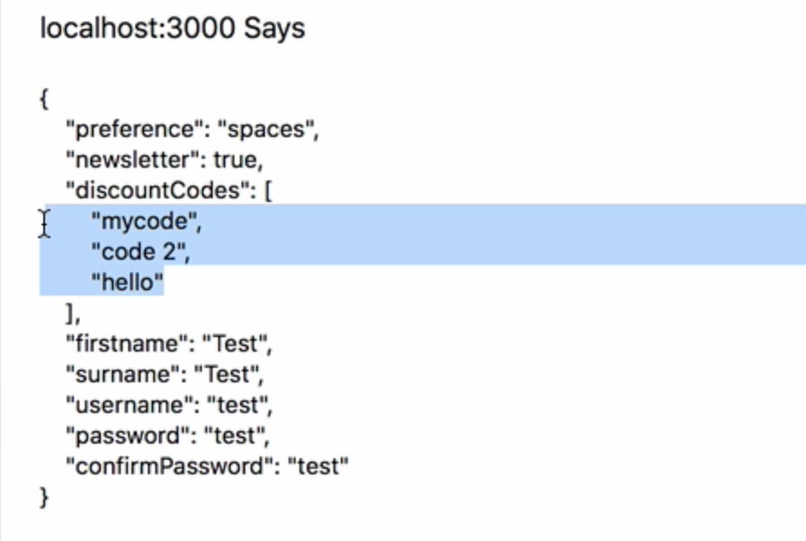

Instructor: 00:00 Here we have a form containing some text fields, a select field and a check box. Let's add a section which allows the user to add and remove discount codes. There could be any number of discount codes.

00:16 We'll head over to fields/index.js where the rest of our fields live. We're going to write a new stateless component called `discounts`. It's going to have `fields` as its prop. It's going to return `div` with the `className`, `custom-field-array-container`.

00:44 Then we're going to map over the `fields` in our props. Code will correspond to the discount `code` and we'll return a `div` using the `index` as the `key` and the `className` `field-array-item`.

#### fields/index.js
```javascript
export const discounts = ({ fields }) => (
  <div className="custom-field-array-container">
    {fields.map((code, index) => (
      <div key={index} className="field-array-item">
    ))}
  </div>
```

01:03 Now we're going to use `redux-form` `Field` component. Let's go ahead and import that. 

```javascript
import { Field } from 'redux-form';
```

We'll create a new `Field`. The `name` can be the `code`. Its `type` is `text`. The `components` it uses is the `customInput` component which is up here, and we'll provide a label which will be `Discount Code` with the `index`.

01:35 For each of these fields we'll add a `button` which allows us to delete a discount code. To do that we'll just provide an `onclick` method in passing a function, and we can return `fields.remove` passing in the `index`. The remove method is provided to us by a redux-form as the button's text. We'll use a cross sign.

```javascript
<div key={index} className="field-array-item">
  <Field
    name={code}
    type="text"
    component={customInput}
    label={`Discount Code #${index + 1}`}
    autoFocus
  />
  <button type="button" onClick={() => fields.remove(index)}>
    &times;
    </button>
</div>
```

02:05 Now we need to provide a button that allows us to `add` `Discount Codes`. This time we provide an `onClick` method, and we just need to say `fields.push`. The text will depend on how many discount codes are already rendered.

02:28 We can say if there are no fields add the discount codes, otherwise add another. Let's provide `autoFocus` so that the field order fixes as soon as it renders on the page. 

```javascript
<button type="button" onClick={() => fields.push()}>
  Add {!fields.length ? 'Discount Code(s)' : 'Another'}
</button>
```
Because we're passing that into our custom input, we need to be explicit about the auto focus.

02:50 On our input field we can say `autoFocus` equals `props.autoFocus`. 

```javascript
<input {...input} type={type} autoFocus={props.autoFocus} />
```

Now let's hook this up to our RegisterForm, and at the bottom we're going to add `FieldArray`, put the name `discountCodes`, and the `component` is `discounts`.

#### RegisterForm.js
```javascript
<Field
  name="newsletter"
  component={customInput}
  type="checkbox"
  label="Sign up to Newsletter?"
/>
<FieldArray name="discountCodes" component={discounts} />
<button type="submit">Submit</button>
```

03:13 We'll need to `import` `FieldArray` from `reduxForm` and `discounts` from the function we just wrote. `FieldArray` from `reduxForm` and `discounts` from `fields`. 

```javascript
import { Field, FieldArray, reduxForm } from 'redux-form';
import { customInput, customSelect, discounts } from './fields';
```

Lastly, let's open our CSS file, and we'll add some CSS for the `field-array-items`. They're going to be `display` `flex` and `justify-content` `space-between`.

03:43 The `field-array-item` button can have `align-self start`. 

#### RegisterForm.css
```css
.field-array-item {
  display: flex;
  justify-content: space-between;
}

.field-array-item button {
  align-self: start;
}
```

Let's save and refresh now. Here's the add discount codes button. 



Let's provide some spacing to it by heading to the selector for `custom-input-container` and `custom-select-container`, and we'll add `custom-field-array-container`.

```css
.custom-input-container,
.custom-select-container,
.custom-field-array-container {
  position: relative;
  margin: 0 0 25px 0;
}
```

04:14 Here's the spacing. When we click on it, we have this new field appear. Now we can add some discount codes. 



Let's ensure that they get attached to our form data correctly. We'll provide some values for the required fields, and we'll hit submit.

04:39 Here are form values so the discount codes array contains one of our codes along with the rest of the data. If we want to, we can delete these fields from our form.

