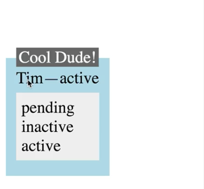
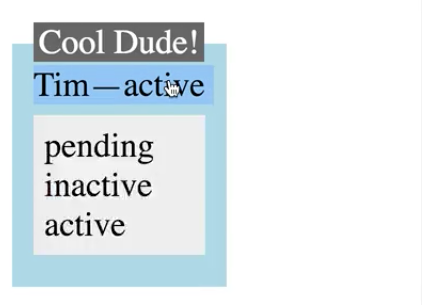
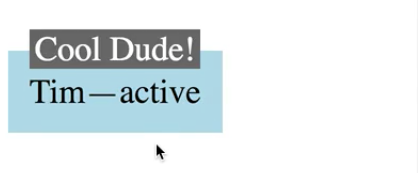

I want to be able to click the status and show and hide this list of other statuses. I also want to be able to hover over the name and show this tooltip, and I'd like it to go away when I `mouseOut`. 



We can use `withState()` and `withHandlers()` from **Recompose** to accomplish this. First, let's work on the `status`.

I'm going to add a `withState()` higher-order component here. It takes three properties -- the name of the state object that's going to hold the actual state value, then give it the name of the method that you'll be able to call to change the `'listShown'` variable, and the third parameter is your initial state. We'll set that to `false`. We need to wrap the functional stateless component in parens.

```jsx
const Status = withState('listShown', 'setListVisible', false)(({ status }) => 
    <span>
        { status }
        <StatusList />
    </span>
);
```

Now, our functional stateless component will receive `'listShown'` and `'setListVisible'` in addition to its normal props. We'd like to only show the `StatusList` if `'listShown'` is `true`. When we click on the span, we want to `'setListVisible'` to the opposite of whatever it was before.

You can either call `setListVisible()` directly with a value, like `true` or `false`, or you can call it with a function. In this case, you get the previous value. We can set it from `x` to `!x`. That will act as a toggle. 

```jsx
const Status = withState('listShown', 'setListVisible', false)(({ status, }) => 
    <span onClick={ () => setListVisible((x) => !x) }>
        { status }
        { listShown && <StatusList /> }
    </span>
);
```

When I save and refresh, it goes away, but now I'm able to click to show and hide it.

####Shown


####Hidden


I've added local state to this functional stateless component without using a `React.createClass()` or `extends` class method.

Now let's do the `Tooltip`. We're going to do the same thing. We'll call this state variable `'tooltipShown'`, and we'll call this method `'setTooltipVisible'`. We'll start this one with `false` also. Now we only want to show the `Tooltip` if `'tooltipShown'` is `true`. We have to make sure we're importing it, so we're going to get `'tooltipShown'` and `'setTooltipVisible'` in as props because of the `withState()` higher-order component. 

```jsx
const Tooltip = withState('tooltipShown', 'setTooltipVisible', false)(
    ({ text, children, tooltipShown, setTooltipVisible }) =>
    <span>
        { tooltipShown && <div className="Tooltip">{ text }</div> }
        <span onMouseEnter={ () => setTooltipVisible(true) }
            onMouseLeave={ () => setTooltipVisible(false) }>{ children }</span>
    </span>
);
```

Next `onMouseEnter`, we want to set the `tooltipVisible` to `true`. Here we're using just a raw value instead of a function. `onMouseLeave`, we want to set the `tooltipVisible` to `false`.

When I save and refresh, now I can hover over and leave the name to see a `Tooltip`. 


I can also click this to show the status. This is pretty good, but one cool thing about higher-order components is creating your own higher-order components that you can reuse across different scenarios. These two scenarios are similar. We're showing and hiding something.

Let's create a `withToggle` higher-order component. `withToggle` is going to have to `compose` a couple of different things. We'll set up `withState()` with the variable of `'toggledOn'` as our `true` / `false` variable. We'll have a method called `'toggle'`. We'll start it as `false`.

```jsx
const withToggle = compose(
    withState('toggledOn', 'toggle', false),
);
```

Next we want to use `withHandlers()`. `withHandlers()` takes an object where every key is the name of the handler that you'd like to pass into your component. We'll add a handler called `show`. Then the function takes in the props. We want to pull the `toggle` method off of that.

You need to return another function, and this is going to be your actual handler function. This is the function that would receive the event object. I'll type `e` because I'm not going to be using it. Then here we get to call the `toggle` method. We want to set it to `true` because we're going to `show`. Next we'll do the same thing for `hide`. We will toggle it `false`.

```jsx
const withToggle = compose(
    withState('toggledOn', 'toggle', false),
    withHandlers({
        show: ({ toggle }) => (e) => toggle(true),
        hide: ({ toggle }) => (e) => toggle(false)
    })
);
```

Last, we will make one called `toggle` as a convenience. It will override the `'toggle'` defined here in `withState`. We'll call `toggle`, but this time we'll use the function signature. We'll get the `'current'` value, and we'll flip it. Now we have a general purpose with toggle higher-order component.

```jsx
const withToggle = compose(
    withState('toggledOn', 'toggle', false),
    withHandlers({
        show: ({ toggle }) => (e) => toggle(true),
        hide: ({ toggle }) => (e) => toggle(false)
        toggle: ({ toggle }) => (e) => toggle((current) => !current)
    })
);
```

Let's go replace what we've got down here in `Status`. We can replace this `withState` in `Toolip` as well. These now will take in `toggledOn` as the variable holding the state. `Status` will take in the `toggle` function, while `Tooltip` will take in the `show` and `hide` functions.

```jsx
const Status = withToggle(({ status, toggledOn, toggle }) => 
    ...
);

const Tooltip = withToggle(({ text, children, toggledOn, show, hide }) =>
    ...
);
```

We can replace the entirety of this `setListVisible` function in the `onClick` within `Status` with just a reference to `toggle`, and we have to change `listShown` to `toggledOn`. When it's `toggledOn`, show `<StatusList />`. Every time we click it, call `toggle`. 

```jsx
const Status = withToggle(({ status, toggledOn, toggle }) => 
    <span onClick={ toggle }>
        { status }
        { toggledOn && <StatusList /> }
    </span>
);
```

Because we're using `mouseEnter` and `mouseLeave` down here in `Tooltip`, we'll replace the functions within `mouseEnter` and `mouseLeave` with `show` and `hide`. `tooltipShown` needs to change to `toggledOn`. 

```jsx
const Tooltip = withToggle(({ text, children, toggledOn, show, hide }) =>
    <span>
        { toggledOn && <div className="Tooltip">{ text }</div> }
        <span onMouseEnter={ show } onMouseLeave={ hide }>{ children }</span>
    </span>
);
```

When `toggledOn`, `show` the `Tooltip`. `show` it on enter and `hide` it on leave. Should be able to refresh the page and see the exact same behavior.