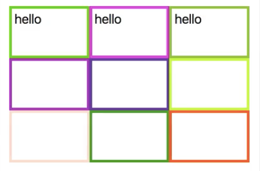

I have an example app here. It's a `Spreadsheet` with nine cells. When I type into a `Cell`, you can see that every `Cell` is re-rendered. This is indicated by the border color changing. I prefer if, when I type into a `Cell`, that only that `Cell` re-renders, and the others shouldn't.



Let's look how `data` flows through my application.

I have the `Cell` component. It takes in `data`, an `onChange` handler, and a `width`. The `data` is passed directly to a `textarea` as the `value`. When the `textarea` changes, it triggers the `onChange` handler.

```html
const Cell = ({ data, onChange, width }) =>
    <div
        className="Cell"
        style={{
            width: `${width}%`
            borderColor: randomColor()
        }}
    >
        <textarea type="text" value={ data } onChange={ onChange } />
    </div>;
```

Next, I have the `Spreadsheet` component. You tell it how many `rows` and `cols` you want, and you pass it all the `cellsData`. You also pass it an `onCellChange` handler.

I'm mapping over the `rows`, and then I'm internally mapping over the `cols`. I'm creating a unique ID of the row and column indexes, and I'm using that ID to pass to the `Cell` as its own ID, as well as how to retrieve it from the `cellsData`.

Additionally, when the `Cell` changes, I call `onCellChange` with the `id` of which `Cell` to change, and the new `value` I want to change it to.

```html
const Spreadsheet = ({ rows, cols, cellsData, onCellChange }) =>
  <div className="Spreadsheet">
    { range(rows)
        .map((row, i) =>
          range(cols)
            .map((col, j) => `${i}-${j}`)
            .map(id =>
              <Cell
                key={ id }
                id={ id }
                data={ cellsData[id] || '' }
                onChange={
                  (e) => onCellChange(id, e.target.value)
                }
                width={ 100/cols }
              />)) }
  </div>;
```

Lastly, I have this `App` component. It's enhanced with a couple of **Recompose** higher-order components. I'm passing in three `rows`, three `cols`, all my `cellsData`, and when a `Cell` changes, I want to call `setCellState`.

```html
const App = enhance(({ cellsData, setCellState }) =>
  <div className="App">
    <Spreadsheet
      {...{ rows: 3, cols: 3, cellsData, onCellChange: setCellState }}
    />
  </div>
);

```

`setCellState` is declared here with the `withHandlers` higher-order components. It's building upon this `withState` higher-order component, and I'm storing my state into a prop called `cellsData`.

Whenever I set a `Cell` state, I'm going to call `setCells`. I'm going to de-structure all of the existing `cellsData`, but then I'm going to set my one new `Cell` to the new `value`. Now that we have that out of the way, let's go optimize `Cell`.

```html
const enhance = compose(
    withState('cellsData', 'setCells', {}),
    withHandlers({
        setCellState: ({ cellsData, setCells }) => (id, val) =>
            setCells({
                ...cellsData,
                [id]: val
            })
    })
);
```

I'll write a higher-order component called `optimize`, and I'm just going to pass it `pure`. I'm going to go ahead and decorate my `Cell` component with my new `optimize` higher-order component. Now, let's refresh and see the behavior.

```html
const Cell = optimize(({ data, onChange, width }) =>
    <div
        className="Cell"
        style={{
            width: `${width}%`
            borderColor: randomColor()
        }}
    >
        <textarea type="text" value={ data } onChange={ onChange } />
    </div>
);
```

It still behaves the same. The `pure` higher-order component is going to check every single prop, pass the `Cell` on every prop change. It'll compare the old props and the new props. If any of them do not pass a shallow equal test, then `Cell` will be re-rendered.

Why, when I type into this top-left `Cell`, do all of the cells still update? Their `data` is not changing, and their `width` is not changing. It must be the `onChange` handler. This is a common problem when trying to take advantage of the `pure` higher-order component.

You can see here in `Spreadsheet` that on every render, we're passing in a new, anonymous function. 

```html
const Spreadsheet = ({ rows, cols, cellsData, onCellChange }) =>
  <div className="Spreadsheet">
    { range(rows)
        .map((row, i) =>
          range(cols)
            .map((col, j) => `${i}-${j}`)
            .map(id =>
              <Cell
                key={ id }
                id={ id }
                data={ cellsData[id] || '' }
                onChange={
                  {/* v HERE v */}
                  (e) => onCellChange(id, e.target.value)
                  {/* ^ HERE ^ */}
                }
                width={ 100/cols }
              />)) }
  </div>;
```

Let's fix that. I'm just going to pass a reference to `onCellChange` instead. This reference will never change, but we have to do the work that we were doing somewhere. Let's do the work inside of this `optimize` higher-order component.

```html
const Spreadsheet = ({ rows, cols, cellsData, onCellChange }) =>
  <div className="Spreadsheet">
    { range(rows)
        .map((row, i) =>
          range(cols)
            .map((col, j) => `${i}-${j}`)
            .map(id =>
              <Cell
                key={ id }
                id={ id }
                data={ cellsData[id] || '' }
                onChange={
                  {/* v HERE v */}
                  onCellChange
                  {/* ^ HERE ^ */}
                }
                width={ 100/cols }
              />)) }
  </div>;
```

Now I need to use `compose` because I'm going to be using more than one higher-order component. I'll use `withHandlers` to overwrite the `onChange` prop that's coming in, with a new `onChange` prop that I'll define here.

```html
const optimize = compose(
    pure, 
    withHandlers({
        onChange: ({})
    })
);
```

I'll pull off the `id` and the original `onChange` prop. I'll grab the event, and I'll call the original `onChange` prop with the `id`, and the `e.target.value`, just like I was doing before. Now, let's refresh. This is great. Now, when I type into this top-left field, only the top-left field is updating.

```html
const optimize = compose(
    pure, 
    withHandlers({
        onChange: ({ id, onChange }) => (e) => onChange(id, e.target.value)
    })
);
```

An alternative to `pure` is `onlyUpdateForKeys`. You configure this higher-order component by passing it an array of all the keys that you actually care about. In this case, we only care about `data`, and `width`, and `onChange`.

```html
const optimize = compose(
    onlyUpdateForKeys(['data', 'width', 'onChange']),
    withHandlers({
        onChange: ({ id, onChange }) => (e) => onChange(id, e.target.value)
    })
);
```

This is nice because it offers some protection. What if the user of your component passes extraneous props? `onlyUpdateForKeys` protects against that by declaring just the props that you actually care about. If I refresh this, again, you can see it's still working as before.

What if I want to declare some `PropTypes` here? I can use the `setPropTypes` higher-order component. `data` is a string, `width` is a number, and `onChange` is a `func`. This is fine, but we have duplication now.

```html
const optimize = compose(
    setPropTypes({
        data: PropTypes.string,
        width: PropTypes.number,
        onChange: PropTypes.func
    }),
    onlyUpdateForKeys(['data', 'width', 'onChange']),
    withHandlers({
        onChange: ({ id, onChange }) => (e) => onChange(id, e.target.value)
    })
);
```

I'm declaring `data` with `onChange`, and I'm declaring `data` with `onChange` in two different spots. That's where the `onlyUpdateForPropTypes` higher-order component comes in. Now, if we refresh, it actually doesn't work.

```html
const optimize = compose(
    setPropTypes({
        data: PropTypes.string,
        width: PropTypes.number,
        onChange: PropTypes.func
    }),
    onlyUpdateForPropTypes,
    withHandlers({
        onChange: ({ id, onChange }) => (e) => onChange(id, e.target.value)
    })
);
```

That's because the `PropTypes` need to be declared before this higher-order component can work. It needs to be above the `setPropTypes` usage. Now, it works, and it's still only updating the `Cell` that I'm typing into.

```html
const optimize = compose(
    onlyUpdateForPropTypes,
    setPropTypes({
        data: PropTypes.string,
        width: PropTypes.number,
        onChange: PropTypes.func
    }),
    withHandlers({
        onChange: ({ id, onChange }) => (e) => onChange(id, e.target.value)
    })
);
```

The last optimization higher-order component is `shouldUpdate`. This really provides the most granular level of control over render optimizations. It's essentially an alias for the `shouldComponentUpdate` hook.

```html
const optimize = compose(
    shouldUpdate(()),
    withHandlers({
        onChange: ({ id, onChange }) => (e) => onChange(id, e.target.value)
    })
);
```

However, you'll get both the `prev` props and the `next` props. It's your job to return `true` or `false` on whether you'd like to update or not. In my case, I only want to update if `prev.data !== next.data || prev.width !== next.width || prev.onChange !== next.onChange`.

```html
const optimize = compose(
    shouldUpdate((prev, next) =>
        prev.data !== next.data || 
        prev.width !== next.width || 
        prev.onChange !== next.onChange
    ),
    withHandlers({
        onChange: ({ id, onChange }) => (e) => onChange(id, e.target.value)
    })
);
```

This should also work exactly the same, and it does.