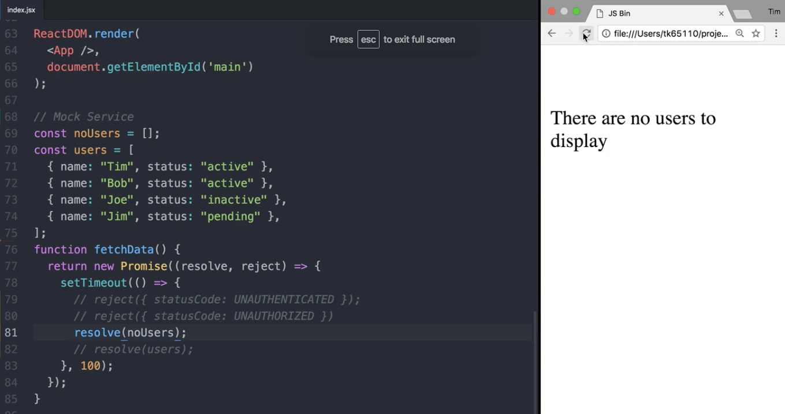

I have a `withUserData` higher-order component that's fetching user data and supplying it to my `UserList`. If there is an `error`, it'll `setState` with an `error`. If it's successful, it will `setState` with the successful user data. Either way, this gets converted to props passed into my `UserList`. I either receive `users` or `error`.

```html
const withUserData = lifecycle({
    componentDidMount() {
        fetchData().then(
            (users) => this.setState({ users }),
            (error) => this.setState({ error })
        );
    }
});
```

When everything's fine, it shows the `UserList` as normal, but if I have an `error`, and the `statusCode` is available, I want to show an `AuthError`. If there's no `error`, but the `user.length === 0` , I want to show a `NoUsersMessage`.

```html
const UserList = withUserData(({ users, error }) =>
    error && error.statusCode && <AuthError error={ error } /> ||
    users && users.length === 0 && <NoUsersMessage /> ||
    <div className="UsersList">
        { users && users.map((user) => <User {...user} />) }
    </div>
);
```

Let's create a new higher-order component. We'll compose together a couple of things. First, we'll use `withUserData`, and then we'll use `branch` to render the `AuthError` if the data `hasErrorCode`.

The first parameter is a predicate that returns `true` or `false`. The component we want to render is going to be the `AuthError`. Let's implement `hasErrorCode`.

```html 
const enhance = compose(
    withUserData,
    branch(hasErrorCode, renderComponent(AuthError))
);
```

branch's predicate always gets passed to `props`, so I'm going to remove the `error.statusCode` logic and put it here in `hasErrorCode`. Then I'll actually destructure `error` off of the `props`, and I'll further remove the rest of this logic.

```html
const hasErrorCode = ({ error }) => error && error.statusCode;
```

Now let's show the `NoUsersMessage` when the data has no `users`. We'll call `renderComponent` and pass it the `NoUsersMessage`. Let's implement the `hasNoUsers` predicate. I'll steal this `users.length` logic right here, and move it over to `hasNoUsers`, and remove this line from `UserList` completely.

```html 
const hasNoUsers = ({ users }) => users && users.length === 0;

const enhance = compose(
    withUserData,
    branch(hasErrorCode, renderComponent(AuthError))
    branch(hasNoUsers, renderComponent(NoUsersMessage))
);

const UserList = withUserData(({ users, error }) =>
    <div className="UsersList">
        { users && users.map((user) => <User {...user} />) }
    </div>
);
```

You can see our `UserList` has been cleaned up immensely. It's now dealing with happy-path-only scenarios. All of our `nonOptimalStates` have been moved out and dealt with separately. Now we have to use our new higher-order component here.

```html
const UserList = enhance(({ users, error }) =>
    <div className="UsersList">
        { users && users.map((user) => <User {...user} />) }
    </div>
);
```

We should be able to refresh and still see the same behavior. I can return different responses, such as an unauthenticated `error`, and see that we're unauthenticated, or I can return an empty array and show a message.



If you wanted to go even further, we could refactor this even more. Let's replace `hasErrorCode` and `hasNoUsers` within `enhance` with a custom higher-order component called `nonOptimalStates`. I'd like to be able to just pass an array of objects. I want to say `{ when: hasErrorCode, render: AuthError }`, and `{ when: hasNoUsers, render: NoUsersMessage }`.

```html 
const enhance = compose(
    withUserData,
    nonOptimalStates([
        { when: hasErrorCode, render: AuthError },
        { when: hasNoUsers, render: NoUsersMessage }
    ])
);
```

This will come in handy across my application when dealing with all the `nonOptimalStates` for all of my components. Now we have to implement that.

It's going to take in a `states` array, and it's got to return our higher-order component, because that's what `compose` is looking for. Because I'm going to have multiple calls to `branch`, I'm going to have to wrap them all in a `compose` call themselves. I'm actually going to return a composed higher-order component.

```html
const nonOptimalStates = (states) => 
    compose()
```

I want to map over the `states` array. I'll take each `state` in, and I'll return a `branch` higher-order component. The predicate will be the `states.when` key. I'll render the `states.render`  key. When I map over the `states`, that will return an array, but `compose` is expecting ordinal parameters, so I need to spread those in.

```html
const nonOptimalStates = (states) => 
    compose(...states.map(state =>
        branch(state.when, renderComponent(state.render))));
```

I should be able to refresh and see the same behavior as before. Again, I can comment out different things, and return either errors, or maybe no `users`, and it behaves the same.

```html
function fetchData() {
    return new Promise((resolve, reject) => {
        setTimeout(() => {
            // reject({ statusCode: UNAUTHENTICATED });
            // reject({ statusCode: UNAUTHORIZED });
            resolve(noUsers);
            // resolve(users)
        })
    })
}
```