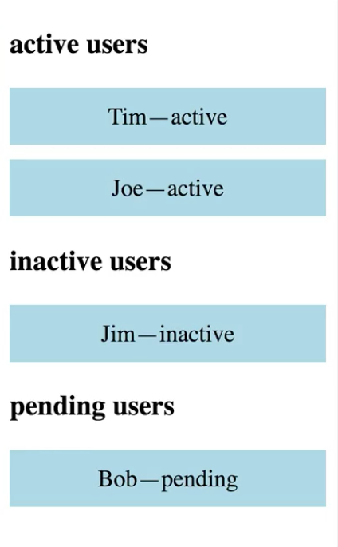
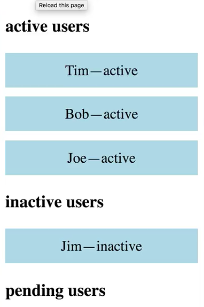

I'm displaying three `UserList`s. They're filtered by `status`. 



These are my `active` users, `inactive`, and `pending`. I'm doing it by using a simple `UserList` component that I wrote, and filtering the users' array based on the `status`.

```html
const App = () =>
    <div className="App">
        <h3>active users</h3>
        <UserList users={ users.filter(u => u.status === 'active') } />

        <h3>inactive users</h3>
        <UserList users={ users.filter(u => u.status === 'inactive') } />        

        <h3>pending users</h3>
        <UserList users={ users.filter(u => u.status === 'pending') } />        
    </div>
```

I'd like to replace this block of code. I want to hide away the custom filtering logic into some custom components. Instead, we'll have three components. We'll have `ActiveUsers`. I just want to pass it to `users` and have it figure out which ones are `active`. We'll have `InactiveUsers`, and we'll have `PendingUsers`. 

```html
const App = () => 
    <div className="App">
        <ActiveUsers users={ users } />
        <InactiveUsers users={ users } />
        <PendingUsers users={ users } />
    </div>
```

I'll create `ActiveUsers` by calling a higher-order component called `filterByStatus`. I'm going to tell it I want to filter by the `'active'` `status` and I'll pass it my `UserList`, which is the base component that I want to modify. I'll do the same thing for `InactiveUsers` and `PendingUsers`.

```html
const ActiveUsers = filterByStatus('active')(UserList);
const InactiveUsers = filterByStatus('inactive')(UserList);
const PendingUsers = filterByStatus('pending')(UserList);
```

Now, let's implement `filterByStatus`. `filterByStatus` needs to take in a `status`, and it needs to return a higher-order component. I'm going to make use of the `mapProps` higher-order component from **Recompose**.

`mapProps` takes in a function. That function takes in the props. We'll take some props in and we'll map them to some new props. The only prop I care to look at is the `users` prop.

```html
const filterByStatus = {status} => mapProps(
    ({ users })
);
```

I want to return an object, which will be the new prop object. `mapProps` completely blows away any props passed in. If they're not in this object, they won't be passed to the wrapped component.

```html
const filterByStatus = {status} => mapProps(
    ({ users }) => ({

    })
);
```

I want to pass in `status` and I want to pass in a new `users` prop. This one will take the `users` prop coming in, but filter it the same way we were doing before. I'll check if it's equal to the `status` that I supply.

```html
const filterByStatus = {status} => mapProps(
    ({ users }) => ({
        status, 
        users: users.filter(u => u.status === status)
    })
);
```

`UserList` now gets the filtered `users` and the `status`. I want to add the header into my component. I'll use the `status` and the word `users` to create my header. When I refresh, everything continues to behave the same.

```html
const UserList = ({ users, status }) => 
    <div className="UserList">
        <h3>{ status } users</h3>
        { users && users.map((user) => <User {...user} />) }
    </div>;
```

If I were to change one of the user's statuses, you'll see the filtering logic continues to work.

