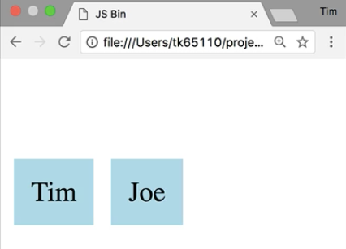

A **higher order component** typically always has the same structure. It takes in a `BaseCompenent` and it returns a component, in this case, it's a **functional stateless component**. Then it renders out the `BaseCompenent` and it spreads -> `...` the `props` in.

####index.js
```jsx
const { Component } = React;

const hoc = {BaseComponent} => (props) =>
    <BaseComponent {...props} />;
```

Now, if we create another `User` and we pass our first `User` to our higher order component -> `hoc`, it's not going to modify it in any way, but we will have a valid React component. I just have to add the name. You see, the prop signature is identical to `User`, and it renders exactly the same.

```jsx
const hoc = {BaseComponent} => (props) =>
    <BaseComponent {...props} />;

const User = ({ name }) =>
    <div className="User">{ name }</div>

const User2 = hoc(User);
```



Now if we want our higher order component to actually do something, typically you add a configuration step. Here we'll take in some `props` we'd like to override and then we can spread those onto the component as well. Now, we have to use our configuration phase and pass in any prop that we'd like to override.

```jsx
const hoc = (overrideProps) => {BaseComponent} => (props) =>
    <BaseComponent {...props} {...overrideProps} />;

...

const User2 = hoc({ name: 'Bob' })(User);
```

Now the name will always be `'Bob'`, regardless of what I change the name in the JSX. You could save the configuration portion of the higher order component call into a variable. We can call this one `alwaysBob`, sometimes that's nice for readability. Then we can name our higher order component properly, as well.

```jsx
const overrideProps = (overrideProps) => {BaseComponent} => (props) =>
    <BaseComponent {...props} {...overrideProps} />;

...

const alwaysBob = overrideProps({ name: 'Bob' });
const User2 = alwaysBob(User);
```

Another reason you might want to create a higher order component is to tap into a **lifecycle hook**. In this case, I need to use a `class` component and we have to do the same thing where we return the `BaseCompenent` and spread the `props` in. Perhaps we want to create a component that never updates.

We could tap into the `shouldComponentUpdate()` method, and we can return `false`. We don't need a configuration step for this phase. We can call this `neverRender`. 

```jsx
const neverRender = {BaseComponent} => 
    class extends Component {
        shouldComponentUpdate() {
            return false;
        }
        render() {
            return <BaseComponent {...this.props} />;
        }
    };

...

const User2 = neverRender(User)
```

Now, `User2` will never `render`.

Now, if `Steve` were bound to some data and it changed the update would not be reflected.