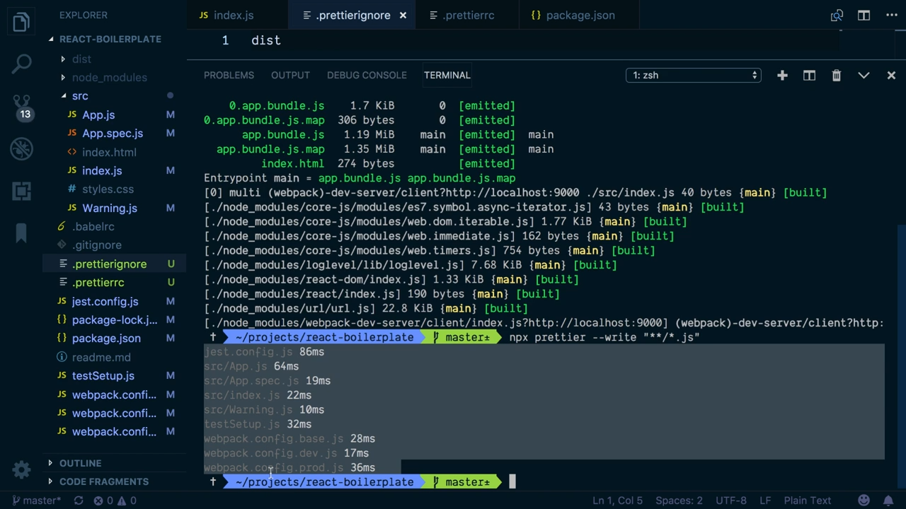

This `index.js` file works, but the formatting is a disaster. I have extra indentation all over the place, extra lines where I don't need them. Some of lines are ending with semicolons some are not. This parenthesis is hanging out all the way down here.

#### index.js
```javascript
import React from 'react'


import ReactDOM from 'react-dom';
import '@babel/polyfill'
    import App from './App'
import './styles.css'

ReactDOM.render(<App />,
  document.getElementById('app')


)
```

I could manually fix all these problems, but I'd like to introduce an automated solution so that I don't have to worry about this, and I can let the editor and my build tools fix the formatting for me. To do that, we're going to install Prettier. We'll do `npm i -D prettier`. We're also going to install `pretty-quick`.

With those installed, let's go into our `package.json`. In my `scripts`, I'm going to create a script I'm going to call `format`. `format` is going to use `pretty-quick` to run `prettier` against my code. I'm going to make this command `pretty-quick`. I'll save that file.

#### package.json
```javascript
  "scripts": {
    "build": "webpack --config webpack.config.prod.js",
    "dev": "webpack-dev-server --open --config webpack.config.dev.js",
    "dev:hot": "npm run dev -- --hot",
    "test": "jest",
    "format": "pretty-quick"
  },
```

Back in my terminal, I'm going to do an `npm run format`. We'll see that it's finding changed files since git revision, which is my last git commit. It'll let me know that it `Found 3 changed files`, and that it's fixing `src\index.js`.

#### First Run


If I look at that `index.js` file, that formatting has mostly been cleaned up.

#### index.js
```javascript
import React from "react";

import ReactDOM from "react-dom";
import "@babel/polyfill";
import App from "./App";
import "./styles.css";

ReactDOM.render(<App />, document.getElementById("app"));
```

I have consistent semicolons at the end of each line. It's gotten rid of all the extra spaces that I had before this parenthesis. It's left this space between the `React` and `ReactDOM` imports, and that's OK. We can take that out manually if we don't want it there, but if we wanted it, Prettier won't touch it.

We have this automatic formatting, and that's great. That means we don't have to worry about it. Let's say I prefer to not have semicolons, and I like using single quotes instead of double quotes in my JavaScript. We can fix that with a Prettier config file.

In the root of my project, I'm going to add a new file, and I'm going to call this one `.prettierrc`. In this file, I'm going to give it a JSON object, and I'm going to define a couple of settings here.

I'm going to say that I always want my `tabWidth` to be `2`. I don't want semicolons, so I can take this `semi` setting and set that to `false`. I can set `singleQuote` to `true`.

#### .prettierrc
```javascript
{
  "tabWidth": 2,
  "semi": false,
  "singleQuote": true
}
```

With that set up, let's switch back to our `index.js` file. Let's go back into the terminal. I'm going to run that `format` command again, `npm run format`. We'll see that our double quotes have been converted to single quotes, all the semicolons are gone, and it's looking pretty nice.

#### index.js
```javascript
import React from 'react'
import ReactDOM from 'react-dom'
import '@babel/polyfill'
import App from './App'
import './styles.css'

ReactDOM.render(<App />, document.getElementById('app'))
```

By only changing the files that have been changed since the last commit, `pretty-quick` speeds up this automatic formatting.

In our case, since we've just introduced Prettier and we have all these files, I'd like to automatically format all the JavaScript files once, so any new projects we start from this repository automatically have our default formatting in all the included files.

To do that, I'm going to jump back into the terminal, and I'm going to use npx to run Prettier against all the JavaScript files in this project. I'll use `npx prettier`. I'm going to pass it the `write` flag so that my changes are automatically written and saved to those files. Then I'm going to specify a file pattern.

I'm going to `"**/*.js"` and I'll execute that.

#### Terminal
```
npx prettier --write "**/*.js"
```

If we expand the terminal, we'll see that it's run through, and it's updated `.bundle` files, and our `jest.config`, `App.js`, and our test files. Some of these files are generated. We don't necessarily want those included. It doesn't matter that we formatted them this time, but normally, we just don't want to bother with that.

#### Files Updated


I'm going to come in here, and I'm going to add another file to the root of my project. This one is going to be called `.prettierignore`. In the `.prettierignore`, I'm going to add `dist`, and I'll save that.

#### .prettierignore
```javascript
dist
```

Then I'm going to go back into the terminal. I'm going to run that command again and expand this terminal window out. We'll see that none of the files in `dist` are included this time. It's only files that are part of our project, which is what we want.

#### No Dist


We can also format our JSON files with Prettier. I'm going to update the `.prettierignore`, because I want to format things like my `package.json`, but I don't want to format the `package-lock.json`, because that's a generated file. I'm not worried about the format on that.

In `.prettierignore`, I'm just going to add `package-lock.json`.

#### .prettierignore
```
dist
package-lock.json
```

Save the file, and then back in the terminal, I'm going to go back to that `npx prettier` command, and I'm going to update my file path to look at JSON files this time.

#### Terminal
```
npx prettier --write "**/*.json"
```

I'll run that. We'll see that it executed against our `package.json`, but not our `package-lock`.

Now that we have prettier installed and configured, and all of our files are formatted, the other thing we can do is we can set our editor up to automatically format our files for us using our Prettier config.

There's Prettier support for a bunch of editors, but I'm using VS Code here. Let's walk through that real quick.

If I open up my extensions toolbar here, I can type in `prettier`, and there's going to be a lot of options available. I'm going to use this `Prettier - Code formatter` VS Code extension.

#### Prettier - Code formatter


With that installed, let's go into our document. I'm going to add some unnecessary indentation. I'll add a couple of semicolons, since those are turned off in our Prettier config. I'm going to save the file. That's not going to change anything, yet.

#### index.js
```js
import React from 'react';
import ReactDOM from 'react-dom';
  import '@babel/polyfill'
import App from './App'
  import './styles.css'

ReactDOM.render(<App />, document.getElementById('app'))
```

If I go into my command panel, I can go in and I can run this `Format Document` command.

#### Format Document Command


That's going to apply my Prettier config to the file, and then I can save those updates. It would be even easier if VS Code would apply my formatting when I save the file.

I'm going to go into my VS Code settings. I'm going to use `"Cmd + ,"`, to do that. Here, I'm going to search for `format`. I'm going to find this `Editor: Format On Save` setting. I'm going to check that, and then I can close my settings.

#### Format On Save Setting


I can come in here, and I can mess up my formatting again. I can save the file, and it's going to apply that formatting for me.
