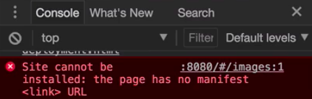
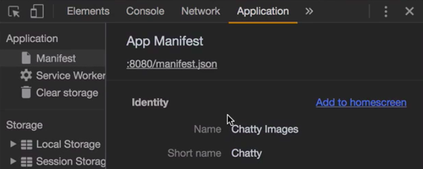

Instructor: [00:00] The first step to creating a privacy web application is by creating a web manifest. Let's create a `manifest.json` file in the root of the project.

[00:14] The web manifest describes your app using some metadata. We can write the `"name": "Chatty Images"`, and we have also a `"short_name"`. If your name is already short, you don't need this property, but if not, it will use each of them depending on the case. If you don't write the short name, it will default to the name.

#### manifest.json
```json
{
    "name": "Chatty Images", 
    "short_name": "Chatty"
}
```

[00:43] We also have a `"start_url"`. This is the URL that is open from the app that is already installed.

[00:52] Let's write the `"index.html"` file. The `"display"` property will tell a browser how to open it. We can say `"browser"`, and this will be opened just as a browser. We can say `"standalone"`, which will be opened like a normal app.

[01:14] We can say `"fullscreen"`, which will remove everything from the screen, except from the content of the app itself, and `"minimal-ui"`, which is like standalone but with some minimal browsing UI components. Let's leave it as `"standalone"`.

```json
{
    "name": "Chatty Images", 
    "short_name": "Chatty",
    "start_url": "index.html",
    "display": "standalone"
}
```

[01:35] We can define as well the `theme_color`. Let's use a color of this purple toolbar, `"#9c27b0"`. This property will be used, for example, for setting the toolbar color on Android or other platforms.

[01:57] Then we can set as well a `"background_color": "#fff"`. This will be used by the splash screen. By using the name, the background color, and the icons, a splash screen is created in Chrome for Android.

```json
{
    "name": "Chatty Images", 
    "short_name": "Chatty",
    "start_url": "index.html",
    "display": "standalone",
    "Theme_color": "#9c27b0",
    "background_color": "#fff"
}
```

[02:13] Finally, we have the `"icons"` property. This is an array of objects, and each object has a `"src"` property.

[02:27] We have a couple of icons here. Let's say `/static/icons/144.png`. We have to indicate the size as well, or `"sizes"` and the type, which in this case is a `"image/png"`. Let's copy and paste this and do the same but replace `144` with `512`.

```json
{
    "name": "Chatty Images", 
    "short_name": "Chatty",
    "start_url": "index.html",
    "display": "standalone",
    "Theme_color": "#9c27b0",
    "background_color": "#fff"
    "icons": [
        {
            "src": "/static/icons/144.png",
            "sizes": "144x144",
            "type": "image/png"
        },
        {
            "src": "/static/icons/512.png",
            "sizes": "144x144",
            "type": "image/png"
        }

    ]
}

```

[03:03] Just like this, we created a `manifest.json`. If we open here the dev tools, we will see an error that says the site cannot be installed. The page has no manifest, so we still have to include it in the index file.



[03:23] Let's go into `index.html` and create the index. We have to say `rel="manifest"`.

[03:33] Then let's indicate the `"/manifest.json"` file. 

#### index.html
```html
<link rel="manifest" href="/manifest.json">
```

Then we will reload the devtools here. There we go. We see the metadata that we added.



[03:49] This we can test the `manifest.json`. We see the name. We see the short name. We see how it's presented. You can set as well the orientation in portrait or landscape, and we see the icons.

[04:05] We can see here as well that you have a add to home screen link. But when you press it, we get an error that says that it's not a service worker, which is another requirement for the privacy web app to be installed, but we will cover that later.