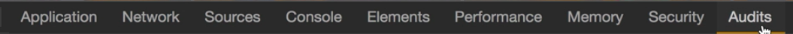
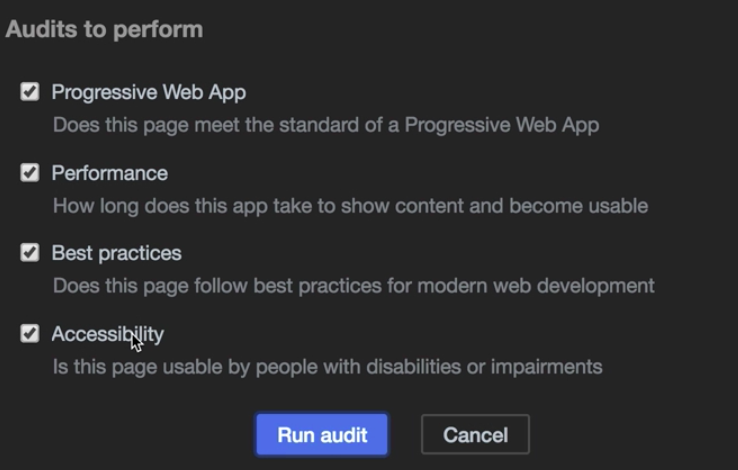
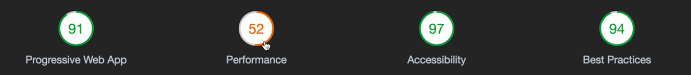
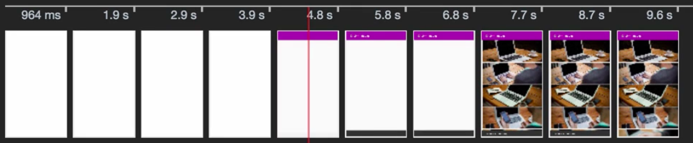
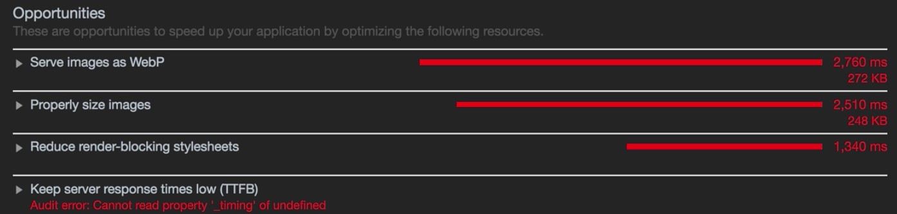

Instructor: [00:00] The Chrome browser already comes with a great audit tool. To find it, open the dev tools, and you'll see this Audit tab in here. 

In order to run an audit, we just have to click the Perform an Audit button, and you'll see that a pop-up opens where you can select which sections of this audit to perform.

[00:22] We're going to keep them all selected and press Run Audit. Then, it will start running it in a Nexus 5X device, and we'll let it. The audit runs from a fresh install without any service worker and cache enabled. 

[00:53] At the top section, you'll find the score of the four sections that we have tested. 

Don't panic if you find some scores that are not that high, for example, the performance. Performance can vary from one run to another. To be honest, the audit tests are quite strict. You can always take the feedback to improve the application.

[01:17] Remember that Progressive Web Apps is a never-ending journey, and you can always improve it. Below this overview with the scores, you'll find more details of each of the sections. For example, for the Progressive Web Apps section, there are two failed audits where we cannot do too much. One, it has to do with the server. Right now, this app is deployed in a test server. This other metric is about performance.

[01:46] We check all the past audits. They all are the most needed for the progressive web app, so register a service worker, available offline, using HTTPS, make it installable, and so on. If we scroll down to the Performance, we'll see this timeline where you can see how the app renders along the time.

[02:11] Here, we can see some interesting metrics. The first one is the first meaningful paint. That metric tells when there is some content missing when in the screen. Then, we also have the first interactive metric and describes when the application has rendered already and the user can start interacting with it, which means that the JavaScript has already been loaded and parsed.

[02:33] If we scroll down a little bit more, you'll see this Opportunities section, which gives you some hints on how can you improve your application.

Of course, the main issue of this application is that it's using a bunch of images from a third-party server which is also kind of an image placeholder server. If you have your own server, you should use the HTTP cache in order to make it as performant as possible.

[03:01] In this case, we have no control about these images. There is this third hint about reducing render blocking with style sheet. If we go to the code and open the `index.html`, we have this CSS style sheet which is loaded from `googleapis.com`. This style sheet is loaded in a normal way, which by default is render blocking.

[03:28] That means that, until our render blocking resource hasn't been loaded, the unload event of the window is not triggered. That delays the render of the application. We can use some strategies to defer the loading of this style sheet. Let's continue scrolling and click on the Passed Audits.

[03:50] Between all this, you can see that the off-screen images is parsed, which is because of Linux loading the images that are not in the screen. If you keep scrolling down, you'll see the Accessibility and the Best Practices audits...