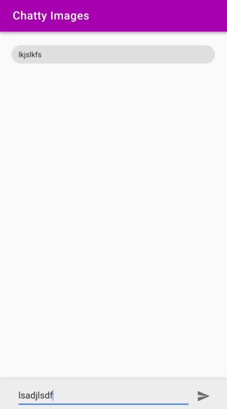
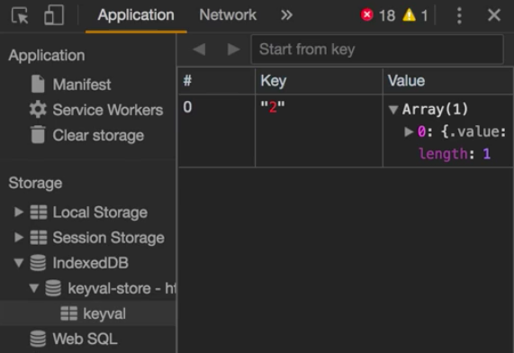

Instructor: [00:01] When we click on any match, we're going to a detail view where we can write a message. This detail view is in the `Details.vue` component. In here, we're using a Firebase stream to synchronize a method as a state with the Firebase database.

[00:20] These messages are not cached because Firebase works through TCP circuits. They cannot be cached, neither by static caching or run time caching, so we have to do the caching ourselves. For that, we have several options. While local storage and session storage or synchronous storages, IndexedDB is asynchronous, which makes it perfect to cache the messages without blocking the UA.

[00:45] Let's start by opening a terminal and `install idb-keyval`. 

#### Terminal
```bash
$ npm install idb-keyval
```

Then let's create, under the `src` folder, a `store.js`. Here, let's `import idbkeyval from 'idb-keyval'`. 

#### store.js
```javascript
import idbKeyval from 'idb-keyval'
```

IndexedDB is somewhat complex, and it's not the scope of this lesson, but idb-keyval allow us to use it with a simplified API, similar to the local storage or session storage by using a key value storage.

[01:28] This module should have a `get` method with `id`, and then it calls the `get` method of `idbKeyval`. It will have, as well, a `save` method that will take an `id` and `messages`. It will call the `set` method of `idbKeyval`, passing the `id` and the `messages`. Don't forget to export these functions.

```javascript
export const get = id => idbKeyval.get(id)

export const save = (id, messages) => idbKeyval.set(id, messages)

```

[02:01] Then let's go to `Details.vue`, and start by defining the `data` option for the component state, which has a `cache` messages property initialized to an empty array. Since we are going to use a computed property with the name of messages, let's rename this one to `fireMessages`.

#### Details.vue
```javascript
export default {
    props: ['id'],
    data: () => ({ cachedMessages: [] }),
    firebase() {
        return { fireMessages: imagesRev.child(this.id).limitToLast(60) }
    },
    methods: {
        sendMessage(input) {
            this.$firebaseRefs.fireMessages.push(input)
        }
    },
    components: {
        DetailsFooter
    }
}
```

[02:23] Now let's create that `computed` property, so `messages()` and this property will check that we have `fireMessages` by checking the `length`. Then, it will return the `fireMessages`, but if not, it will return the `cachedMessages`. 

```javascript
computed: {
    messages() {
        return this.fireMessages.length ? this.fireMessages
            : this.cachedMessages 
    }
}
components: {
    DetailsFooter
}
```

If you think about it, we are using a network-first approach. We check that we have `fireMessages`, which will mean we have the connection open. If not, it will load the `cachedMessages`.

[03:05] In order to interact with the IndexedDB, let's `import { get, saved } from '../store'`, 

```javascript
import { get, saved } from '../store'
```

Then let's create a `created` hook. In here, we'll get the `cachedMessages` for the `id` of this picture, and IndexedDB returns a promise in the case of using IDB. Let's use `then` to get the `messages`, and then we'll set the `cachedMessages` to those `messages`.

```javascript
created() {
    get(this.id).then(messages => {
        this.cachedMessages = messages
    })
}
```

[03:43] We're still not saving the messages to into IndexedDB. For that, an easy way is by using the `$watch` install method of Vue, so we watch over the `'messages'` in the way that, when they change, we'll `save` them using the `id` and passing the `messages`.

[04:07] In this case, we have to specify `{deep: true}` as the option for the watch method. Otherwise, the messages array will be watched only by reference, which means that if we add a message to the array, it will not change. But by using deep true, it will be deeply watched.

```javascript
created() {
    get(this.id).then(messages => {
        this.cachedMessages = messages
    })

    this.$watch('messages', messages => {
        save(this.id, messages)
    }, {deep: true})
}
```

[04:28] Finally, if we run this, `npm run dev`, and go the images, let's open up an image and write something. 



If we go and turn off the Internet, we reload it, the messages are still there. Of course, if we try to send now a message, it will break, because we have no Internet. We'll take care of that later.

[05:00] You can inspect your IndexedDB storage by opening the dev tools. In the application tab, you have an IndexedDB entry in the storage section. We can click in the keyval, and we see and entry with the key two and an array of one, which is this message. 



The IndexedDB storage capacity is quite high, but be careful and set a limit on what data you store.