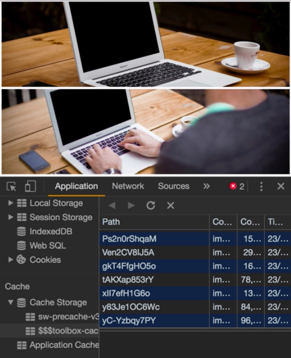

Instructor: [00:01] So far, we cache all the static assets, including the HTML and JavaScript files, but if I turn off the Internet and reload the page,  the images are not cached. That's because they are not static. They are retrieved from external resources. We can cache them using runtime caching.

[00:25] Let's put the Internet back and open the `webpack.config.js` file. In the `SWPrecache`, we can add a `runtimeCaching` key, which is an array of objects. Each object has a `urlPattern` key, which is array x for the URLs that we need to cache. 

#### webpack.config.js
```json
new SWPrecache({
    verbose: true,
    cacheId: "my-awesome-app",
    filepath: "service-worker.js",
    staticFileGlobs: [
        "index.htmlm",
        "manifest.json",
        "dist/**/*.{css,js}"
    ],
    runtimeCaching: [
        {
            urlPattern: 
        }]
    stripPrefix: "/"
    })
```

Let's check which URLs we need to cache.

[00:53] Open the dev tools, and in there, in the Network tab. Let's reload the page and go up to the first one. You see an endpoint from `picsun.photos`, where I retrieve a json with all the images that later will load. We'll need to cache this one.

[01:17] The images also, they come from the `source.unsplash.com` endpoint and `images.unsplash.com`, so we'll need to cache them both, as well. Aside from the images, I'm also using a font from `fonts.googleapis.com` for the CSS and `fonts.gstatic.com`  for the font itself.

[01:40] We can conclude that we want to cache whatever starts with `https//` and has one of the `picsum|fonts|source|images`. 

```javascript
runtimeCaching: [
    {
        urlPattern: /^https:\/\/(picsum|fonts|source|images)/,
    }
]
```

Aside from the URL button, an object needs also a `handler` property. Here we have several options. We have the `cacheFirst`, which will try to load the resource from the cache.

[02:13] If it doesn't exist, it will perform the fetch call to the external resource. The opposite of `cacheFirst` will be the `networkFirst`. As you can guess, it will perform the fetch call, and if it fails, it will load it from the cache.

[02:28] We also have another interesting one called `fastest`. This will perform both the fetch call and will take it from the cache at the same time, in parallel. The interesting part is that even though normally the cached one will be the faster to load, it will perform the fetch call and will be stored in the cache, so the cache is always fresh and updated. Let's keep it with fastest and save the file.

```javascript
runtimeCaching: [
    {
        urlPattern: /^https:\/\/(picsum|fonts|source|images)/,
        handler: "fastest"
    }
]
```

[02:53] Let's run it in production mode. Let's run `npm run build && http-server -c-1`. Then, let's go and reload the app. If we check the Application tab and go to the cache storage, we'll see that not only we have the sw-precache key, but also the `$$$toolbox-cache$$$` entry, which will have the runtime cache with the font, with the list endpoint, and with all the images.

[03:35] Right now, if I turn off the Internet and reload the web page, you'll see that both the font and the images are kept in cache and they are still working. 



One thing you must keep in mind is that the cache is limited. You can click on the clear storage, and you can see how much you are using and how much you have left. That usually depends on how much space you have left on your hard disk.

[04:06] For this case, we can optimize it by only caching some of the images, but not all of them. Runtime caching allow us to do that by using some options. First, we need to define another runtime caching entry. Let's copy this one we have up here.

[04:25] For the first one, we are going to use it only for the `picsum` and the `fonts` calls, and the second one only for the `source` and `images`, which are the two endpoints that give us the images. For the one of the images, let's add an `options` key with a `cache` key.

```javascript
runtimeCaching: [
    {
        urlPattern: /^https:\/\/(picsum|fonts)/,
        handler: "fastest"
    },
    {
        urlPattern: /^https:\/\/(source|images)/,
        handler: "fastest",
        options: {
            cache: {

            }
        }
    }
]
```

[04:47] Here, we can define a `maxEntries`, and let's say `5`. Max entries will only work if we also define a `name` for that cache. Let's call it `awesome-image-cache`. In this way, only five images will be kept in cache.

```javascript
options: {
    cache: {
        maxEntries: 5,
        name: "awesome-image-cache"
    }
}
```

This works with an LRU cache, which stands for list recently used. As you can guess by the name, it's a cache that removes the least used entries and keeps the latest ones.

[05:24] Let's save the file, re-run it again, and in the dev tools, just to have a fresh install in the clear storage, we can go down to the bottom and press the `clear set data` button. Then we will also unregister the service worker if you have it checked. Let's reload again.

[05:46] If we go again to the cache storage, we'll see that we have another cache entry, the `awesome-images-cache`. Here, we'll see only five images cached. Again, this time we go and switch off the Internet. We should see that only some of the images are saved, and some others are not. In this way, you can control how many entries you can cache for the runtime caching.