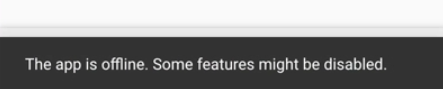

Instructor: [00:00] I start by opening `app.vue` and add a `data` component option in the `default`. That has an `online` property set to `false`. Then, we need to check if the app is online or not when it gets loaded. We can use the `mounted` hook for that.

#### App.vue
```javascript
export default {
    props: ['show', 'messages'],
    data: () => ({ online: false }),
    mounted() {

    }
}
```

[00:22] Here, we'll set `this.online = navigator.onLine`. The mounted hook is called when this component is attached to the DOM. 

```javascript
export default {
    props: ['show', 'messages'],
    data: () => ({ online: false }),
    mounted() {
        this.online = navigator.onLine
    }
}
```

That way, we make sure navigator or window is there. We still have to listen for the online status changes.

[00:41] For that, we have to use `window.addEventListener` and listen for the `'online'` event, which in that case will set `this.online` to `true`. In the same way, we have to listen as well for the `offline` event. We'll set it to `false`.

```javascript
export default {
    props: ['show', 'messages'],
    data: () => ({ online: false }),
    mounted() {
        this.online = navigator.onLine
        window.addEventListener('online', () => {
            this.online = true
        })
        window.addEventListener('offline', () => {
            this.online = false
        })

    }
}
```

[01:08] I'm adding the online logic here because it's better to have it in one place. Since the app component is the root component of the app, we are making sure there is only one instance. Here, using any button, that's fine.

[01:24] Now that the app knows when it's online or offline, we can use it, for example, in the `Details.vue`. We could disable the input and then send message when it's offline. It doesn't make sense to have it enable when there is no Internet connection, because you cannot send messages.

[01:44] For that data, we have to pass down this online property. First to the  `<router-view>` pass in `online`. 

```html
<v-content>
    <router-view :online="online"></router-view>
</v-content>
```

In this case, the `Details.vue` will get it. We have to add it to the `props`. 

#### Details.vue 
```javascript
export default {
    props: ['id', 'online'],
    ...
}
```

Then, it will send it to the footer. 

```html
<DetailsFooter @send="sendMessage" :online="online"/>
```

Then, in the `DetailsFooter.vue`, which is the component with the input on the bottom, we can get the online properties here as well.

#### DetailsFooter.vue
```javascript
export default {
    props: ['id', 'online'],
    ...
}
```

[02:26] Use it to disable to the button when it's not online, 

```html
<v-btn :disabled="!online" type="submit" icon flat><v-icon>send</v-icon></v-btn>
```

and the same for the `v-text-field`. 

```html
<v-text-field
    :diabled="!online"
    class="input"
    v-model="input"
    label="Message"
    single-line
></v-text-field>
```

If I go ahead and turn off the Internet, then you see that the button and the input are disabled. This works as expected. If we turn it on again, they're enabled.

[02:58] We can further improve the user experience by adding a message when it gets offline. In the `App.vue` component, we could use another  `<v-snackbar>` like this one that shows the message, `The app is offline. Some features might be disabled.`

[03:25] We will use that `showOnline` data. 

#### App.vue
```html
<v-snackbar
    :abolute="true"
    v-model="showOnline"
    :timeout="4000"
>
    The app is offline. Some features might be disabled.
</v-snackbar>
```

In `data` in the default, we'll say, `showOnline: false`, and when you get offline, we'll set the `showOnline = true`. 

```javascript
export default {
    props: ['show', 'message'],
    data: () => ({ online: false, showOnline: fasle }),
    mounted() {
        this.online = navigator.onLine
        window.addEventListener('online', () => {
            this.online = true
        })
        this.online = navigator.onLine
        window.addEventListener('online', () => {
            this.online = false
            this.showOnline = true
        })
    }
}
```

We'll save this and run it. Then, we turn off the Internet, and we'll see the message here.

