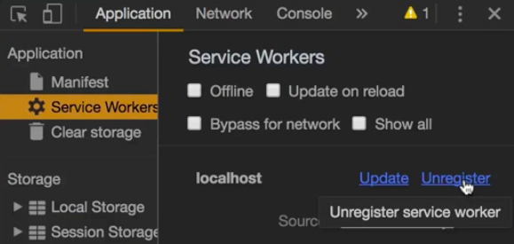

Instructor: [00:01] The way the browser updates a service worker is by comparing, byte to byte, the new one to the already installed one. If they are different, the new one will be installed. By that theory, if we change something in the toolbar -- let's save it all -- then it will save, build, and run it again. Then we should reload.

[00:30] Supposedly, now it's installed. If we reload again, our changes should be there, but it's not.

[00:36] This is a common pitfall that usually happens with service workers. Usually, it's due to this reason. If you go to the network and save, for example, the service worker, you'll see that it has a cache control of one hour. The server is caching, as well, the static files sent to the browser.

[00:57] To solve it, we need to tell http server to don't cache. We do that by writing `-c-1`. 

#### Terminal
```bash
$ npm run build && http-server -c-1
```

Now, our static assets are not cached at that time. First, let's un-register the service worker in the application service worker type and delete this cache entry. 



Then, let's run it again.

[01:24] Since right now it's not cached when we reload, our updated toolbar will be shown. Now, it's already cached, and it will check any of the static files.

[01:36] We see the message is minus one. We can revert our toolbar, for example, rerun it. Now, if we go and reload, it should be installed and updated. On the next reload, it has been updated already.

[01:59] You will do this as long as you are testing your service worker, but when you're already finished, and you want to continue developing, you don't want to interfere with the service worker. We want to have reloading and other stuff, and don't have the files cache.

[02:15] When you're finished, you go to the application, delete the cache, and register the service worker. As you remember, the service worker is only applied on production. When you run in development mode, it wouldn't be a problem as you continue developing on your own.