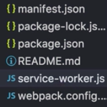

Instructor: [00:00] It's more convenient to have the service worker generation as part of your build. Since we are using webpack, we can use the service worker precache webpack plugin.

[00:11] First, let's remove the `sw-config.js` file, because we don't need it anymore, and then open our terminal and `install sw-precache-webpack-plugin`. 

#### Terminal
```bash
$ npm intall -D sw-precache-webpack-plugin
```

Now let's open the `webpack.config.js` file. Up at the top, let's import the `SWPrecache` webpack plugin. `require('sw-precache-webpack-plugin')`. 

#### webpack.config.js
```javascript
const SWPrecache = require('sw-precache-webpack-plugin')
```

Then let's use it where you have your plugins defined.

[00:56] I have it down at the very bottom, so have to write `new SWPrecache`. The first thing we can configure is the `cacheId`, which is a string that will be prepended to the cache entry of your app. Let's call it `"my-awesome-app"`.

```javascript
new SWPrecache({
    cacheId: "my-awesome-app",
})
```

[01:25] By default, webpack will place the service worker in the same directory as your output.path, which in this case is the folder `dist`. We want to place it in the root directory because the scope of the service worker depends on where it's placed.

[01:40] We can access that directory and subdirectories but not parent directories. That's not what we want, because we want to cache the `index.html` file as well. That wouldn't be possible if it's not in the same directory.

[01:55] You can write `"filepath"` and say `"service-worker.js"`. Then it will be created with that name in that path. By default, the service worker precache plugin will cache the files that go through the webpack graph. The rest of the static files, like the `index.html`, that doesn't go through the graph.

[02:18] For that, we can write `staticFileGlobs:`, and it has the same syntax as the SW config file as before. Here, we can define the `"index.html"`, then the `"manifest.json"`, and then everything with CSS and JS into this folder.

```javascript
new SWPrecache({
    cacheId: "my-awesome-app",
    filepath: "service-workder.js",
    staticFileGlobs: [
        "imdex.html",
        "manifest.json",
        "dist/**/*.{css,js"
    ]
})
```

[02:42] Finally, the plugin will also prefix the files that tries to find, like in `index.html`and `manifest.json`, with the same directory of your output path, which in this case is `dist`. It will try to find it as `dist/index.html`, `dist/manifest.json`.

[03:02] To avoid that, we have to use the `stripPrefix` property and write `"/"`. That's the route of your app. 

```javascript
new SWPrecache({
    cacheId: "my-awesome-app",
    filepath: "service-workder.js",
    staticFileGlobs: [
        "imdex.html",
        "manifest.json",
        "dist/**/*.{css,js"
    ],
    stripPrefix: "/"
})
```

You run `npm run build` again; then the service worker is created right here in your files as you can see.



[03:21] You can also see, in `var cacheName`, that it's using the cache ID that we have defined, and that the paths are correct. We still haven't used the service worker because we have to register it, but we'll see that later. Depends on where it's placed.

