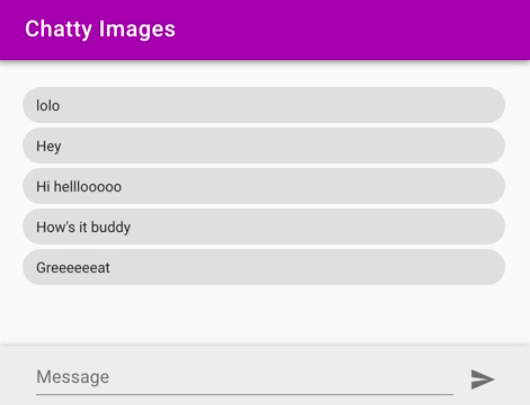
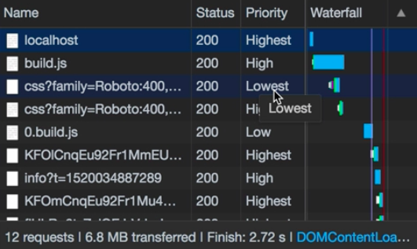

Instructor: [00:01] To use preload in the CSS, first we need to change the `rel` attribute to `preload`. Then by using the `as` attribute, we can define which kind of resource are we loading. For JavaScript files, we'll use the `script`. For fonts, `font`. For CSS, a `style`.

#### index.html
```html
<link 
    rel="preload"
    as="style"
    href='https://fonts.googleapis.com/css........'
>
```

[00:24] If we save this and reload the page, we'll see that the CSS is loaded at the beginning with the highest priority, but it's not applied. You can see in the header, the font is not the right one, and here, in the icon.


[00:45] The thing is that this is working as it's supposed to be, because preload and prefetch, they only fetch the resource and keep in memory, but they don't apply it to the DOM. It's up to the developer to apply it when it's needed.

[01:00] Since in this case, we want to apply it when it's loaded, then we can simply write an `onload` event. In there, we can change the `rel ` attribute to a `stylesheet` again. In that way, the browser will apply it, but the resource will be already loaded because of the preload.

```html
<link 
    rel="preload"
    as="style"
    onload="this.rel = 'stylesheet'"
    href='https://fonts.googleapis.com/css........'
>
```

[01:23] Let's save this, and reload again. As you can see, now, the font and the CSS is applied, and the icon is usable as well.



[01:37] The CSS is here with the highest priority. To use prefetch, it's precisely the same, but using `"prefetch"` in the `rel` attribute instead of `"preload"`.

[01:48] The difference is that we will use preload for the very important files that we will use at the beginning, and prefetch for the rest that the application use later. That means that if we save it and reload again, we'll see that the CSS first is fetched with the lowest priority.



[02:12] In this case, because there is nothing with the highest priority in this point, it continues downloading it with the highest priority. It's up to the browser what to download, but using `prefetch`, we're telling it that this resource is of a lower priority.

[02:28] Finally, we run an audit, and we scroll down to the performance section to the Opportunities, we don't see any more `.hint` for render blocking styles. But if we check the `Passed Audits`, we pass the reduce render blocking scripts and style sheets, so this is working.