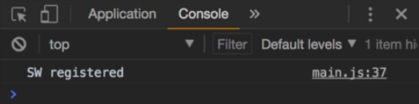

Instructor: [00:00] To make it simple, I'm going to register the service worker in the `main.js` file. We have to use the `navigator` API, which has a `serviceWorker` property with a `register` method. The register method takes the URL of the `service-worker.js`, but not the path to the file. 

#### main.js
```javascript
navigator.serviceWorker.register('/service-workder.js')
```

[00:21] Just as you would do it if you want to open the service worker from the browser, the register method returns a promise. We can do `.then`, and check if the service worker has been registered. Let's print a `console.log` -- `'SW registered'`.

```javascript
navigator.serviceWorker.register('/service-workder.js').then (() => {
    console.log('SW registered')
})
```

[00:40] There are some cases though where we don't want to register a service worker. For example, we have to check if the browser has support for service workers, by checking that the service worker property from Navigator exists.

[00:55] Let's create a variable for that condition, `shouldSW`. First, we have to check that the `serviceWorker` property exists `in navigator`, so we can use it to register the service worker conditionally. 

```javascript
const shouldSW = 'serviceWorker' in navigator
if (shouldSW) {
    navigator.serviceWorker.register('/service-workder.js').then (() => {
        console.log('SW registered')
    })
}
```

We only generate the service worker in production, when we run npm run build.

[01:20] In fact, the service worker webpack plugin doesn't work very well with the webpack dev server, so there is no point in trying to register the service worker in development mode. Let's add the other condition to register it only in production.

[01:34] Let's say `const prod` is equal to `process.env.NODE_ENV` equal to `'production'`. Then say shouldServiceWorker register when the service worker is in Navigator and is in `prod` mode. 

```javascript
const prod = process.env.NODE_ENV === 'production'
const shouldSW = 'serviceWorker' in navigator && prod
```

To try the service worker registration, since we are using it only in product, we have to run `npm run build`.

[02:06] Then we will need some kind of http server, so I installed http server from npm. 

#### Terminal
```bash
$ npm run build && http-server
```

Run this, and then let's reload the URL.

[02:22] We see in the console, service worker registered. 



If we go to the application, we see this service worker has been registered. We can also check in the cache storage that this entry has been created and these files, index.html, dist/build.js, and manifest.json, have been cached.

[02:43] The application should be working offline. To try that, let's upload this application somewhere, for example by using search. Then I'm going to open this URL in the browser, `https://bumpy-connection.surge.sh`. Remember that service workers only works under https.

[03:11] Now our files have been cached, so if I go and turn off the WiFi and I reload here, it's still working. The only thing is, the images haven't been cached yet, but we'll see that later.