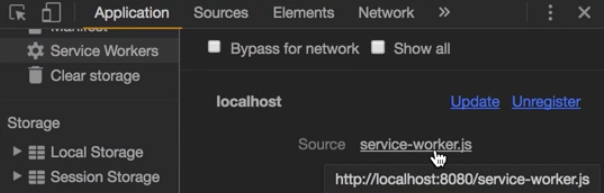

Instructor: [00:00] First, we need to create a service worker for development. Let's call this file `service-worker-dev.js`. This service worker has to do nothing else than just overwriting the production service worker. For that, we can write `self.addEventListener`. On the `install` event, we need to call a function that calls `self.skipWaiting`. This will force the service worker to be activated.

#### service-worker-dev.js
```javascript
self.addEventListener('install', () => {
    self.skipWaiting()
})
```

[00:35] We could have other apps running on the same pair of host and port, so it would be nice if we can refresh them, as well. For that, let's add another `addEventListener` for the `activate` event. We can access other tabs and windows this service worker is running on by typing `client`, which we have to filter using `matchAll` of `type: 'window'`.

[01:05] This returns a promise with the `client` as the payload. Then we need to iterate over those clients. Let's use that `for (let client of clients)`. To refresh them, we can use the client `navigate` method, passing the `client.url` as a parameter.

```javascript
self.addEventListener('activate', () => {
    self.clients.matchAll({ type: 'window' }).then(clients => {
        for (let client of clients) {
            client.navigate(client.url)
        }
    })        
})
```

[01:28] We still need to use this service worker. The way you may think we can do that is by registering the dev service worker on development and the other on production. Let's try that out. In the `main.js` file, we could add another condition when it's `!prod`. Then you see it here, should `shouldSWDev`. 

####main.js
```javascript
const prod = process.env.NODE_ENV === 'production'
const shouldSW = 'serviceWorker' in navigator && prod
const shouldSWDev = 'serviceWorker' in navigator && !prod

if (shouldSW) {
    navigator.serviceWorker.register('/service-workder.js').THEN (() => {
        console.log('Service Worker Registered')
    })
} else if (shouldSWDev)
```

Let's copy/paste the `navigator.serviceWorker` down here. Instead, we're going to register the dev service worker.

```javascript
if (shouldSW) {
    navigator.serviceWorker.register('/service-workder.js').THEN (() => {
        console.log('Service Worker Registered')
    })
} else if (shouldSWDev) {
    navigator.serviceWorker.register('/service-workder-dev.js').THEN (() => {
        console.log('Service Worker Registered')
    })
}
```

[02:16] Now let's run the app in production. Let's type `npm run build &&http-server -c-1`. Now let's reload the page and make it bigger. You can see here the service worker is registered, and this is the use file service worker we use in production.



[02:46] If we stop this and we run `npm run dev`, we reload, and supposedly the dev service worker should have been installed. Let's reload again and let's go to the application tab. We see that the production service worker is still registered. We see this is the production service worker. The question is why is this happening.

[03:14] If you think carefully, this file, the `main.js` file, is cached by the service worker. The browser is serving this cache my `main.js` file, which at the point of caching, production was true. The service worker that is going to be registered is always this one. Then we can unload one service worker or another on the registration level.

[03:38] Instead, what we can do is only register one service worker and stop it, depending on the environment. For that, let's remove these conditions and also these else. Let's keep the condition for when the service worker exists in Navigator, and then we unregister this service worker.

[04:02] Then let's go to the `package.json`. Here, I'm going to add a `predev` script, which will be run before the dev script because of the `pre`-prefix. This script will copy the `service-worker-dev.js` file to `service-worker.js`. For development, the service worker file will be overwritten.

#### package.json
```javascript
"scripts": {
    "predev": "cp service-worker-dev.js service-worker.js"
    ...
}
```

[04:30] If you want this `cp` command to work on all platforms, you can install `npm install --save-dev cp`. That will install a cross-platform cp command.

[04:42] Finally, let's run `npm run dev`. If we check `service-worker.js`, this one is the development service worker. Let's then go to the webpage and reload. You can see that the development service worker has overwritten the production one.

[05:00] If we go to the application and refresh the cache, you'll see there is no cache. This is perfect for development because even if there were some service worker caching some assets, this method will overwrite them and clean the cache.

[05:16] If you're wondering why the cache is clean, let's first create the production service worker again with `npm run build`. If you remember, this production service worker on the activate event which happens when another service worker gets installed, will delete all caches right before the other service worker takes place.