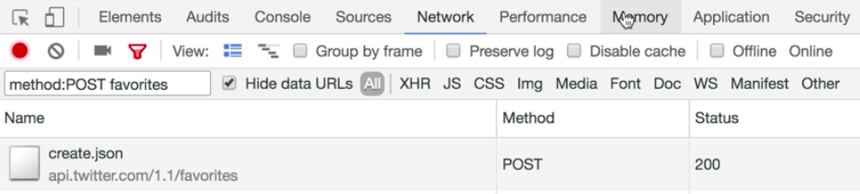

Instructor: [00:00] To take a look at a real-world example of optimistic UI updates in action, we can head to [Twitter](https://twitter.com/), open up our DevTools, and head to the network tab. We'll filter down to just this request, `method:POST favorites`, that is going to be fired off when we click the heart icon.

[00:15] When we click that, we'll see that everything seems happen pretty instantaneously. We can slow that down by clicking on the `online` button, and then select `Slow 3G` network. When we click the heart button again, we'll see that the request is pending, although the heart was visually updated. Once a request is completed, that is when they increment or decrement the like counter.

[00:36] If we disable the network altogether, we'll see when we click, it will visually update, and they revert the state as soon as they determine that there was a network failure.