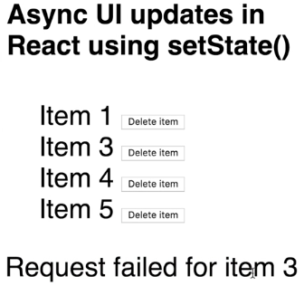

Instructor: [00:00] There's one new concept I want to introduce here, and that is I want to account for if we have an `error`, we want to make sure to display that to the user. If we have an `error`, we're going to pluck that out of state, we're going to display it right here for the user to see. 

```html
render() {
    const {items, loading, error} = this.state;
    return (
      <div>
        <h4>Async UI updates in React using setState()</h4>
        <ul style={{opacity: loading ? 0.6 : 1}}>
          {items.map(item => (
            <li key={item.id}>
              {item.title}{' '}
              <button onClick={() => this.deleteItem(item.id)}>
                Delete item
              </button>
            </li>
          ))}
        </ul>
        {error && <p>{error}</p>}
      </div>
    );
```

To get an error to throw here, we're going to make our `DeleteItemRequest` up here, fail for ID three specifically. 

[00:30]What we're going to do here is, we will say if the `id === 3`, the function we're going to pass the set time as is going to be `reject`, which will reject the promise. Otherwise, we'll `resolve` it as usual.

```javascript
function deleteItemRequest(id) {
    return new Promise((resolve, reject) => {
        setTimeout(id === 3 ? reject : resolve, 750);
    });
};
```

[00:45] As we can see for item one, item two, this is succeeding. If we click on item three, we get an error because we have yet to handle that rejection. We're going to add for clarity here that we're beginning with `null` as `error` in our state, which is why we're not rendering anything quite yet.

```javascript
state = {
    items: Array.from(Array(5), (_, i) => ({
      id: i + 1,
      title: `Item ${i + 1}`,
    })),
    loading: false,
    error: null,
};
```

[01:04] If we add a handler here on the promise through the `catch`, this is what we're going to do if the promise is rejected, we are going to `setState`, `error` that `request failed for item ${id}`. Since we have the ID right here, I'll use that in the message. We can make sure this is happening as we expect.

[01:26] There we go. Now, if we click on item three, that we get our error message. Looks like we forget to clear out our loading state, let's go ahead and make sure that in any case that we set `loading` back to `false`.

```javascript
deleteItemRequest(id)
      .then(() => {
        this.setState(state => ({
          // 2) Update state
          items: state.items.filter(item => item.id !== id),
          // Stop loading
          loading: false,
        }));
      })
      .catch(() =>
        // 2b) Show error to user
        this.setState({
          error: `Request failed for item ${id}`,
          loading: false,
        })
      );
    };
```

[01:42] Now, we'll go ahead, and item two will succeed, item three will fail. We're no longer loading, and we've displayed our error to the user...

