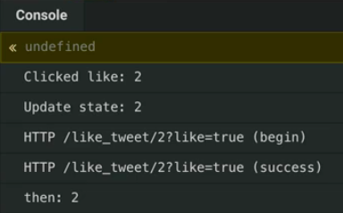
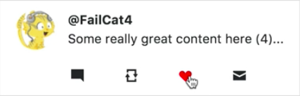

Instructor: [00:00] So far, we've plugged in our like tweet request function, so that when we click like, we can see these fake requests are being fired off. Let's plug in a proper method here so that `this.onClickLike`, and we'll add this method to our `App`.

[00:17] Say, `onClickLike` and we know that this is going to accept the `tweetId`. We can chain onto this, and once that promise resolves, what we can do is we'll just log out for now.

[00:32] We will say, `"Resolved"`. If we run into an error, we'll use a `catch`, and we'll just say, `"Cached"`. 

#### App.js
```javascript
onClickLike = tweetId => {
    likeTweetRequest(tweetId, true)
        .then(() => {
            console.log('Resolved');
        })
        .catch(() => {
            console.log('Catched!');
        })
    };
```

Now if we click the Heart, we have resolved. If we click this the third or fourth Heart that is going to fail, we'll see that we've caught the error.

[00:53] We'll add one more log here, just so that we can see that we've clicked the like. Let's paste these in here just so we can get a clearer picture of what we're doing here. I'll just log in these method names for now.

[01:05] What we need to do is since we're making the optimistic update, the first thing that we're going to do is we're going to say, `Update state` for this tweet id. 

```javascript
onClickLike = tweetId => {
    console.log(`Clicked like: ${tweetId}`);

    console.log(`Update state: ${tweetId}`)
    likeTweetRequest(tweetId, true)
        .then(() => {
            console.log(`then: ${tweetId}`);
        })
        .catch(() => {
            console.log(`cath: ${tweetId}`);
        })
    };
```

We're going to see we click, we're going to update state which we haven't done yet. Then we're going to fire off our request here.



[01:22] We're going to use `this.setState`, and we're updating it based on our previous state. So this is going to accept a function. The first thing we need to do is we need to determine if the tweet `isLiked`.

[01:37] We can do that by peeking at our `state.likedTweets`, and we can figure out if that `includes(tweetId)`. Now that we know that, we can `return` our new state. For now, we'll just update our `likedTweets` array.

[01:52] So liked tweets is going to equal, depending on whether we've already liked it or not, we will return `state.likedTweets`. In the case that we've already liked it, we're going to `filter`. We're going to keep only the ones that are not the tweet id.

[02:13] In our other case, we'll append that to our `state.likedTweets`, and we'll append our `tweetId`. 

```javascript
this.setState(state => {
    const isLiked = state.likedTweets.Includes(tweetID);

    return {
        likedTweets: isLiked
            ? state.likedTweets.filter(id => id !== tweetId)
            : [...state.likedTweets, tweetId],
    };
});
```

So now if we click the Heart, we should see these updating. We can see the heart toggling on and off.



[02:28] The next step, we're going to need to reach in and increment or decrement the tweet's `likes` property. Using the same information knowing if it's already liked, we can update the tweet's array based on the current tweet's `state.tweets`. And we'll `map` over each of these.

[02:48] I'll give us a tweet that we can now check if `tweet.id === tweetId`. What we can do is we're just going to update the single property on it, and that's going to be its `likes` property.

[03:04] We're going to either increment or decrement the current value based on whether the tweet `isLiked`. If it's already liked, we're going to decrement it. Otherwise, we can increment the property.

[03:17] If it's not the one we're looking for, go ahead and just return the tweet. 

```javascript
this.setState(state => {
    const isLiked = state.likedTweets.Includes(tweetID);

    return {
        tweets: state.tweets.map(
            tweet => 
                tweet.id === tweetId
                    ? {...tweet, likes: tweet.likes + (isLiked ? -1 : 1)}
                    : tweet
        );
        likedTweets: isLiked
            ? state.likedTweets.filter(id => id !== tweetId)
            : [...state.likedTweets, tweetId],
    };
});
```

Now, if we click this, we'll see that the hearts are toggling on and off, and the like count is incrementing and decrement as we would expect.

[03:35] Although, as we can see, we have yet to handle the failure case.