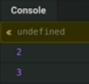
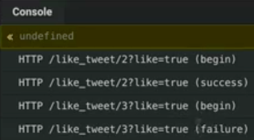

Instructor: [00:00] I want to compare this approach where we click it, submit the request, wait for the request to succeed, and then update stay. We can see some delays going on.

[00:14] I want to contrast this to what we can achieve by pulling in the concept of optimistic UI updates.

#### App.js
```html
class App extends React.Component {
  state = initialState;

  render() {
    const {tweets, likedTweets} = this.state;
    return (
      <div className="container">
        <h3 className="text-muted text-center lead pt-2">
          Optimistic UI Updates with React
        </h3>
        <div className="list-group">
          {tweets.map(tweet => (
            <Tweet
              key={tweet.id}
              tweet={tweet}
              isLiked={likedTweets.includes(tweet.id)}
              onClickLike={this.onClickLikeOptimistic}
            />
          ))}
        </div>
      </div>
    );
  }
}
```

Where when we click the Heart, things happen immediately, and that asynchronously, we can account for failure and revert the state as needed. Let's take a look at implementing this. Let's rip this out. We know that we're going to receive a `tweetId` here.

[00:41] Let's `log` that out to the console to look at what we're working with. 

```html
onClickLike={tweetId => console.log(tweetId)}
```

Here's our tweet ID. 



If we click on the Heart, we're logging into the console this tweet ID. Now, if we look at our state, 

```javascript
const initialState = {
  tweets: [0, 3, 98, 0, 0].map((likes, i) => ({
    id: i + 1,
    likes,
    username: `${shouldFail(i + 1) ? 'Fail' : 'Cool'}Cat${i + 1}`,
    content: `Some really great content here (${i + 1})...`,
  })),
  likedTweets: [2],
};
```

what we're working with is we have this array of tweets, which is an array of objects with an ID, a number, which is the number of likes per tweet that we're generating here. You can see `0, 3, 98, 0` and so on.

[01:12] The user name, which is what we're displaying here, and that tweet content. We're already mapping through that and displaying that. We have a tweet component that's already built for us. Now, we have this function here which is going to act as a request. 

```javascript
// Fake request. Fail for id 3 or 4
function likeTweetRequest(tweetId, like) {
  console.log(`HTTP /like_tweet/${tweetId}?like=${like} (begin)`);
  return new Promise((resolve, reject) => {
    setTimeout(() => {
      const shouldSucceed = !shouldFail(tweetId);
      console.log(
        `HTTP /like_tweet/${tweetId}?like=${like} (${shouldSucceed
          ? 'success'
          : 'failure'})`
      );
      shouldSucceed ? resolve() : reject();
    }, 1000);
  });
}
```

It's going to mimic making an `HTTP` request, where it's going to do some logging for us so we can get a feel for when that request begins and ends.

[01:38] We're introducing this idea of making it fail for tweet ID three and four. Now, we can go ahead and plug that in our `onClickLike`. What we can do is, let's call our `likeTweetRequest`, and we'll pass in `true` for now. 

```javascript
onClickLike={tweetId => likeTweetRequest(tweetId, true)}
```

We can see that our request function is succeeding and failing as we expect and that we have a promise rejection that we've yet to handle.

