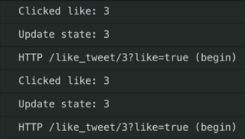
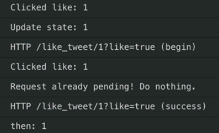

Instructor: [00:00] Our heart icons are optimistically updating so that when we click them, they visually immediately update. Only in the event of a failure does it revert after the request is failed. If we look a little deeper, we'll see that we have a use case where a bug will arise if we click this rapidly. Ultimately, both requests failed when you get the visual impression here that the tweet was successfully liked.



[00:27] If we follow the timeline of events, if I click this twice in rapid succession, the first time we clicked it we transitioned to liking the tweet, so that the second time we clicked it, when we came here we said, "Oh, this is already liked."

[00:43] We again updated it to toggle that, which transitioned us to not liking it. When this request failed, we reverted state, swapping back to the current liked status, which it was already liked from the first optimistic update. We need to introduce a way to prevent multiple or conflicting invocations.

[01:06] One simplified solution we can introduce is we can add an instance property on our `App`. We'll call this, `likeRequestPending`. This is going to begin as `false`. We could add this into our component state. Since we don't need it in `render`, we can apply this as an instance property and keep things a little bit simpler.

```javascript
likeRequestPending = false;
```

[01:28] We want to introduce this before we update our state. Immediately after we click the heart, what we want to do is we want to check our flag that we're going to be raising and lowering. Ask if this `likeRequestPending`, what we're going to do is, we're going to `return` and short-circuit this whole thing. We will log out here request already pending. Now, we can raise our flag here by saying, this `likeRequestPending` is `true`.

```javascript
onClickLike = tweetId => {
    console.log(`Clicked like: ${tweetId}`);

    // Prevent multiple/conflicting invocations of onClickLike
    if (this.likeRequestPending) {
      console.log('Request already pending! Do nothing.');
      return;
    }
    ...
};
```

[01:57] Once this request is completed in either the success or failure case, we're going to lower the flag. We will add an additional `then` handler here. We will set that flag to `false`. 

```javascript
likeTweetRequest(tweetId, true)
      .then(() => {
        console.log(`then: ${tweetId}`);
      })
      .catch(() => {
        console.error(`catch: ${tweetId}`);
        this.setState(setTweetLiked(tweetId, isLiked));
      })
      .then(() => {
        this.likeRequestPending = false;
      });
```

Now, if we come in here and click any of these in rapid succession, we'll see that we click and update our state immediately and fire off a request. The second time we click it, the request is already pending so that we've done nothing.



[02:23] To look at our failure case, before we had the bug where we would doubly revert our state, giving a false impression that the tweet was successfully liked. Now, we've caught and prevented that.