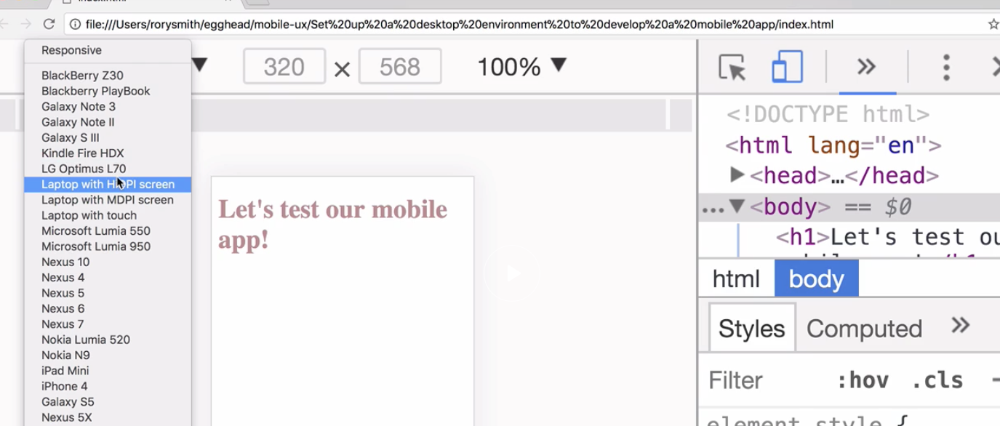

Instructor: [00:00] Desktop browsers have great facilities on offer for us to develop Web apps for mobile devices. Let's take a look at what Chrome Dev Tools has to offer. We're going to open this `index.html` file. Let's inspect the page.

[00:17] When we use the device toolbar, we can emulate devices inside the browser. Currently I'm emulating an iPhone 5, but I have many more to choose from. I can adjust the scale. All the resources that available to us when we debug desktop applications are still available to us now.

