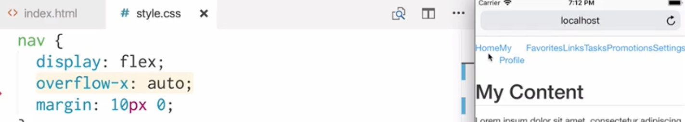
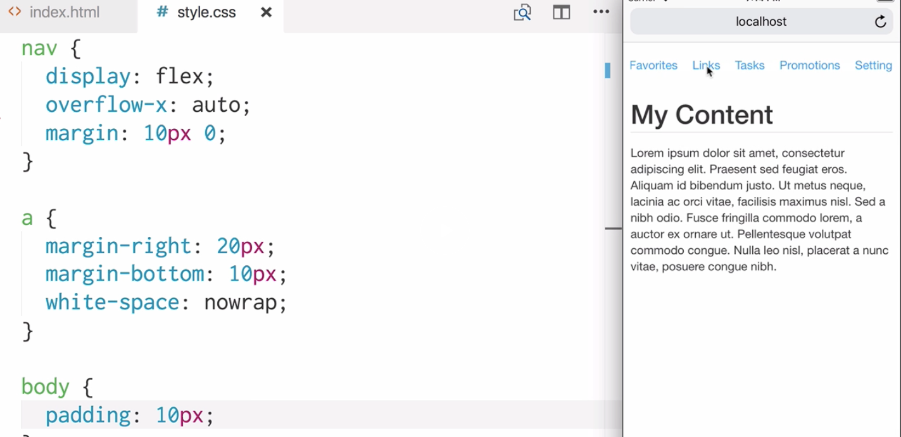

Instructor: [00:00] Let's start by making a main `section`. Inside the `section`, we'll have a `header` and a `paragraph`, both with some placeholder text. Here's our content. Now, above this content we're going to insert a `nav`, which is going to have links to parts of our site.

```html
<section>
    <h1>My Content</h1>
    <p>Lorem ipsum dolor sit amet, consectetur adipiscing elit. Praesent sed feugiat eros. Aliquam id biendum justo. Ut metus neque, lacinia ac orci vitae, facilisis maximus nisl. Sed a nibh odio. Fusce fringilla commodo lorem, a auctor ex ornare ut. Pellentesque volupat commodo congue. Nulla leo nisl, placerat a nunc vitae, posuere congue nibh.</p>
</section>    
```

[00:22] In our code above our section, we'll set up our `nav`. Inside the `nav`, we'll set up some placeholder links. We're going to have `Home`, `My Profile`, `Favorites`, `Links`, `Tasks`, `Promotions`, and `Settings`. Let's save and refresh. Here's our `nav` at the top of the page. The links are beginning to wrap onto two lines, because there isn't enough horizontal space.

```html
<nav>
    <a href="">Home</a>
    <a href="">My Profile</a>
    <a href="">Favorites</a>
    <a href="">Links</a>
    <a href="">Tasks</a>
    <a href="">Promotions</a>
    <a href="">Settings</a>
</nav>    
<section>
    <h1>My Content</h1>
    <p>Lorem ipsum dolor sit amet, consectetur adipiscing elit. Praesent sed feugiat eros. Aliquam id biendum justo. Ut metus neque, lacinia ac orci vitae, facilisis maximus nisl. Sed a nibh odio. Fusce fringilla commodo lorem, a auctor ex ornare ut. Pellentesque volupat commodo congue. Nulla leo nisl, placerat a nunc vitae, posuere congue nibh.</p>
</section>  
```

[00:55] We're going to make our menu so that any overflow is horizontally scrollable. To do this, let's head over to our CSS file. We want to target the `nav`. In our `nav`, we're going to use `display: flex;`, which is automatically going to apply flex direction row. We're going to give it `overflow-x: auto;` so that the other flow can be scrolled.

[01:21] We'll give it some `margin`. Let's save and refresh. Now, we have a row of our options. They're fitting the space exactly as they should be. Currently, there's actually no need for `overflow-x: auto;`, because there's no `overflow-x`. What we need to do is space these options out because they're too close to each other.



```css
nav {
    display: flex;
    overflow-x: auto;
    margin: 10px 0;
}
```

[01:47] We need to ensure that each option sits on its own line. In the case of `My Profile`, the text is wrapping onto a second line. Let's target all the links in our `nav`. Let's give them `margin-right: 20px;` and `margin-bottom: 10px;`. We'll apply `white-space: nowrap;`. Let's save now and refresh. Now, our menu is overflowing.

```css
nav {
    display: flex;
    overflow-x: auto;
    margin: 10px 0;
}

a{
    margin-right: 20px;
    margin-bottom: 10px;
    white-space: nowrap;
}
```

[02:20] It's going across the end of the page here. We can scroll it from side to side. Let's give our `body` some `padding` so that our content isn't all the way to the edge of the page. Our nav is now working as we expect it to. We can place as many items as we want in this menu, and it will overflow off the page.

```css
nav {
    display: flex;
    overflow-x: auto;
    margin: 10px 0;
}

a{
    margin-right: 20px;
    margin-bottom: 10px;
    white-space: nowrap;
}

body {
    padding: 10px;
}
```



[02:42] The scroll behavior feels a bit strange at the moment. It's not smooth, and there's no movement after releasing. To get around this, on our `nav` we can use `-webkit-overflow-scrolling: touch;`. Now, our menu feels much smoother and nicer to use.

```css
nav {
    display: flex;
    overflow-x: auto;
    -webkit-overflow-scrolling: touch;
    margin: 10px 0;
}

a{
    margin-right: 20px;
    margin-bottom: 10px;
    white-space: nowrap;
}

body {
    padding: 10px;
}
```
