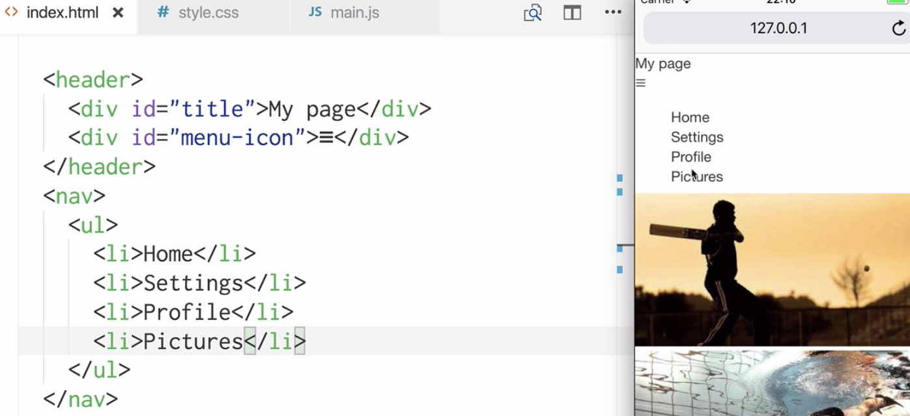
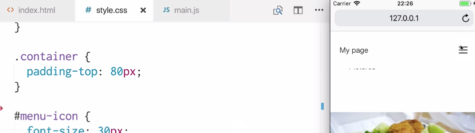
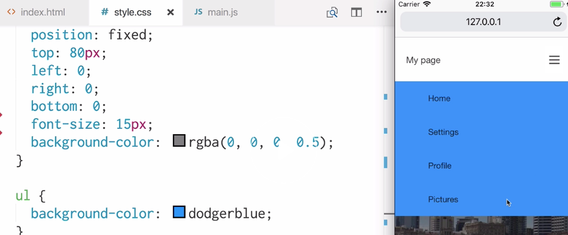
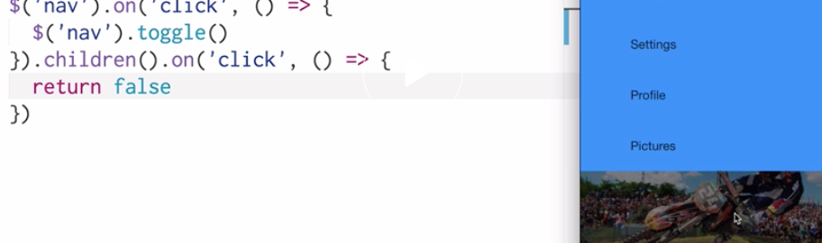

Instructor: [00:00] Here, we have a container `div`, which has five images inside it. These are just placeholder images that are coming from lorempixel.com and they're going to be different every time we load the page.

[00:14] What we want to do on this page is create a menu at the top, which allows us to navigate around different parts of the site. The menu is going to go here at the top. Let's go ahead and create a `header` element. It's going to contain a `title` called `My Page` and a `menu-icon` which is going to allow us to open a menu with menu items inside it. We're going to use this text character `≡` as our icon.

```html
<header>
    <div id="title">My Page</div>
    <div id="menu-icon">≡</div>
</header>    
```

[00:46] When we open this menu, we want to see a `nav`. The `nav` is going to contain our list of items. We'll place our unordered list `ul` inside our `nav` with separate menu items. Let's save and refresh our page in our simulator over here. Here's what we just wrote in our HTML.



```html
<nav>
    <ul>
        <li>Home</li>
        <li>Settings</li>
        <li>Profile</li>
        <li>Pictures</li>
    </ul>
</nav>        
```

[01:13] What we're going to do is ensure that when this icon `≡` is tapped, this menu is toggled. To do that, we're going to write some JavaScript. I'm going to use JQuery for this, but you can use any library you want or just vanilla JavaScript.

[01:31] Let's target our `menu icon`. We'll add a `click` event to it. When our menu icon is clicked, we're going to `toggle` the `nav`. Let's save that and refresh. Now when we click our menu icon, the nav disappears. It comes back when we click it again.

```js
$ ('#menu-icon').on('click', () => {
    $('nav').toggle()
})
```

[01:59] There's still quite a lot to do here to ensure that the menu is giving a good experience for our user. We're going to want to ensure that this header is fixed at the top of the page all the time so that they can always access this menu wherever they are on the page. We're also going to want to ensure that when the user taps away from this menu, then it closes.

[02:22] Let's go to our CSS. Let's start by targeting our `header`. We'll give it `position: fixed;` so that it stays at the top of the page. We'll give it a `background-color` so that it can be seen over the top of content. We'll give it some `padding`. We're going to want to position our title on the left and our icon on the right. To do that, we're going to use `display-flex:` and `justify-content: space-between;`. We'll also use `align-items: center;` to vertically center our title and icon.

```css
header {
    position: fixed;
    background-color: white;
    padding: 20px;
    display: flex;
    justify-content: space-between;
    align-items: center;
}
```

[03:09] Next, we'll give our `container` some `padding-top` so that their header isn't covering it on the initial page load. Let's also give our `#menu-icon` a large `font-size` so that it's easier to tap. Initially, our `nav` should have `display: none;` so that it's not viewable on the initial page load. Let's save and refresh.

```css
container {
    padding-top: 80px;
}

#menu-icon {
    font-size: 30px;
}

nav {
    display: none;
}
```

[03:41] Now, we can see our header with a larger icon. We're using justify content and that's pushing the title to the left and the icon to the right. If we scroll down, we can see that it's fixed to the top of the page. Furthermore, nav is not viewable on the initial load and it does show when we open it using our icon. However, as you can see, there are some display issues with our menu at the moment. We can't really see what our menu is showing.



[04:15] Let's fix this. Let's go back into our `nav` CSS. We also want our `nav` position to be fixed `position: fixed;`. We want to give it `top: 80px;`, which is the same measurement as what we're giving our container so that it doesn't appear below our header. We're going to want it to cover the rest of the entire screen though, it should take up this space where our content is.

[04:43] To do that, we're going to give `left: 0;`, `right: 0;`, and `bottom: 0;`. We'll give it a slightly larger `font-size` of `15px`. Because this `nav` is the container for our list, we're going to want to use a semi transparent `background-color`. This will be to emphasize the `nav` menu's appearance.

[05:09] We're going to say `background-color: rgba(0,0,0,0.5);`. To the list itself, let's apply a `background-color` so that we can tell the difference between the container and the list. Finally to the list items, we'll give it some `padding` just to space everything out. Let's save and refresh again.

```css
nav {
    display: none;
    position: fixed;
    top: 80px;
    left: 0;
    right: 0;
    bottom: 0;
    font-size: 15px;
    background-color: rgba(0, 0, 0, 0.5);
}

ul {
    background-color: dodgerblue;
}

li {
    padding: 20px;
}
```

[05:40] Now when we click on our icon, we can see that our nav shows with this nice menu in here. The container's background color is this semi transparent one here. The list's background color is here. As we'll see when we scroll down the page and we open our nav, it doesn't go underneath the header.



[06:04] Currently, the user can only close the menu when they tap this icon, but it would be nice if they could close it by tapping this area here. Because if they're tapping there, they probably want to get back to the content of the page.

[06:18] Let's head back over to our JavaScript. We're going to do a similar thing to when we used a `toggle` on our `nav` when tapping the `#menu-icon`. This time, we're going to target our `nav` and we're going to attach a `click` event. We can say when the `nav` is tapped, then `toggle` it. There's a problem with this because this means that whenever the user taps anywhere in this nav, it's going to toggle the nav, but if they're tapping a link it shouldn't just close the nav.

[06:59] We're going to target the `nav`'s `.children`, ie this unordered list here. When that area is clicked, we're just going to `return false`. Let's save and refresh and see how that affects our app. Now when we open our menu, we can see that this area can be reserved for tapping on each individual item. This portion will close our nav.

```js
$('nav').on('click', () => {
    $('nav').toggle()
}).children().on('click', () => {
    return false
}) 


```

