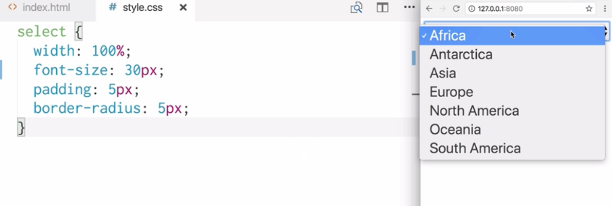
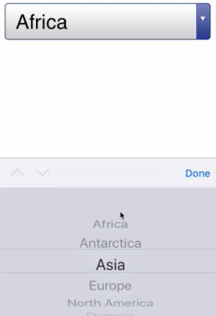
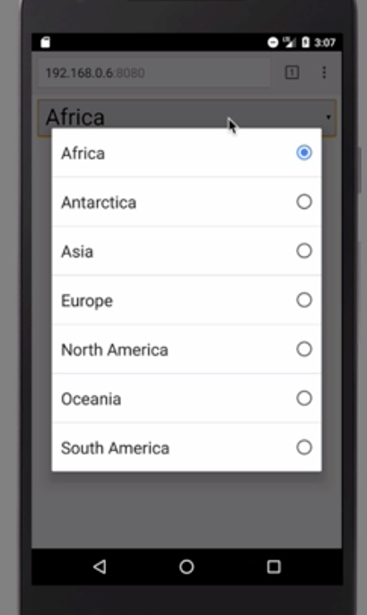

Instructor: [00:00] Let's write a `select` field that's going to contain all of the continents. We'll have `Africa`, `Antarctica`, and so on. Let's save this and see what it looks like in a desktop browser. I've got desktop Chrome open here. Here's our little `select` field. Let's write some styles to make this a bit bigger.

```html
<select name="continents">
    <option value="africa">Africa</option>
    <option value="antarctica">Antarctica</option>
    <option value="asia">Asia</option>
    <option value="europe">Europe</option>
    <option value="north-america">North America</option>
    <option value="oceania">Oceania</option>
    <option value="south-america">South America</option>
</select>    
```

[00:32] Targeting our `select` field, we'll give it `width: 100%;` so that it takes up the available width, `font-size: 30px;`, `padding: 5px;`, `border-radius: 5px;`. Let's save and refresh in our desktop browser. Here's our `select` field.

```css
select {
    width: 100%;
    font-size: 30px;
    padding: 5px;
    border-radius: 5px;
}
```



[00:56] In desktop browsers like this one, when we interact with the `select` field, we get this drop down menu appear. However, the `select` field looks different depending on what device and browser you're looking on.

[01:10] Let's head over to our iOS simulator. Here's the `select` field in our iPhone SE simulator running Safari. Already, we can see differences in the styling. The main difference can be seen when we interact with the `select` field. Instead of a drop down, this section appears at the bottom of the page. It contains all of the options. This is more suitable for a small screen because there's more screen space available to select an option.



[01:43] Now, let's head over to our Android simulator. Here's our `select` field in the Nexus 5 simulator running Chrome. This time when we interact with it we get a modal appear. There's even more screen space available to us to select an option.



[02:02] There's nothing fancy going on here. We're just using the native browser capabilities such as this select menu, and we're finding out that the native behavior is actually optimized for the device and the browser that we're using.