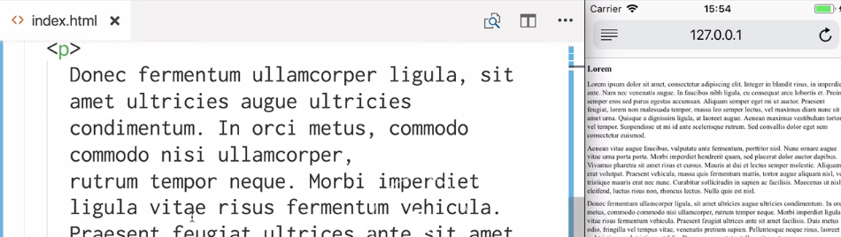
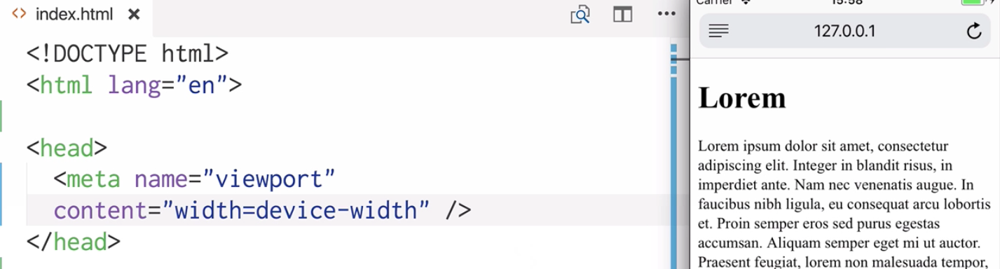
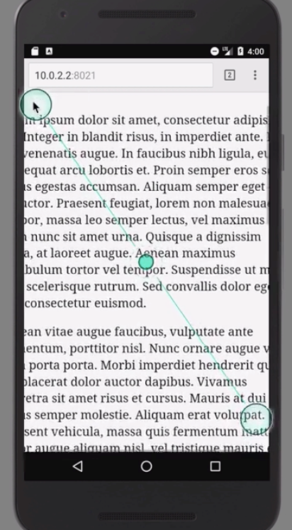

Instructor: [00:00] Here in our `index.html`, we have an example page of Lorem Ipsum text split into paragraphs. Let's go to iOS Safari and see how this looks. We can see that all of our text is really small and very difficult to read on a mobile device because of its small viewport. Let's switch over to Chrome on Android to see how that looks and we have a similar situation here. Luckily there's a solution to this.



[00:31] Let's go over to our code, specifically into our `head` tag. We're going to need a `meta` tag. We're going to target the `viewport`, we're going to give it `name="viewport"`. We're going to use the `content` attribute. This is going to be a string of settings. We're going to use `width=device-width`.

```html
<head>
    <meta name="viewport"
    content="width=device-width" />
</head>  
```

[00:54] Let's save this and head back over to iOS Safari. Let's refresh. Instantly the scale of our page is different because of the meta tag that we're using. Everything is a lot more easy to read now. Let's check it out on Android Chrome, and everything is slightly larger. The main difference though can be seen on Safari in our case, because we're comparing an iPhone 5s screen with a Nexus 5x screen. The 5x screen is significantly bigger.



[01:33] We can control the scale of our page on a mobile device using pinch zoom. If we pinch zoom on Safari, we can change the scale. As of Safari 10, we can't affect this with the `meta` tag that we're using. However, we can affect Chrome.



[01:53] Let's head back over back to our Android simulator. We'll pinch zoom to see that we can change the scale. Let's go back to our `meta` tag. In the content attribute, we'll pass in `maximum-scale=1`. Let's save and refresh.

```html
<head>
    <meta name="viewport"
    content="width=device-width, 
    maximum-scale=1" />
</head> 
```

[02:17] Now in Chrome when we pinch zoom, the scale isn't changed. It's worth bearing in mind that by doing this you may be affecting the level of accessibility on the page.