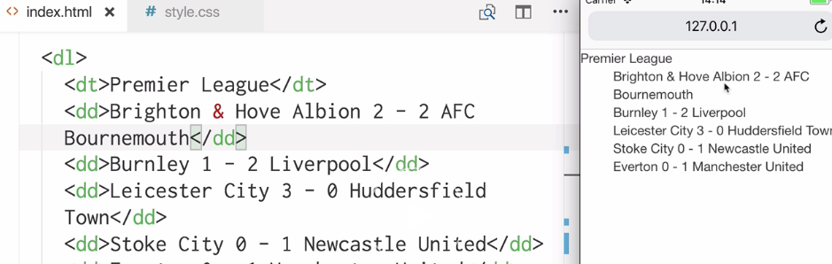
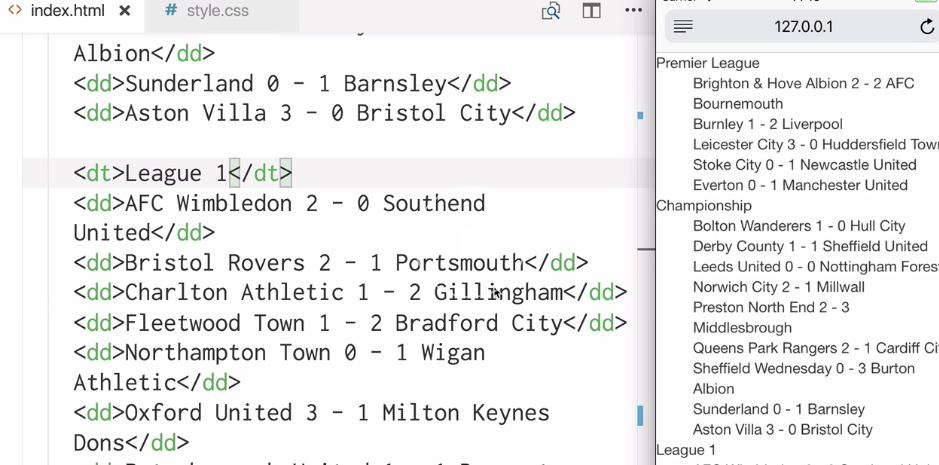
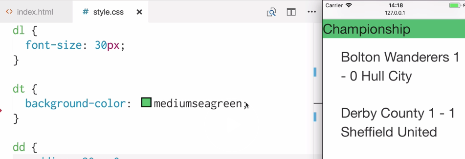
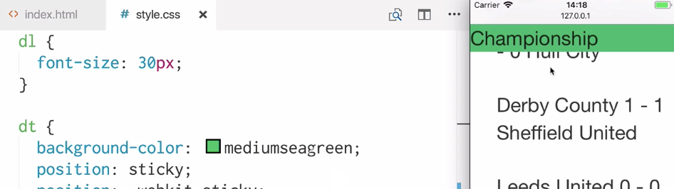
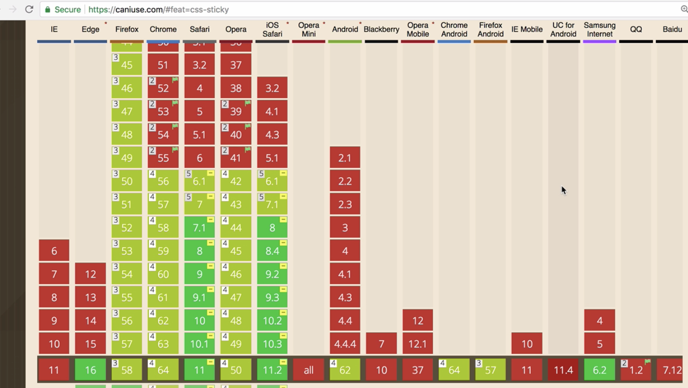

Instructor: [00:01] Let's start by setting up a description list element `dl`. Inside the description list, we're going to have sections comprising a section header and content underneath. The section header is going to be a `dt` tag or description term. The content will comprise description details tags or `dd`.

[00:23] In this example, we're going to use results of soccer matches for our data. The title of our first section header is going to be `Premier League`, and within each `dd` is going to be a soccer result. For example, `Brighton & Hove Albion 2 - 2 AFC Bournemouth`. Let's pad this out with some more results and let's save and visit our page on iPhone 5s Safari 11.

```html
<dl>
    <dt>Premier League</dt>
    <dd>Brighton & Hove Albion 2 - 2 AFC Bournemouth</dd>
</dl>    
```



[00:54] Here's our description list with a description term and description details here. Let's add some more sections to our code. Now, we have a `section` for `Championship` results and `League 1` results. Save and refresh. Here's our description list with more data inside of it.




```html
<dt>Championship</dt>
<dd>Bolton Wanderers 1 - 0 Hull City</dd>

<dt>League 1</dt>
<dd>AFC Wimbledon 2 - 0 Southend United</dd>
```

[01:17] Let's change the appearance of our description list a little by heading to our CSS. Targeting the description list element `dl`, we'll give it `font-size: 30px;`. We'll give every description term element a `background-color`. We'll give some `padding` to each description details element. Let's see how that looks.

```css
dl {
    font-size: 30px;
}

dt {
    background-color: mediumseagreen;
}

dd {
    padding 20px 0;
}
```




[01:43] Now, everything is a bit bigger and spaced out. Currently, we can only see our description term element when we get to the section that we're looking at, but a common situation would be that we want this description term, or this header, to be fixed at the top of the page during the time that we're scrolling that section. This could be especially useful when there is a lot of data and it may be easy to forget which section we're actually looking at.

[02:12] There's an easy way to implement this. Let's head back to our description term `dt` in our CSS. We're going to add `position: sticky;`, and we'll need `position: -webkit-sticky;` to target webkit browsers. We're also going to use `top: 0`. Let's save and refresh and see how that changes our page.

```css
dt {
    background-color: mediumseagreen;
    position: sticky;
    position: -webkit-sticky;
    top: 0
}
```



[02:36] Now when we scroll down the page or up the page, the description term-the header-stays fixed at the top of the page. As we scroll down and we get to the next section, it takes over like this. This is particularly useful for small viewports because if there's a lot of data, or data taking up a lot of room, our users will still be able to get the context of what section they're looking at.

[03:08] Before jumping in and using position sticky, it's definitely worth checking first that it's supported on the devices or operating systems that you need to support.



