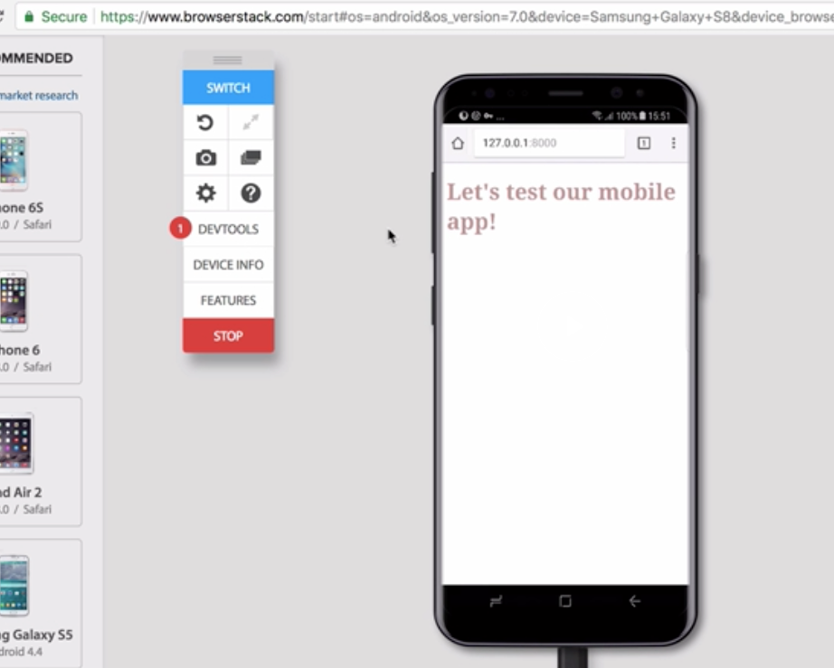
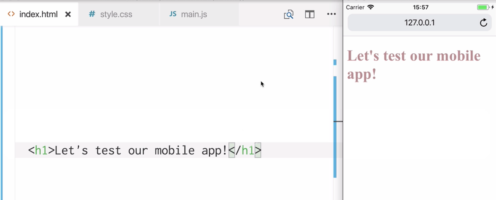
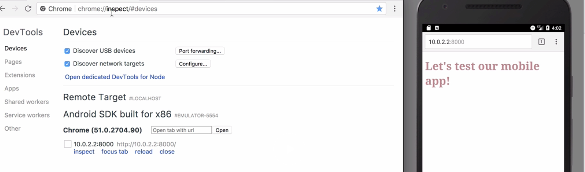
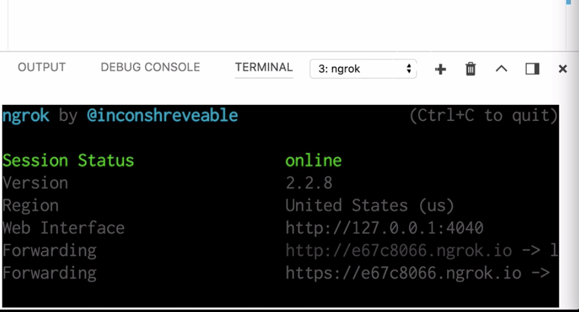
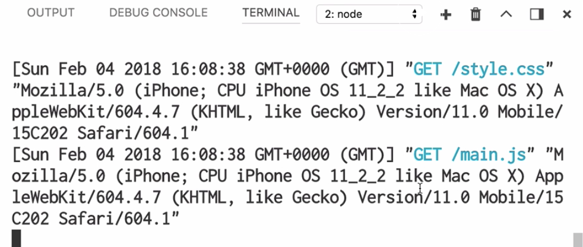

Instructor: [00:00] Regularly, we're going to want to emulate a mobile device so that we can test our app on the device. To do that, we can use remote debugging. This is different to simply using desktop browser developer tools, because there may be features to advise or operating system that aren't available through a browser like Chrome.

[00:21] To test on a device emulator, we're going to want to set up an http server, because we're not going to be able to simply open `index.html`. Because we'll be using a remote source.

[00:38] From the command line, we're going to want to install http server globally. Then, we can say `http-server -p 8000`. I always use the `flag -c-1`, because this avoids caching issues.

```html
$ npm install http-server -g

$ http-server -c-1 -p 8000
```

[00:59] Let's run this, and we have our http server running. Now, we can access our app on a device emulator. One example of this is a cross-browser testing platform such as BrowserStack.

[01:15] We have access to many different devices and operating systems for mobile phones. Let's go ahead and open Samsung Galaxy S8 in Chrome. Let's enter our http server address, and here's our app.



[01:33] On newer devices, we even have access to the dev tools, we can debug in the same way that we normally would with Chrome. We can test our mobile app using device simulators available to us from our operating system.

[01:48] Using this method, we can be quite sure that what we're seeing is going to be the same as what our user is seeing. Let's open our http server link in the iPhone 5S simulator in Safari. Here's our app.



[02:04] We can even use dev tools to debug this. Using Safari, we can head to the develop menu. Inside simulator, we can head to the relevant page. Here's our app. We can use these dev tools to debug our app remotely through the simulator.

[02:22] Android Studio offers us an emulator for Android devices, too. Let's head over to our page. In the Android emulator, we're using Chrome on a Nexus 5X device. Instead of using 127.001 as our address, we need to use 10.02.2 followed by the port.

[02:47] We can also debug this Android emulator in a similar way to the iOS simulator. It's just a little different. If we go to the devices section of Chrome, we can see the remote target that we set up here.



[03:03] If we head to inspect, we can use the dev tools to debug our app. Often, we may want to debug our app using our phone so that there's no simulator or emulator involved. Sometimes, this may not be possible because we can't access `index.html` from our phone.

[03:25] We may not be able to access localhost directly from a phone. But there is a way around this. Let's check our server's still running. In a separate tab in our terminal, we're going to globally install ngrok. Once ngrok is in our path, we can type `ngrok http` then the port number.

```html
$ npm install ngrok

$ ngrok http 8000
```

[03:48] Now, we have remote urls available to us. If we were to access this url from a phone, we would see our app. I'm going to access this from my phone now, and here's the response.




[04:03] I can see our app on my phone so that I can test the usability of it to insure that what I'm seeing through my emulators is what I'm going to see on the actual devices.