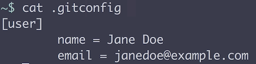
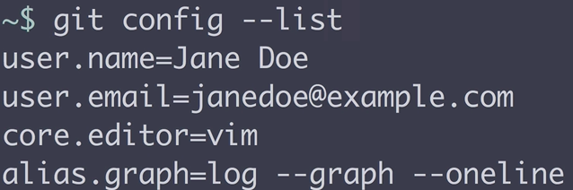

First, let's change directories to our user root, `cd ~`. We can check to see if we already have a `.gitconfig` file, `cat .gitconfig`. In this case, we don't. Whether or not we already have a `.gitconfig` file, we can use the `git config` command with the `--global` parameter to tell it to add a new setting to our `.gitconfig` file, `git config --global`.

Let's add a new `user.name`, and we'll say `'Jane Doe'` here, `git config --global user.name 'Jane Doe'`. If we output the contents of our `.gitconfig` file, we could see that the username of Jane Doe has been added. When we use the `git config` with a `--global` param, it writes to the `.gitconfig` file in our root directory.

To write an email to our `.gitconfig`, we'll say `git config` with the `--global` param, and we'll say `user.email` is going to be `janedoe@example.com`, `git config --global user.email janedoe@example.com`. If we output our `.gitconfig` file, `cat .gitconfig`, we can see that an email has been added.

To set our editor that Git will use to resolve conflicts and other operations, let's use `git config` with the `--global` param. We'll say `core.editor` is going to be `vim`, `git config --global core.editor vim`, in my case. Your editor may be different. If we output our `.gitconfig`, we can see that our editor has been set.

We can set aliases in our `.gitconfig` by saying `git config` with the `--global` param. We say `.alias`, and then the name of the alias. For example, let's create a log command that automatically creates a graph representation of our Git history.

We'll say `graph` and then the command inside of the quotes here. We'll say `log`, we'll give it the `--graph` param, and we'll tell it to just use `oneline` at a time in our logs, `git config --global alias.graph 'log --graph --oneline'`. If we look at our `.gitconfig` file, we can see that an alias has been added.

We can use that alias by saying `git` and then the alias name, which for us was `graph`. Now, we're running that command. If you want to create a Git alias, the important pieces, going back to our command, are the `.graph` piece can be replaced with any name that you want for an alias. Inside of your quotes, you have any Git command. 

If you ever want to see what's in your `.gitconfig` file, you can always output the file like we did before, `cat .gitconfig`. You can also use a built-in Git command, where you say `git config` and then say `--list`. It will give you a condensed list of all of the rules that you have in your `.gitconfig` file.

