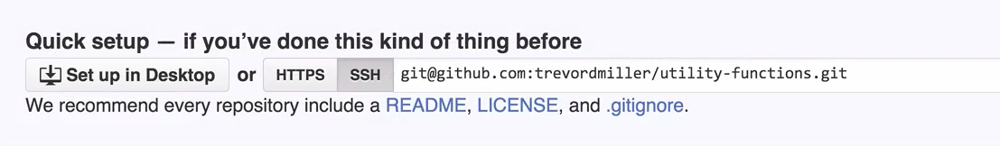

Here, we're inside of a folder called `utility-functions`. If we take a look at what's inside, we have a couple of files. We want to make this folder into a Git repo. The first thing we need to do is to run `git init`. This will initialize an empty Git repository.

If we output what's in this directory, there is a new `.git` folder at the root. If we take a look at this .git repo, `cd .git`, we can see that there's a lot of folders and files in here. Although we're not going to get into the details of this in this lesson, the important thing to know is that all of the Git settings and information is located in this `.git` repo at the root of our project.

Since all of our Git information is in this `.git` folder, if we ever want to remove Git from our project, all we have to do is delete that folder from our project. If we were to remove .git, `rm -rf .git/`, and take a look at our project again, Git is no longer a part of our project, including all of the information that it's gathered about our project.

If we try to run a Git command, like `git add -A` for example, it says that this is not a Git repository. Once we run `git init`, then we can run `git` commands, and it no longer throws an error. Now that we have a Git repo set up locally, it won't be much use to us unless we can sync it with a repo on the Internet somewhere. That could be on GitHub, or Bitbucket, or any number of Git repo hosting services.

In my case, I'm going to use GitHub. What I've done is, I've logged into my GitHub account. I will go to the new repository [button](https://github.com/new). It's asking for our repository name. I usually use the folder name of my project. In this case, it's `utility-functions`.

I will copy that and paste it in the repo name. We'll give it a description. We can go down and click on the `Create Repository` button. This takes us to a new repo page, which gives us a URL that has a .git extension. 

We're going to copy that URL because this is the location of our remote repo.

Back in our command line, we're going to say `git remote add`, and then the name of our remote, which will be `origin`. We'll paste in the URL that we copied, `git@github.com:{username}/{repositoryname}.git`. If we run that, we now have a remote set up on a repo. To verify that it was added correctly, we can type `git remote -v`. We can see that the URLs were added correctly.