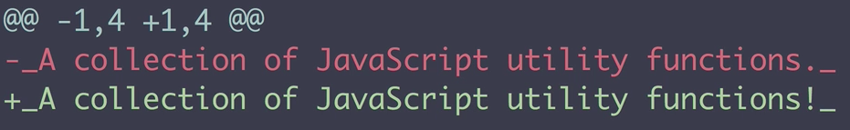
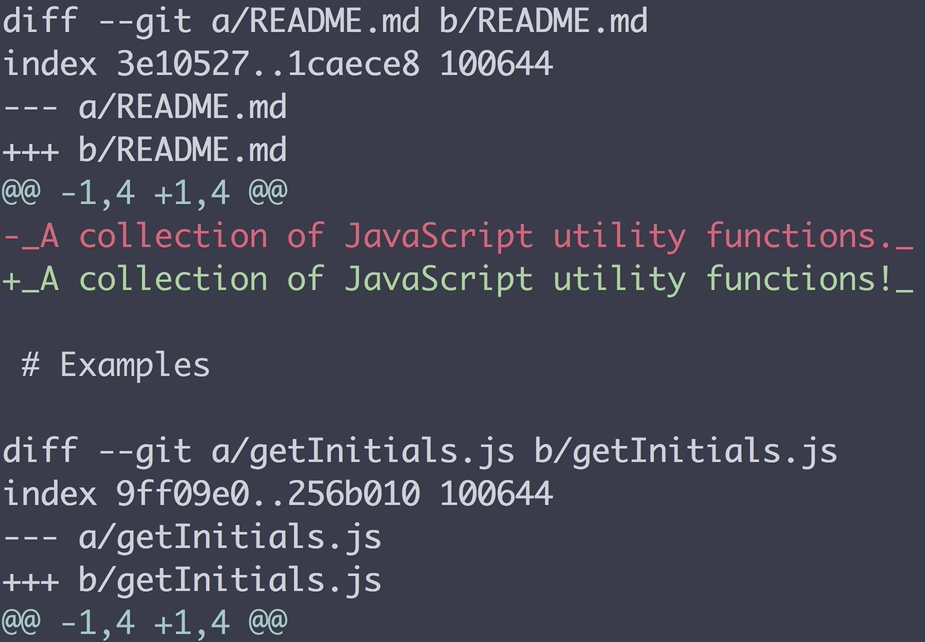

I'm in my command line inside of a directory called `utility-functions`, which is a Git repository. I'd like to update my project to use the ECMAScript 2015 module syntax. So let's create a new branch called `es2015-modules`, `git checkout -b es2015-modules`. I've opened the `getInitials.js` file in `utility-function` in my code editor, and let's change this function declaration to use the `export default`. 

#### getInitials.js
```javascript
export default function getInitials(name) {
    return name.split(' ')
        .map(word => `${word.charAt(0).toUpperCase()}.`)
        .join('');
}
```

Let's do the same thing for each of our other functions in our project. 

#### getMonthName.js
```javascript
export default function getMonthName(place) {
    const Months = [
        'january',
        'february',
        'march',
        'april',
        'may',
        'june',
        'july',
        'august',
        'septemper',
        'october',
        'november',
        'december',
    ]
}
```

Now back in our command line if we run `git status`, we can see that five files have been changed.

To view specifically what has changed in each of these files, let's run the `git diff` command. Now if we scroll through our output we see that each `function` declaration has been updated to include the `export default`. What the `git diff` command does is it shows us the changes between two references. By default, it uses the last commit and the current working directory. So each of these `diff` blocks that starts with the word `diff` and goes down through the actual syntax changes, says that we are comparing some reference with another reference of the same file, `diff --git a/getURLSlub.js b/getURLSlug.js`.

Below that, we see a series of minus and plus symbols, and when you see three together it's referring to a file, whereas when you see a single symbol it's referring to a line in that file. In this case we can see the `getULRSlug.js` file had lines removed and added, and it tells us where the specific lines were added and removed.

If we want to see all these statistics in a condensed way, we can run `git diff` with the `--stat` option, and instead of outputting the entire differences between the two references, it will only show us the line counts that have been modified, as well as the total amount of files changed, the insertions and deletions. So remember that `git diff` uses two references to compare file changes, and by default those references are the working directory, and the last commit.

We can also provide other options to show different references. We can use the `--cached` option to show the difference between the working directory and the staging area, `git diff --cached`. So if we run this right now we shouldn't expect anything, because we haven't staged our file changes. But if we stage our file changes and rerun the `--cached` command, we see the same `diff` output as before, but now it's between the working directory and the staging area, instead of the working directory and the last commit.

We can pass in the `HEAD` reference to view all uncommitted changes. So that's comparing both the working directory and staging area with the last commit, `git diff HEAD`. Right now if we run this it won't look any different than the `--cached` option, because we only have changes in our staging area. But let's go into one of our files and make a local change in our working directory. Like here in our read me I'm going to change the period at the end of the description to be an exclamation point.

#### README.md
```
_A collection of JavaScript utility functions._ 
``` 
to
```
_A collection of JavaScript utility functions!_ 
```

Let's save and close that file. Now if we run `git status` we can see that we have some staged files, and we also have unstaged changes. 


So now if we run our `git diff HEAD` command, we see the changes between both the working directory and the staged changes compared with our last commit. So again, that means all uncommitted changes.



We can also pass in other references like a `{branch}` name, so for example, one option that is really helpful is to grab your latest remote branches using `git fetch`, and then run `git diff` with your remote `master` branch, `git diff origin/master`, and this will show us all the changes that we have locally that haven't been merged into our remote `master` branch. So this would be the same diff that you would see if you were using a `pull` request on something like GitHub.

So if we run that right now, we get the same output as our last `HEAD` command, but the difference is that now if we were to commit these changes, let do that now, and if we run the `git diff HEAD` command, we don't see any changes because our last commit is the same as what's in our working directory and staging area. But we if we run our `git diff origin/master` command again, we'll see all of the changes that have been committed locally that are not in our remote `master` branch.



By default, the `git diff` command will use all files and directories in our repo that are not in a git ignore file. We can narrow that down by passing in specific files and directories as arguments. So for example, let's do the same comparison that we did before with our remote branch, but let's only look at the `getRandomNumber.js` file, `git diff origin/master getRandomNumber.js`, so if we run that command we only see the `diff` of the single file that we passed in as an argument.


So to review, the `git diff` command lets us compare changes between two references, by default this is the working directory and the last commit. We can compare the last commit with the staging area by using the `--cached` option, we can compare the last commit with both our staged and unstaged changes by using the `HEAD` reference.

We can compare our checked out branch with another local or remote branch by passing in the branch name, and finally with all of these options we can also pass in specific directories or file names like `getRandomNumber.js` to only see the diff between the files or directories and not all of the tracked files in the repository.