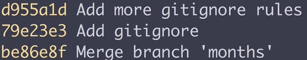
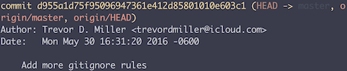

In our command line, we're inside of a directory called `utility functions`, which is a git repository. When using the `git log` command, we can pass in arguments to tell our commit how we want them to be formatted.

The `--oneline` option will condense our commits to a single line. We can see that we have the `commit ID`, as well as the `commit message`. 

The `--decorate` option will display all references for our commits. Here, we see a new output in our log that shows the refs for this commit.

The `--graph` option will display an ask e.r. graph of the branch structure of each commit. 

The lower-class `-p` option stands for patch, and shows us the changes made in each commit. For example, right below a commit, we can see the changes in a line.

The `--stat` option shows us the number of insertions and deletions for each commit change. Whenever a line is modified, it counts as an insertion or deletion. For this commit, we have seven insertions on the git ignore file, `7 +++++++`. For this commit right here, we have 13 deletions, `13 -------------`, the read-me file, three insertions, `3+++` in the git `getRandomNumber.js` file, as well as the total summary of the stat changes on the line below.

We can also compose all of these options together to format our commits. For example, we can pass the `--oneline` option alongside the `--graph` option to get a condensed graph of our branch structure, `git log --oneline --graph`.

You can compose these options in any order that you'd like. For example, we can say that we want the statistics for each commit, and we also want the condensed version of each of the commits, `git log --stat --oneline`. If we run that, we get the condensed version of each commit, as well as the statistics for the commit.